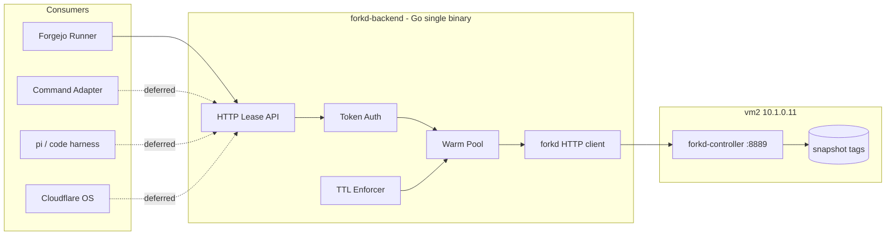
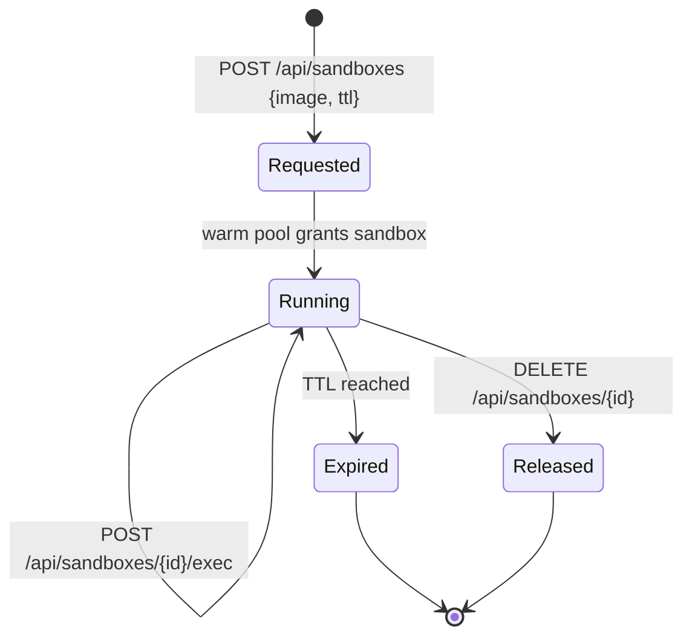

# forkd Ephemeral Backend - Plan

**Target repo:** `jrimmer/hyper-forgejo-runner` (own repo, at `forgejo-work/hyper-forgejo-runner/`)

## Goal Capsule

Build a general-purpose ephemeral sandbox backend on top of forkd, exposed as a thin HTTP lease/pool API. The API is the shared contract for future consumers (Forgejo runner, command adapter, pi/code harnesses, Cloudflare OS / sandstorm). This plan delivers the backend itself and validates it with a direct client smoke test; the Forgejo runner integration is a scoped follow-up phase (U4) because the runner code does not yet exist in the repo.

**Authority hierarchy:** the plan is the authority for scope and sequencing. The user (Jason) owns product decisions; the implementer owns execution details the plan leaves open.

**Stop conditions:** stop when the lease API is implemented, tested, and validated by a direct client (create → exec → TTL-expire → release) against a live forkd-controller. Do not build the Forgejo runner, command adapter / pi / sandstorm consumers in this plan — they are deferred follow-up work.

**Tail ownership:** the implementer owns the code, tests, and deployment of the backend. The user owns the decision to build the Forgejo runner (U4) and to decommission the old Hyper runner.

## Product Contract

### Summary

forkd is installed and proven on vm2 (10.1.0.11): 10 microVMs fork from a warm parent in 53ms, and `forkd exec` runs real commands inside live children. This plan builds the general-purpose layer on top of it — a small HTTP API that treats sandboxes as leases, with images as pre-baked snapshot tags — and validates the contract with a direct client smoke test. The result is a reusable ephemeral-compute backend that any future consumer can call without knowing forkd exists.

### Problem Frame

The homelab has four distinct consumers that all want the same thing: a fast, isolated, ephemeral compute environment. The Forgejo runner needs per-job microVMs. The command adapter needs pre-cached code/analysis environments. pi and code harnesses need on-demand sandboxes. Cloudflare OS (sandstorm) needs an ephemeral backend. Today each would re-implement the same glue (auth, TTL enforcement, warm-pool management, error handling) on top of forkd, producing four drifting wrappers. The Hyper runner (`hyper-forgejo-runner`) is the existing partial answer but is Hyper-specific and not general. The missing piece is a shared lease/pool contract that keeps every consumer thin.

### Requirements

**R1. Lease API.** Expose an HTTP API where a sandbox is a lease: create with an image tag + TTL, use via exec/stream, release via delete or TTL expiry. Consumers never manage forkd snapshots, netns, or warm pools.

**R2. Image-tag instance spec.** A caller specifies what it needs by a named image tag (a forkd snapshot tag) plus a narrow set of runtime knobs (TTL, memory, network, optional init command). Environment definition lives in pre-baked layers, not in the request.

**R3. Warm pool.** `POST /sandboxes` returns in milliseconds by pre-forking from a warm parent. The pool is the performance contract.

**R4. TTL enforcement.** Every sandbox has a TTL; the backend kills it on expiry. No orphaned microVMs, self-healing pool.

**R5. Auth at the API.** Token-based auth per consumer. forkd's controller binds to localhost with no auth; the backend must not expose that unauthenticated.

**R6. Forgejo runner integration.** The runner registers with Forgejo, receives tasks via the runner protocol, and executes each job in a forkd sandbox obtained from the lease API. Existing `.forgejo/workflows/*.yml` files work unmodified.

**R7. Image baking is admin-only.** Baking new image tags is a separate, privileged path (CLI or admin API), not part of the runtime contract. Consumers never bake.

### Scope Boundaries

**In scope:** the lease/pool HTTP API, the forkd client layer, TTL enforcement, auth, TLS/bind hardening, owner-scoping, and the first image bake (`py-base`).

**Deferred to Follow-Up Work:**
- Forgejo runner integration (U4) — the runner code does not yet exist in the repo; building it is a separate effort
- exe.dev-style container consumer → **command adapter** (synchronous, caller-driven: "run this command/snippet in a sandbox, return the result")
- pi / code-harness consumer
- Cloudflare OS (sandstorm) backend integration
- Admin image-baking API (start with CLI)
- Versioned image tags (start with unversioned tags, add `:vN` discipline when rebuilds begin)

**Outside this product's identity:** modifying forkd itself (upstream project, Apache-2.0, we consume it); the sandbox-api Python layer (backed up, not migrated in this plan).

## Planning Contract

### Key Technical Decisions

**KTD1. HTTP/JSON, not gRPC, for the public contract.** Consumers are heterogeneous (Go runner, Python harness, sandstorm). JSON is universally consumable; gRPC adds friction for ad-hoc callers. forkd's controller is already HTTP, so this is the path of least resistance.

**KTD2. Go, single binary.** Matches the homelab preference for plain Go binaries over Docker in LXC. Easy systemd service, static deploy. The saved Python sandbox-api is prior art for concepts, not the runtime.

**KTD3. Sandboxes are leases, not jobs.** Every sandbox carries a TTL; the backend kills on expiry. This is what makes the pool self-healing and prevents orphaned microVMs.

**KTD4. Image tag is the primary spec.** Callers reference a pre-baked snapshot tag; they do not run install commands at request time. This preserves the warm-pool speed advantage. On-demand baking is an explicit opt-in, not the default.

**KTD5. Reject unknown image tags by default.** A caller requesting a nonexistent tag gets an error. On-demand baking is opt-in via a separate endpoint, keeping the common path fast and predictable.

**KTD6. Auth at the API, isolation at the kernel.** Token auth per consumer at the HTTP layer; per-child KVM isolation comes free from forkd.

**KTD7. TLS + explicit bind for the lease API.** The lease API terminates TLS (or sits behind a TLS reverse proxy) and binds to an explicit address (default `127.0.0.1`). Any non-localhost consumer must use HTTPS. This protects the per-consumer tokens and the arbitrary-command `exec` payloads from on-path sniffing.

**KTD8. Owner-scoped sandbox access.** Every sandbox-scoped handler (`exec`, `stream`, `delete`) verifies the sandbox belongs to the authenticated consumer. Sandbox IDs are unguessable (random, not sequential). This prevents one consumer from exec-ing into or killing another's sandbox.

### High-Level Technical Design



**Lease lifecycle:**



**API surface (directional):**

```
POST   /api/sandboxes                  {image, ttl, memory_mib?, network?, init_cmd?} → {id, address}
GET    /api/sandboxes                  list mine
POST   /api/sandboxes/{id}/exec        {cmd, cwd?, env?, timeout} → {stdout, stderr, exit}
GET    /api/sandboxes/{id}/stream      stream output / interactive
DELETE /api/sandboxes/{id}             kill + release
GET    /api/images                     list snapshot tags
```

### Assumptions

- forkd-controller runs as a systemd service on vm2 at `127.0.0.1:8889` (already installed and proven).
- The backend runs on vm2 alongside forkd-controller, or on a host with network access to it.
- Image baking starts with the forkd CLI (`forkd from-image`, `forkd snapshot-diff`); the admin API is deferred.
- The Forgejo runner (U4) is deferred; its protocol stubs (`code.gitea.io/actions-proto-go` v0.6.0) are noted for when it is built.

## Implementation Units

### U1. forkd HTTP client layer

**Goal:** Wrap forkd-controller's HTTP API (`/v1/snapshots`, spawn, exec, kill) in a typed Go client that the backend uses to manage sandboxes.

**Requirements:** R1, R3

**Dependencies:** none

**Files:**
- `forkd/client.go` (new)
- `forkd/client_test.go` (new)

**Approach:** A thin client over forkd-controller's HTTP endpoints. It maps forkd's spawn/exec/kill verbs to typed methods. It does not own warm-pool or TTL logic — that lives in the backend service. Use the existing `hyper/` package layout as the pattern for a client wrapper.

**Test scenarios:**
- Happy path: `Spawn(tag, n)` returns N sandbox IDs with addresses.
- Happy path: `Exec(id, cmd)` returns stdout/stderr/exit code.
- Error path: spawn with a nonexistent tag returns a typed error.
- Error path: exec against a dead sandbox returns a connection error surfaced as a typed error.
- Integration: against a live forkd-controller, spawn 1 sandbox and exec `echo hi`.

**Verification:** Unit tests pass with a mocked HTTP server; integration test passes against the live forkd-controller on vm2.

### U2. Lease API service

**Goal:** Implement the HTTP lease/pool API (create, list, exec, stream, delete) with TTL enforcement and token auth.

**Requirements:** R1, R3, R4, R5

**Dependencies:** U1, U3

**Files:**
- `api/server.go` (new)
- `api/handlers.go` (new)
- `api/middleware.go` (new) — auth
- `api/ttl.go` (new) — TTL enforcement
- `api/server_test.go` (new)
- `api/handlers_test.go` (new)

**Approach:** A Go HTTP server. `POST /api/sandboxes` validates the image tag against `GET /api/images`, grants a sandbox from the warm pool (or spawns one), and registers a TTL. A background sweeper kills expired sandboxes. Auth is a per-consumer token checked in middleware; every sandbox-scoped handler verifies the sandbox belongs to the authenticated consumer (KTD8). The server terminates TLS and binds to an explicit address (KTD7). The warm pool pre-forks N sandboxes from a tag on startup and on demand. `exec` accepts `cwd` and `env` and the sandbox persists working-directory state across exec calls within its lease.

**Test scenarios:**
- Happy path: `POST /api/sandboxes {image:"py-base", ttl:300}` returns `{id, address}`.
- Happy path: `POST /api/sandboxes/{id}/exec {cmd:"python3 -c 'print(1)'"}` returns stdout.
- Happy path: two sequential exec calls with `cwd`/`env` share working-directory state (e.g. `cd /tmp` then `pwd` returns `/tmp`).
- Edge case: `POST /api/sandboxes` with an unknown image tag returns 404.
- Edge case: `POST /api/sandboxes` with a missing/expired TTL is rejected or defaults.
- Error path: exec against a released sandbox returns 404.
- Error path: request without a valid token returns 401.
- Error path: consumer A execs into consumer B's sandbox returns 403 (owner-scoping).
- Integration: TTL expiry — create a sandbox with a 1-second TTL, wait, confirm it is killed and `GET /api/sandboxes` no longer lists it.

**Verification:** Unit tests pass; integration test against live forkd-controller confirms create → exec → TTL-expire → gone.

### U3. Image registry

**Goal:** Expose `GET /api/images` listing available snapshot tags, and validate requested tags against it.

**Requirements:** R2, R5

**Dependencies:** U1

**Files:**
- `api/images.go` (new)
- `api/images_test.go` (new)

**Approach:** Query forkd-controller for snapshot tags and return them as a list. The create handler consults this to reject unknown tags (KTD5). Optionally cache the list with a short TTL to avoid hammering forkd-controller.

**Test scenarios:**
- Happy path: `GET /api/images` returns the list of baked tags (e.g. `py-base`).
- Edge case: empty registry returns an empty list, not an error.
- Integration: after baking `py-base`, `GET /api/images` includes it and `POST /api/sandboxes {image:"py-base"}` succeeds.

**Verification:** Unit tests pass; integration confirms the baked `py-base` tag is visible and usable.

### U4. Forgejo runner integration (follow-up phase)

**Goal:** Build the Forgejo Actions runner on top of the lease API so each job runs in a forkd sandbox. This is a follow-up phase because the runner code does not yet exist in the repo — it is a build, not a cutover.

**Requirements:** R6

**Dependencies:** U2, U3

**Files:**
- `runner/` (new — protocol client, workflow parser, expr evaluator, action handlers)
- `runner/executor.go` (new)
- `runner/executor_test.go` (new)

**Approach:** Build the runner protocol client (register, fetch task, update task, update log) using the `code.gitea.io/actions-proto-go` stubs, parse `WorkflowPayload` YAML, evaluate `${{ }}` expressions, and execute each step via the lease API (`POST /api/sandboxes/{id}/exec` with `cwd`/`env`), streaming logs back and releasing the sandbox on job completion. Map `runs-on:` labels to image tags (e.g. `ubuntu-latest` → `py-base` or a dedicated runner image). This unit is deferred to follow-up work in this plan; it is scoped here so the API contract (U2) is designed to support it.

**Test scenarios:**
- Happy path: a test workflow (`checkout → run: echo`) executes end-to-end in a forkd sandbox and reports success.
- Happy path: step stdout streams back to the Forgejo UI in real time.
- Error path: a failing step (`run: exit 1`) reports job failure and releases the sandbox.
- Integration: the sandbox is released (killed) after job completion — `GET /api/sandboxes` no longer lists it.

**Verification:** A real Forgejo workflow runs on the forkd backend and reports success/failure correctly; the sandbox is released after the job.

### U5. First image bake + backend deployment

**Goal:** Bake the first image tag (`py-base`) and deploy the backend as a systemd service on vm2.

**Requirements:** R7

**Dependencies:** U1, U2, U3

**Files:**
- `deploy/forkd-backend.service` (new)
- `deploy/README.md` (new)

**Approach:** Bake `py-base` via the forkd CLI (`forkd from-image python:3.12-slim --tag py-base`). This bake is a prerequisite for U2's and U3's integration tests, so it runs before those verifications. Deploy the backend binary to vm2 and install the systemd unit. Document the bake + deploy steps. (The runner service unit is deferred with U4.)

**Test scenarios:**
- Happy path: `py-base` tag is baked and visible in `GET /api/images`.
- Happy path: backend service is active after boot.
- Integration: a direct client smoke test (create → exec → TTL-expire → release) runs against the deployed backend.

**Verification:** Service is active, `py-base` is baked, and the direct client smoke test passes against the deployed backend.

## Verification Contract

- `go test ./...` passes in the repo.
- Integration tests against the live forkd-controller on vm2 pass (spawn, exec, TTL-expire).
- A direct client smoke test (create → exec → TTL-expire → release) passes against the deployed backend.
- The sandbox is released after the smoke test (no orphaned microVMs).
- `forkd doctor` on vm2 reports `fail=0`.

## Definition of Done

**Global:**
- The lease API is implemented and tested (U1–U3).
- `py-base` is baked and the backend is deployed as a systemd service on vm2 (U5).
- No orphaned microVMs remain after a smoke test (TTL + release verified).
- The Forgejo runner integration (U4) is scoped but deferred to follow-up work.

**Per-unit:** each unit's test scenarios pass and its verification is met.

## Risks & Dependencies

- **forkd-controller auth:** it binds to localhost with no auth. The backend must not expose it unauthenticated (KTD6). Mitigation: token auth in the backend middleware; forkd-controller stays localhost-only.
- **Lease API transport:** a cleartext network-reachable API lets an on-path attacker steal tokens and exec payloads (KTD7). Mitigation: TLS termination + explicit bind (default `127.0.0.1`); non-localhost consumers use HTTPS.
- **Cross-consumer sandbox access:** guessable sandbox IDs let one consumer exec into or kill another's sandbox (KTD8). Mitigation: unguessable IDs + owner check on every sandbox-scoped handler.
- **forkd upstream churn:** forkd is a young project (v0.5.3). Its HTTP API may change. Mitigation: isolate all forkd calls in the `forkd/` client layer (U1) so API changes are contained.
- **Warm-pool memory:** a warm parent lives in RAM. On 64GB vm2 this is ample, but the pool size must be bounded. Mitigation: configurable pool size, default conservative.
- **Runner build effort (U4):** the Forgejo runner does not exist yet; building it is a substantial separate effort. Mitigation: deferred to follow-up work; the API contract (U2) is designed to support it.
