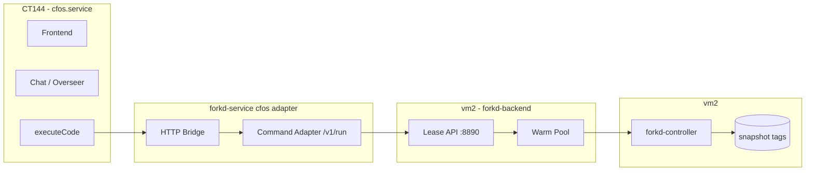

# CFOS/Sandstorm on forkd - Plan

**Target repo:** `lacy.casa/forkd-service` (at `forgejo-work/hyper-forgejo-runner/`)

## Goal Capsule

Move Cloudflare OS (CFOS, "Gadgets Workshop", running at `os.lacy.casa` on CT144) off Cloudflare Workers execution and onto forkd microVMs. Today CFOS runs gadget/agent code (`executeCode`) on a "restricted and heavily-sandboxed variant of Cloudflare Workers." This plan replaces that execution backend with forkd microVMs obtained from the forkd lease API, so gadget code runs in fast, isolated, ephemeral microVMs on our own hardware instead of Cloudflare's.

**Authority hierarchy:** the plan is the authority for scope and sequencing. The user (Jason) owns product decisions; the implementer owns execution details the plan leaves open.

**Stop conditions:** stop when CFOS's `executeCode` path executes agent/gadget code in a forkd microVM (obtained via the lease API) and returns results to the CFOS chat, with the Cloudflare Workers execution path no longer used for that flow. Do not build the full exe.dev-style interactive dev environment in this plan — that is a separate follow-up.

**Tail ownership:** the implementer owns the code, tests, and deployment of the forkd execution adapter for CFOS. The user owns the decision to decommission the Cloudflare Workers execution path and any CFOS-side changes.

## Product Contract

### Summary

CFOS is a self-hosted platform for "vibe coded" personal applications and AI agents that run inside a strong sandbox. It runs on CT144 (10.1.0.144) as a pnpm service (`cfos.service`), with the upstream repo at `github.com/cloudflare/cloudflare-os`. Gadgets and agent `executeCode` calls currently execute on a sandboxed variant of Cloudflare Workers. The forkd lease API (built in the prior plan) provides fast, isolated, ephemeral microVMs on vm2. This plan wires CFOS's code execution to forkd, keeping the CFOS frontend, chat, and gadget model intact while swapping the execution substrate.

### Problem Frame

CFOS's execution currently depends on Cloudflare Workers — a managed, external sandbox. The homelab has forkd microVMs (fast fork, warm pool, TTL-enforced leases) that provide the same isolation locally. Running CFOS gadget code on forkd keeps execution on-prem, removes the Cloudflare Workers dependency, and aligns with the homelab's "microVMs over Docker/cloud" preference. The forkd lease API is the shared contract; CFOS becomes another consumer alongside the Forgejo runner and command adapter.

### Requirements

**R1. forkd execution adapter for CFOS.** A component that takes a CFOS `executeCode` request (code + bindings) and runs it in a forkd microVM obtained from the lease API, returning stdout/stderr/exit to the CFOS chat.

**R2. Preserve CFOS gadget model.** The CFOS frontend, chat, gadget identity, and bindings model remain unchanged. Only the execution substrate swaps from Workers to forkd.

**R3. Bindings/context mapping.** CFOS's `env` bindings (gatekeepers, gadgets, external resources) must be made available to code running in the forkd microVM, or explicitly mapped to a forkd equivalent.

**R4. Lease lifecycle.** Each `executeCode` run obtains a sandbox lease (image + TTL), executes, and releases. No orphaned microVMs.

**R5. Auth.** The forkd lease API is token-authenticated; the adapter must present a valid consumer token.

**R6. Image selection.** The adapter selects a forkd image tag appropriate for the gadget/agent code (e.g. a JS/TS-capable image for Workers-style code, or a language base).

### Scope Boundaries

**In scope:** the forkd execution adapter for CFOS, the lease lifecycle, image selection, and wiring it into CFOS's `executeCode` path.

**Deferred to Follow-Up Work:**
- The exe.dev-style interactive dev environment (ssh/mosh into a persistent forkd microVM) — separate plan
- Full CFOS Workers feature parity (Workers logs, R2, Durable Objects semantics) — only what `executeCode` needs is in scope
- Migrating CFOS's own hosting off CT144

**Outside this product's identity:** modifying forkd itself (upstream, we consume it); the Cloudflare Workers platform.

## Planning Contract

### Key Technical Decisions

**KTD1. Adapter as a separate Go component in forkd-service.** A new `cfos/` package (or `cmd/cfos-adapter`) that speaks the forkd lease API and exposes a narrow interface CFOS can call. Keeps CFOS-specific logic out of the core lease API.

**KTD2. HTTP bridge, not a CFOS fork.** CFOS is upstream (`github.com/cloudflare/cloudflare-os`); we don't fork it. The adapter is a sidecar service CFOS calls over HTTP, so CFOS stays close to upstream and the forkd integration is a thin, replaceable seam.

**KTD3. Reuse the command adapter pattern.** The existing `commandadapter` (synchronous `POST /v1/run` → stdout/stderr/exit) is the natural fit for `executeCode`. Extend or wrap it rather than inventing a new execution path.

**KTD4. Image per gadget language.** Gadget code is JS/TS (Workers-style). Bake a `js-base` (or reuse a node-capable image) for gadget execution; language bases (`go-base`, `elixir-base`) serve agent code that needs them.

### High-Level Technical Design

**executeCode flow:**
1. CFOS `executeCode` call → adapter HTTP bridge
2. Adapter maps bindings/context, selects image tag
3. Adapter calls command adapter `POST /v1/run` (or lease API directly) with code + image
4. forkd-backend grants a warm-pool sandbox, executes, returns stdout/stderr/exit
5. Adapter returns result to CFOS chat; sandbox released

### Assumptions

- forkd-backend lease API is live on vm2 at `https://vm2.lacy.casa:8890` (built in prior plan).
- CFOS runs on CT144 and can reach the adapter over the homelab network (internal traffic, not via Pangolin).
- Gadget code is JS/TS; a `js-base` image is baked for it.
- The adapter runs as a systemd service (plain Go binary, per homelab preference).

## Implementation Units

### U1. CFOS adapter service (HTTP bridge)

**Goal:** Stand up a Go HTTP service that accepts CFOS `executeCode`-shaped requests and forwards them to the forkd command adapter / lease API, returning results.

**Requirements:** R1, R2, R5

**Dependencies:** none

**Files:**
- `cmd/cfos-adapter/main.go` (new)
- `cfos/adapter.go` (new)
- `cfos/adapter_test.go` (new)

**Approach:** A thin HTTP service with a `POST /v1/execute` endpoint mirroring CFOS's `executeCode` contract (code, bindings, initiator, model). It authenticates with a forkd consumer token, maps the request to a command-adapter `runRequest`, calls the lease API, and returns stdout/stderr/exit. Bindings that have no forkd equivalent are passed through as env or explicitly rejected.

**Patterns to follow:** `commandadapter/server.go` (auth, runRequest/runResponse shape, writeJSON/writeError).

**Test scenarios:**
- Happy path: a valid `executeCode` request runs in a sandbox and returns stdout/exit 0.
- Error path: invalid/missing code returns 400.
- Error path: lease API unreachable returns 502 with a clear message.
- Auth: missing/invalid consumer token returns 401.
- Integration: a real request executes in a forkd sandbox and returns the expected output.

**Verification:** `go test ./cfos/...` passes; a live request to the adapter executes in a forkd sandbox and returns output.

### U2. Image selection for gadget/agent code

**Goal:** Select the correct forkd image tag for a CFOS execution request based on the code's language/capability.

**Requirements:** R6

**Dependencies:** U1

**Files:**
- `cfos/image.go` (new)
- `cfos/image_test.go` (new)

**Approach:** Reuse the image-inquiry logic from `images/validate-image.py` (capability detection) as a Go function, or a simple label→image map. Default to `js-base` for Workers-style gadget code; allow language bases for agent code. Reject unknown capabilities with a clear error.

**Patterns to follow:** `runner/executor.go` `imageFor()`; `images/manifest.yaml` capability model.

**Test scenarios:**
- Happy path: JS/TS code maps to `js-base`.
- Happy path: Go code maps to `go-base`.
- Edge case: unknown capability returns a clear "no image" error.
- Integration: a JS gadget executes in a `js-base` sandbox.

**Verification:** unit tests pass; a JS gadget executes end-to-end in a `js-base` forkd sandbox.

### U3. Bake `js-base` image

**Goal:** Bake a forkd `js-base` snapshot (Node.js + git) for Workers-style gadget code.

**Requirements:** R6

**Dependencies:** none

**Files:**
- `deploy/bake-js-base.sh` (new, or extend existing bake scripts)

**Approach:** Use `forkd from-image node:22 --tag js-base` with the PATH-symlink fix (Node is already in `/usr/local/bin` in the node image, so likely no fix needed — verify). Confirm git is present for checkout.

**Patterns to follow:** `deploy/bake-go-base.sh` (the PATH fix + `FORKD_SCRIPTS_DIR` + `--size-mib` lessons from the go-base bake).

**Test scenarios:**
- Happy path: `node --version` and `git --version` resolve in a spawned `js-base` sandbox.
- Edge case: rootfs size sufficient (node image is large; use `--size-mib` if needed).

**Verification:** `forkd images` lists `js-base`; a spawned sandbox runs `node --version` and `git --version`.

### U4. Wire adapter into CFOS executeCode path

**Goal:** Point CFOS's `executeCode` at the forkd adapter instead of Cloudflare Workers.

**Requirements:** R1, R2, R3

**Dependencies:** U1, U2, U3

**Files:**
- CFOS-side: `packages/workshop-backend/src/overseer.ts` (modify `executeCodeMode` to call the adapter) — note: CFOS is upstream, so this is a local patch or a documented seam
- `deploy/cfos-adapter.service` (new, systemd unit)

**Approach:** Replace the `LOADER.load(workerDef)` Workers path in `executeCodeMode` with an HTTP call to the forkd adapter. Map the `env` bindings to adapter request fields. Keep the CFOS frontend/chat unchanged. Deploy the adapter as a systemd service on CT144 (or a host CFOS can reach).

**Patterns to follow:** `deploy/forkd-runner.service` (systemd unit pattern).

**Test scenarios:**
- Happy path: a CFOS chat `executeCode` call runs in a forkd microVM and returns output to the chat.
- Integration: bindings (e.g. a gatekeeper) are passed through and usable in the sandbox.
- Error path: adapter down → CFOS surfaces a clear error, no orphaned sandboxes.

**Verification:** a live CFOS `executeCode` call executes in a forkd microVM and returns output; no orphaned microVMs after the run.

## Deferred to Follow-Up Work

- exe.dev-style interactive dev environment (ssh/mosh into a persistent forkd microVM) — separate plan
- Full CFOS Workers feature parity (Workers logs, R2, Durable Objects semantics)
- Migrating CFOS hosting off CT144

## Open Questions

- Does CFOS's `executeCode` need Durable Objects semantics (persistent state across calls), or is each call stateless? If stateful, the adapter needs a persistent-sandbox mode (ties into the exe.dev plan).
- Which CFOS bindings must be available inside the sandbox for the first working version?
