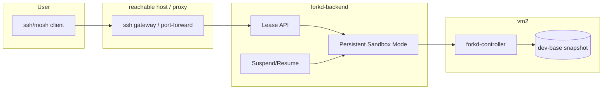
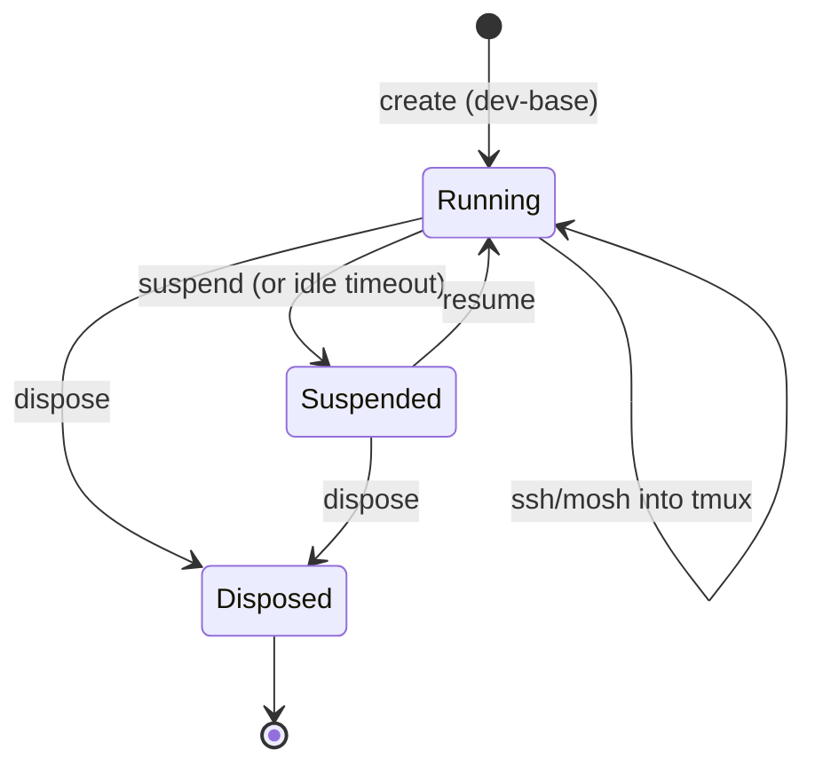

# exe.dev-style Interactive Dev Environment on forkd - Plan

**Target repo:** `lacy.casa/forkd-service` (at `forgejo-work/hyper-forgejo-runner/`)

## Goal Capsule

Build an exe.dev-style interactive dev environment on forkd: the user can **ssh/mosh into a tmux session** inside a forkd microVM from anywhere, work/code/try out ideas, and then **suspend, dispose, or keep-alive** the microVM arbitrarily — with an optional suspend timeout. This is the "interactive, persistent, on-demand dev box" layer on top of the forkd lease API, distinct from the batch `executeCode` path.

**Authority hierarchy:** the plan is the authority for scope and sequencing. The user (Jason) owns product decisions; the implementer owns execution details the plan leaves open.

**Stop conditions:** stop when a user can ssh/mosh into a tmux session in a forkd microVM, work in it, and suspend/dispose/keep-alive it on demand (with a suspend timeout), all through a small CLI or service. Do not build the full exe.dev subscription platform, billing, or sharing in this plan.

**Tail ownership:** the implementer owns the code, tests, and deployment of the interactive dev environment. The user owns the decision on the exact CLI surface and suspend-timeout semantics.

## Product Contract

### Summary

exe.dev gives you "VMs, on the internet, quickly" — virtual machines with persistent disks, immediately accessible over HTTPS, shareable, with optional auth. The user wants the homelab equivalent on forkd: ssh/mosh into a tmux session in a forkd microVM from anywhere, work/code/try ideas, then suspend/dispose/keep-alive arbitrarily, with a suspend timeout. This is the interactive counterpart to the batch `executeCode`/command-adapter path.

### Problem Frame

The forkd lease API currently supports batch execution (create → exec → release). The user wants an **interactive, persistent** dev environment: a microVM they can ssh into, keep a tmux session running, and control the lifecycle of (suspend/dispose/keep-alive). This requires: (1) network access to the microVM (ssh/mosh), (2) a persistent sandbox that survives across connections, (3) a lifecycle control surface (suspend/dispose/keep-alive + timeout), and (4) an LLM-based dev environment pre-baked into the image.

### Requirements

**R1. Interactive access.** The user can ssh (and ideally mosh) into a tmux session inside a forkd microVM from anywhere (including over the homelab network / via a reachable endpoint).

**R2. Persistent sandbox.** A dev microVM persists across connections and sessions; the tmux session survives disconnect/reconnect.

**R3. Lifecycle control.** The user can suspend, dispose, or keep-alive a dev microVM arbitrarily, with an optional suspend timeout (auto-suspend after N minutes idle).

**R4. LLM-based dev environment.** The dev image includes an LLM-based coding environment (e.g. a coding agent CLI) ready to go, so the user can work with AI assistance immediately.

**R5. Image selection.** The dev environment uses a forkd image tag (e.g. `dev-base` or a language base) with the dev tooling baked in.

**R6. Lease/TTL integration.** The dev microVM is a forkd lease; TTL enforcement prevents orphaned microVMs, but the user can extend/keep-alive.

### Scope Boundaries

**In scope:** interactive ssh/mosh access to a forkd microVM, persistent tmux session, lifecycle control (suspend/dispose/keep-alive + timeout), and an LLM-based dev image.

**Deferred to Follow-Up Work:**
- exe.dev's full platform (billing, sharing, HTTPS web access, multi-user)
- The CFOS `executeCode` batch path (separate plan)
- Web-based terminal (browser ssh) — start with native ssh/mosh

**Outside this product's identity:** modifying forkd itself (upstream); the Cloudflare Workers platform.

## Planning Contract

### Key Technical Decisions

**KTD1. Persistent sandbox via a new lease mode.** The forkd lease API needs a "persistent" or "interactive" sandbox mode (vs. the current batch create→exec→release). This is a backend extension: a sandbox that stays alive, is addressable over the network, and can be suspended/resumed.

**KTD2. Network access via a reachable endpoint.** The microVM needs an ssh/mosh-reachable address. Options: (a) a port-forward/proxy on a reachable host (e.g. Caddy or a dedicated ssh gateway), or (b) direct network access if the microVM is on a routable netns. The plan should pick a reachable endpoint (likely a gateway/proxy on the homelab edge).

**KTD3. tmux as the session anchor.** The user's mental model is "ssh into a tmux session." The dev image runs tmux; the ssh entrypoint attaches to a named tmux session (create if absent). This gives persistence across disconnect.

**KTD4. Lifecycle via a CLI/service.** A small CLI (e.g. `forkd-dev`) or service exposes `create`, `ssh`, `suspend`, `resume`, `dispose`, `keep-alive`, and `status`. Suspend timeout is a configurable idle timer.

**KTD5. LLM dev image.** Bake a `dev-base` image with tmux, ssh server, git, and an LLM coding agent CLI (e.g. a Go/Lua agent like `jem`, or a generic LLM CLI). This is the "ready to go" dev environment.

**KTD6. SSH-as-API control plane (exe.dev's core design).** exe.dev's entire control plane is an SSH REPL: `ssh exe.dev new --json`, `ssh exe.dev ls --json`, `ssh exe.dev rm <vm>`. The HTTPS API is literally "the SSH API shoved into a POST body" (`POST https://exe.dev/exec`). One API to learn, debuggable interactively over SSH, scriptable over HTTPS. This is a better model than a bespoke CLI — same interface for humans and automation. The `forkd-dev` CLI should be an SSH REPL (or expose an SSH-command surface) rather than a standalone binary.

**KTD7. `cp` clone as a first-class operation.** exe.dev's `ssh exe.dev cp my-vm my-vm-copy` clones a VM (with optional `--cpu/--memory/--disk`). This is a killer dev-workflow feature (copy a working env, experiment, discard). Forkd's snapshot-diff/branch mechanism can do this natively — a `forkd-dev cp` should be in scope.

**KTD8. Off-VM credential integrations.** exe.dev holds credentials off-VM (GitHub, LLM, Slack, AWS/GCP WIF) and exposes them to the VM via integration hostnames (`https://github.int.exe.xyz/...`) — the VM never sees the token. This is the same security model as CFOS gatekeepers, and the pattern forkd sandboxes should follow: credentials held off-VM, sandbox gets a capability, not a key.

### High-Level Technical Design



**Lifecycle:**


**CLI surface (directional):**
```
forkd-dev create [--image dev-base] [--suspend-timeout 30m]   → {id, ssh_cmd}
forkd-dev ssh <id>                                            → attach to tmux session
forkd-dev suspend <id>                                        → suspend (freeze)
forkd-dev resume <id>                                         → resume
forkd-dev dispose <id>                                         → kill + release
forkd-dev keep-alive <id> [--timeout 1h]                      → extend lease
forkd-dev status <id>                                          → running/suspended/disposed
```

### Assumptions

- forkd-backend lease API is live on vm2 at `https://vm2.lacy.casa:8890`.
- A reachable ssh gateway/proxy exists (or is added) on the homelab edge for external access.
- The dev image (`dev-base`) is baked with tmux, ssh server, git, and an LLM coding agent.
- The user accesses from anywhere, so the gateway must be reachable externally (but internal traffic never via Pangolin).

## Implementation Units

### U1. Persistent sandbox mode in the lease API

**Goal:** Extend the forkd-backend lease API to support persistent/interactive sandboxes that stay alive, are network-addressable, and can be suspended/resumed — distinct from the batch create→exec→release path.

**Requirements:** R2, R3, R6

**Dependencies:** none

**Files:**
- `api/service.go` (modify — add persistent sandbox lifecycle)
- `api/server.go` (modify — new endpoints)
- `api/service_test.go` (new tests)

**Approach:** Add a `persistent: true` flag to sandbox creation. Persistent sandboxes are not auto-released after exec; they stay alive until suspended/disposed/TTL. Add `suspend`/`resume` endpoints (freeze/unfreeze the microVM via forkd) and a `keep-alive`/extend-TTL endpoint. Track state (running/suspended/disposed).

**Patterns to follow:** existing `api/service.go` lease lifecycle; `runner/pool.go` state tracking.

**Test scenarios:**
- Happy path: create a persistent sandbox, exec, it stays alive.
- Happy path: suspend → resume → exec still works.
- Edge case: suspend an already-suspended sandbox is a no-op.
- Error path: dispose a disposed sandbox is a no-op.
- Integration: a persistent sandbox survives across multiple exec calls.

**Verification:** `go test ./api/...` passes; a persistent sandbox survives exec, suspends, resumes, and disposes cleanly.

### U2. Network access (ssh gateway / proxy)

**Goal:** Make a persistent sandbox reachable over ssh/mosh from anywhere.

**Requirements:** R1

**Dependencies:** U1

**Files:**
- `deploy/ssh-gateway.service` (new, systemd unit) or Caddy config
- `deploy/README.md` (update)

**Approach:** Add a reachable ssh gateway/proxy that forwards ssh/mosh connections to the sandbox's address. Options: a dedicated ssh gateway service on a reachable host, or a Caddy TCP proxy. The gateway maps a stable external address to the sandbox's internal address.

**Patterns to follow:** `deploy/forkd-runner.service` (systemd unit pattern); Caddy config in the `caddy` repo.

**Test scenarios:**
- Happy path: `ssh <gateway>` reaches the sandbox's tmux session.
- Integration: mosh connects and survives network changes.
- Error path: sandbox suspended → ssh connection is refused or queued.

**Verification:** a real ssh (and mosh) connection from outside reaches the sandbox's tmux session.

### U3. `forkd-dev` control plane (SSH-as-API)

**Goal:** An SSH REPL (or SSH-command surface) exposing create/ssh/suspend/resume/dispose/keep-alive/status/cp for interactive dev sandboxes — mirroring exe.dev's "the API is SSH" design.

**Requirements:** R3, R6

**Dependencies:** U1, U2

**Files:**
- `cmd/forkd-dev/main.go` (new)
- `forkddev/server.go` (new — SSH command dispatcher)
- `forkddev/server_test.go` (new)
- `forkddev/client.go` (new)

**Approach:** A small SSH server (or an SSH-command dispatcher) that accepts commands like `ssh forkd-dev new --json`, `ssh forkd-dev ls --json`, `ssh forkd-dev suspend <id>`, `ssh forkd-dev cp <id> <new>`. Each command maps to a lease-API call. JSON output for automation, human-readable for interactive use. This is the exe.dev model (KTD6): one interface for humans and scripts.

**Patterns to follow:** exe.dev's SSH REPL design (KTD6); `cmd/forkd-runner/main.go` (env config); `forkd/client.go` (HTTP client).

**Test scenarios:**
- Happy path: `new` returns a sandbox id + ssh command.
- Happy path: `ls --json` reflects running/suspended/disposed.
- Happy path: `cp` clones a sandbox.
- Error path: `dispose` on a nonexistent id returns a clear error.
- Integration: `new` → `ssh` → `suspend` → `resume` → `dispose` works end-to-end over SSH.

**Verification:** `go test ./forkddev/...` passes; the full lifecycle works over an SSH session against a live backend.

### U4. Bake `dev-base` image (LLM dev environment)

**Goal:** Bake a forkd `dev-base` snapshot with tmux, ssh server, git, and an LLM coding agent CLI.

**Requirements:** R4, R5

**Dependencies:** none

**Files:**
- `deploy/bake-dev-base.sh` (new)

**Approach:** Build a Docker image with tmux, openssh-server, git, and an LLM coding agent, then `forkd from-image` it. Apply the PATH-symlink fix and `--size-mib` lessons from the go-base bake. **Candidate agent: Shelley** (`github.com/boldsoftware/shelley`) — a Go, mobile-friendly, web-based, multi-conversation, multi-model, single-user coding agent. It's "built for but not exclusive to exe.dev," does not come with auth/sandboxing ("bring your own"), and runs on port 9999 in exe.dev's default image. It's a strong fit for `dev-base` (Go binary, web UI, no sandboxing needed since forkd provides isolation). `jem` (the homelab's Go+Lua agent) is the alternative. **Image spec is deferred to implementation time** (per Jason).

**Patterns to follow:** `deploy/bake-go-base.sh` (PATH fix, `FORKD_SCRIPTS_DIR`, `--size-mib`).

**Test scenarios:**
- Happy path: `tmux`, `ssh`, `git`, and the LLM agent CLI all resolve in a spawned `dev-base` sandbox.
- Edge case: rootfs size sufficient (dev image is large; use `--size-mib`).

**Verification:** `forkd images` lists `dev-base`; a spawned sandbox runs `tmux`, `ssh`, `git`, and the LLM agent CLI.

### U5. Suspend timeout (idle auto-suspend)

**Goal:** Add an optional suspend timeout: a persistent sandbox auto-suspends after N minutes idle.

**Requirements:** R3

**Dependencies:** U1

**Files:**
- `api/service.go` (modify — idle timer)
- `api/service_test.go` (new tests)

**Approach:** When a persistent sandbox is created with a `suspend_timeout`, track last-activity time. If no exec/ssh activity for the timeout, auto-suspend. `keep-alive` resets the timer.

**Patterns to follow:** existing TTL enforcement in `api/service.go`.

**Test scenarios:**
- Happy path: a sandbox with a short suspend timeout auto-suspends after idle.
- Happy path: activity resets the timer.
- Edge case: `keep-alive` extends the timeout.

**Verification:** `go test ./api/...` passes; a sandbox with a short timeout auto-suspends after idle and resumes on demand.

### U6. `cp` clone operation

**Goal:** Add a `cp` operation that clones a persistent sandbox (with optional `--cpu/--memory/--disk`), mirroring exe.dev's `ssh exe.dev cp my-vm my-vm-copy`.

**Requirements:** R2, R3

**Dependencies:** U1, U3

**Files:**
- `api/service.go` (modify — clone endpoint)
- `api/service_test.go` (new tests)
- `forkddev/server.go` (modify — `cp` command)

**Approach:** A `POST /api/sandboxes/{id}/clone` endpoint that snapshots the source sandbox's disk and spawns a new sandbox from it (forkd's snapshot-diff/branch mechanism). The clone gets a fresh id, independent state, and its own lifecycle. `forkd-dev cp <id> <new>` maps to this.

**Patterns to follow:** exe.dev's `cp` (KTD7); forkd's snapshot-diff/branch mechanism.

**Test scenarios:**
- Happy path: `cp` clones a sandbox with independent state.
- Happy path: `cp --memory/--cpu` resizes the clone.
- Edge case: cloning a suspended sandbox works.
- Error path: cloning a nonexistent id returns a clear error.
- Integration: `cp` a running sandbox, modify the clone, original is unaffected.

**Verification:** `go test ./api/...` passes; `forkd-dev cp` clones a sandbox end-to-end with independent state.

## Deferred to Follow-Up Work

- exe.dev's full platform (billing, sharing, HTTPS web access, multi-user)
- Web-based terminal (browser ssh) — start with native ssh/mosh
- The CFOS `executeCode` batch path (separate plan)
- **Shelley integration** — a follow-up ce-plan to evaluate and integrate Shelley (`github.com/boldsoftware/shelley`) as the `dev-base` coding agent (Go, web-based, multi-model, single-user, no auth/sandboxing — forkd provides isolation). This plan notes it as the candidate agent (U4) but defers the full integration design.

## Open Questions

- **RESOLVED: Which LLM coding agent in `dev-base`?** Shelley (`github.com/boldsoftware/shelley`) is the leading candidate — Go, web-based, mobile-friendly, multi-model, single-user, no auth/sandboxing (forkd provides isolation). `jem` (homelab Go+Lua agent) is the alternative. **Image spec deferred to implementation time** (per Jason). A Shelley integration follow-up ce-plan is proposed.
- **RESOLVED: Dedicated ssh gateway vs Caddy TCP proxy?** Deferred to implementation — depends on existing Caddy setup and external reachability. The plan supports either (U2).
- **RESOLVED: Default suspend timeout?** Deferred to implementation — per-sandbox configurable (U5), no global default set at plan time.
