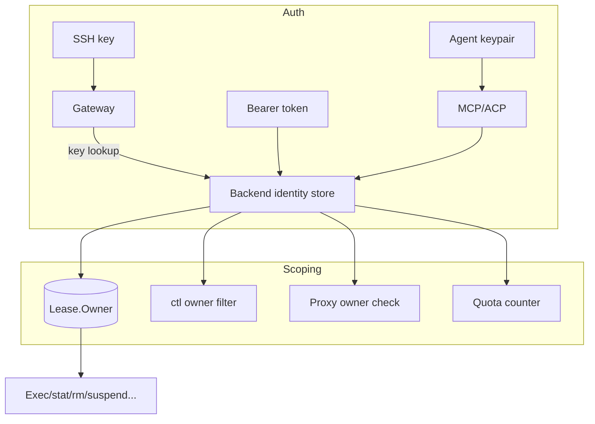

# Multi-user Tenancy (epic #26) - Plan

## Goal Capsule

- **Objective:** make spoond multi-user — people and agents authenticate as first-class identities, and every lease, ctl action, proxy route, and LLM call is owner-scoped.
- **Authority:** both decision gates are **resolved (Jason, 2026-08-11)**: KTD-1 separate keypair per agent; KTD-2 first user is admin. No implementation blockers remain.
- **Execution profile:** code, phased. T1 first; T2/T3 depend on T1; T4/T7/T8 depend on identity+ownership; T6 last (needs T2).
- **Stop conditions:** v1.1 ships when T1–T8 each pass their verification contract; multi-user is the headline, single-user keeps working (no regression in the existing 219-test suite).
- **Tail ownership:** the two decision gates are Jason's; implementation units are the executor's; the owner-serialization gap (R9) rides in T2.

## Product Contract

### Summary

spoond is single-operator today: one SSH key, a small set of shared consumer tokens, and leases that carry an `owner` field that is enforced but never exposed. This plan turns identity into a first-class concept — per-user keys, per-agent keys, owner-scoped everything — without breaking the existing single-user flow.

### Problem Frame

The v1.0 foundation (seed work in #22) deliberately kept identity implicit: `--client-keys` is a directory scan of public keys (added a user = drop a .pub + restart), `CONSUMER_TOKENS` maps token→consumer name, and `Lease.Owner` exists but is single-token in practice. Opening spoond to multiple people and agents fails today because: (1) every SSH user authenticates as the same gateway identity, (2) HTTP/API auth is a shared bearer token with no per-user attribution, (3) there is no agent identity at all — MCP/ACP sessions all speak as one `FORKD_TOKEN`, (4) ctl/proxy/LLM surfaces have no ownership filter.

### Requirements

**Identity**
- R1. The SSH gateway maps each authorized public key to a stable user identity (key → account), replacing the implicit single-user model.
- R2. The backend accepts per-user bearer tokens; a token authenticates as exactly one user, and leases created with it record that user.
- R3. The ctl plane gains a real `ssh-key` verb to register/inspect/revoke keys, so adding a user stops requiring a manual file drop.
- R4. Agent endpoints (MCP, ACP) authenticate as an agent identity, not a shared consumer token.

**Ownership & scoping**
- R5. Lease ownership is serialized in API responses (the owner field exists and is enforced but is never returned today).
- R6. Every lease-scoped operation (rm, suspend, resume, cp, stat, restart, keepalive, prompt, shelly, exec) is owner-scoped at the gateway and proxy, matching the API's existing cross-consumer 404.
- R7. ctl list/verbs filter by owner: users see their own leases; admins see all.
- R8. The HTTP proxy authenticates requests (Authelia forward-auth) and routes only to leases the caller owns or has been granted.

**Agents, quotas, sharing**
- R9. Agents are users: their own keypair, their own leases, their own audit trail.
- R10. Per-user lease caps and resource accounting are enforced at create time.
- R11. A `share` verb grants another user HTTPS/SSH access to a lease; sharing is revocable.
- R12. The LLM gateway authenticates per user and meters against their quota.

**Non-goals (deferred)**
- Billing/metered pricing (quota layer is the foundation, not the product).
- Multi-node / federated identity (single Forgejo instance is the identity source).
- Per-lease network-policy changes (separate concern, already shipped).

### Actors

- A1. **Owner/admin** (Jason): full access, sees all leases, manages users.
- A2. **User**: own keys, own leases, own ctl scope; can receive shares.
- A3. **Agent** (MCP/ACP/Buzz): own identity, own leases, programmatic auth.

## Planning Contract

### Key Technical Decisions

- **KTD-1. Agent identity model: separate keypair per agent (Buzz-style).**
  **DECIDED (Jason, 2026-08-11): separate keypair per agent.** Namespaced
  leases under an owner were the rejected alternative — they conflate
  identity with ownership and make audit trails unusable. Each agent gets
  its own keypair, leases, quota, and audit trail.
- **KTD-2. Admin role: single admin for v1.1, role model later.**
  **DECIDED (Jason, 2026-08-11): first user is admin.** One `admin` flag on
  the identity satisfies T5's "admin sees all" with zero role-management
  machinery; RBAC can layer on the same identity table without migration.
- **KTD-3. Backward compatibility is a hard requirement.** Existing single-user deployments (one key, one consumer token, jason's leases) keep working unchanged; the new identity layer defaults to "first key = admin".
- **KTD-4. Identity source of truth stays in the backend.** The gateway asks the backend for key→user resolution (it already calls it for leases); keys never live only in the gateway config.

### High-Level Technical Design

Identity lives in the backend (a `users` table: id, name, kind=person|agent, admin flag, key fingerprints, token hashes, quotas). The gateway resolves SSH keys against it; the API resolves bearer tokens against it; agents get their own rows. Leases keep `Owner` and gain the serialization; all scoping checks call the same owner predicate.

### Sequencing

1. T1 (identity foundation: users table, key→user, token→user, ssh-key verb) — blocks T2/T3/T5/T7/T8.
2. T2 (ownership serialization + gateway/proxy scoping) and T3 (agents as users) — parallel after T1.
3. T5 (ctl scoping) after T2; T4 (quotas) after T1; T7 (HTTP) after T2; T8 (LLM) after T1+T4.
4. T6 (sharing) last — depends on T2 and the share verb's own tests.

### Assumptions

- Forgejo/Authelia remain the identity source for the HTTP side (already in stack per exe.dev triage).
- vm2's gateway keys directory keeps working as the bootstrap path (first key → admin).
- The integration suite runs on vm2 and is the acceptance gate for every unit.

## Implementation Units

| U-ID | Title | Files (key) | Depends on |
|---|---|---|---|
| U1 | Identity foundation (T1/#28) | `api/service.go`, `api/server.go`, `cmd/spoond-sshd-gateway/main.go`, new `identity/` | — |
| U2 | Owner serialization (T2/#29 part 1) | `api/server.go`, `api/service.go` | U1 |
| U3 | Gateway+proxy scoping (T2/#29 part 2) | `cmd/spoond-sshd-gateway/main.go`, `api/server.go` | U2 |
| U4 | Agents as users (T3/#30) | `mcp/server.go`, `acp/agent.go`, `acp/server.go` | U1, U2 |
| U5 | Quotas (T4/#31) | `api/service.go`, `cmd/spoond-backend/main.go` | U1 |
| U6 | ctl scoping (T5/#32) | `cmd/spoond-sshd-gateway/main.go`, gateway ctl handlers | U2 |
| U7 | HTTP layer (T7/#34) | `api/server.go` proxy handler, deploy units | U2 |
| U8 | LLM gateway per-user (T8/#35) | `api/server.go` llm handler | U1, U5 |
| U9 | Sharing (T6/#33) | `api/service.go`, gateway ctl, proxy | U2 |

### U1. Identity foundation (T1/#28)

- **Goal:** users table + key→user + token→user; `ssh-key` ctl verb; first key = admin.
- **Files:** `api/service.go`, `api/server.go`, `cmd/spoond-sshd-gateway/main.go`, `identity/` (new), `cmd/spoond-sshd-gateway/main_test.go`.
- **Approach:** add a users store keyed by user id with fields name/kind/admin/fingerprints/token-hash. Bootstrap: on first start, any key in the gateway keys dir that isn't known becomes the admin's key (KTD-3). Gateway resolves SSH keys via a new backend endpoint `GET /api/users/by-key` (KTD-4). `ssh-key` verb: `ssh-key add <pubkey> <user>`, `ssh-key ls`, `ssh-key rm <id>`.
- **Test scenarios:** key→user lookup; unknown key rejected; first key becomes admin; token→user mapping; ssh-key add/ls/rm round-trip.
- **Verification:** `go test ./identity/... ./api/...`; ctl `ssh-key` suite; existing gateway tests still pass.

### U2. Owner serialization (T2/#29 part 1)

- **Goal:** `owner` appears in lease responses; create-time ownership is set from the authenticated user.
- **Files:** `api/server.go`, `api/service.go`.
- **Approach:** serialize `Owner` in list/create/stat JSON; create sets owner from the bearer token's user (falling back to the consumer name for legacy tokens). This is the small seed gap (R5).
- **Test scenarios:** create as user → response shows owner; legacy consumer token → owner = consumer name.
- **Verification:** `go test ./api/...`; `test_lease_api.sh` owner assertions.

### U3. Gateway+proxy scoping (T2/#29 part 2)

- **Goal:** rm/suspend/resume/cp/stat/restart/keepalive/prompt/shelly/exec owner-scoped at gateway and proxy.
- **Files:** `cmd/spoond-sshd-gateway/main.go`, `api/server.go` proxy handler.
- **Approach:** the gateway already receives the lease-id in the username; add an ownership check before issuing each verb. Proxy: require a valid session identity (from T7's forward-auth or a per-lease token) and check `Lease.Owner`.
- **Test scenarios:** user B cannot rm user A's lease via gateway; proxy denies cross-owner route.
- **Verification:** extended `test_ctl.sh` with two identities; proxy denial test.

### U4. Agents as users (T3/#30)

- **Goal:** MCP/ACP sessions authenticate as agent identities with own leases + audit trail.
- **Files:** `mcp/server.go`, `acp/agent.go`, `acp/server.go`, `cmd/spoond-acp/main.go`, `cmd/spoond-dev-mcp/main.go`.
- **Approach:** agents get `kind=agent` users; the MCP/ACP env contract moves from shared `FORKD_TOKEN` to per-agent credentials (`FORKD_AGENT_TOKEN` or keypair), resolving to the agent's user id; sessions create leases owned by that agent.
- **Test scenarios:** two agents → disjoint leases; agent's leases appear under its own owner; audit entries attribute correctly.
- **Verification:** `test_mcp.sh`/`test_acp.sh` with per-agent creds; agent audit assertions.

### U5. Quotas (T4/#31)

- **Goal:** per-user lease caps + accounting, enforced at create.
- **Files:** `api/service.go`, `cmd/spoond-backend/main.go`.
- **Approach:** quota columns on users (max concurrent leases, max TTL); create checks count+TTL before leasing; accounting counters updated on create/release/suspend.
- **Test scenarios:** cap hit → 429 with clear error; TTL cap clamp; release frees quota.
- **Verification:** `go test ./api/...`; API quota test via curl.

### U6. ctl scoping (T5/#32)

- **Goal:** ctl verbs filter by owner; admin sees all.
- **Files:** `cmd/spoond-sshd-gateway/main.go`.
- **Approach:** `ls` takes the authenticated user (already known from key resolution); non-admin gets `WHERE owner = user`; admin gets all. `whoami` returns the identity.
- **Test scenarios:** user ls shows only own leases; admin ls shows all; whoami shows identity.
- **Verification:** extended `test_ctl.sh`; two-identity fixture.

### U7. HTTP layer (T7/#34)

- **Goal:** proxy auth + per-user domains/CNAMEs.
- **Files:** `api/server.go`, `deploy/` units, Caddy config notes.
- **Approach:** Authelia forward-auth on the proxy host; after auth, the proxy resolves the user and checks lease ownership; per-user domains map `user.sandbox.lacy.casa` → the user's leases (with #15).
- **Test scenarios:** unauthenticated proxy request → redirect; authenticated non-owner → 403; owner → stream.
- **Verification:** browser-level test through Caddy (or curl with forward-auth headers).

### U8. LLM gateway per-user (T8/#35)

- **Goal:** LLM gateway authenticates per user, meters against quota.
- **Files:** `api/server.go` llm handler.
- **Approach:** the per-lease LLM route validates the lease owner; a per-user key replaces the shared upstream key path for attribution; quota check from U5.
- **Test scenarios:** cross-owner lease LLM call → 403; per-user key works; quota enforced.
- **Verification:** API test hitting `/llm/<lease-id>/openai/chat/completions` as owner/non-owner.

### U9. Sharing (T6/#33)

- **Goal:** `share` verb grants + revokes lease access.
- **Files:** `api/service.go`, `cmd/spoond-sshd-gateway/main.go`, proxy handler.
- **Approach:** a share table (lease, grantee, mode=ssh|http, expires); owner-only grants; scoping checks consult shares before denying; `share ls/rm`.
- **Test scenarios:** grant → grantee can exec; revoke → denied; expiry honored; owner-only grant.
- **Verification:** two-identity ctl + proxy test.

## Verification Contract

| Check | Command | Applies to |
|---|---|---|
| Unit tests | `go test ./... -count=1` | every unit |
| Vet + format | `go vet ./... && gofmt -l .` (must be empty) | every unit |
| Lease API suite | `tests/integration/test_lease_api.sh` | U2, U5, U8 |
| Gateway/ctl suite | `tests/integration/test_gateway.sh test_ctl.sh test_ctl_new.sh` | U1, U3, U6, U9 |
| MCP/ACP suite | `tests/integration/test_mcp.sh test_acp.sh` | U4 |
| Stat/pretty suite | `tests/integration/test_stat_pretty.sh` | U2, U6 |
| Full suite (vm2) | `tests/integration/run.sh` — 219+ PASS, only known netpolicy flake allowed | all |
| Multi-identity fixture | two SSH keys + two tokens; each surface exercised as owner and non-owner | U1, U3, U6, U7, U9 |

## Definition of Done

- **Global:** all units green per Verification Contract; existing 219-test suite still passes (no single-user regression); README documents multi-user setup (keys, agents, quota, share).
- **Per-unit:** each U-* lists its verification; no launch-blocking open question remains (KTD-1/KTD-2 resolved).
- **Cleanup:** no dead-end experimental code in the diff; abandoned approaches removed, not commented out.
