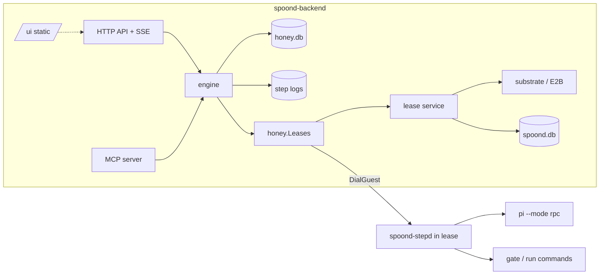

# Honey flightplans: the engine, the catalog and the live view (draft for decision)

Status: **draft for decision, 2026-10-02.** Epic #78. Covers #85 (live
view) in full and the parts of #84, #87 and #88 that the engine needs.
Decisions are numbered W1-W66. Build order at the end.

Implementation starts on a branch off `main`, after `feat/e2b-substrate`
is fully merged. Paths below are `main`'s (module `github.com/jrimmer/spoond/v2`).

## Why

Every piece of unattended work is the same shape with different glue:
CI jobs (the runner), bees (`worker-start.sh`, the agent-hub `swarm-*`
scripts and Agent Mail), image builds and deploy windows. The state
machine that joins them lives in mail subjects and laptop scripts. Nobody
owns it. When vm1 stalled on 2026-10-02 every bee stopped. When the
laptop closes nothing dispatches work.

Honey owns that state machine. A **flightplan** is a versioned definition in
Honey's catalog. A **flight** is one execution of it. Honey stores the flight's
state, its history and its messages, and it recovers them after any
crash. Jobs, the hive, CI and agent coordination become flightplans.

## What this document decides

| # | Decision | Section |
|---|---|---|
| W1 | Build our own engine on SQLite. Borrow Temporal's semantics, not its code. | [Build or adopt](#build-or-adopt) |
| W2 | The engine runs inside `spoond-backend`, with its own database file `honey.db`. | [Architecture](#architecture) |
| W3 | Definitions are structured YAML blocks, not a free graph. | [Definition language](#definition-language) |
| W4 | Expressions are CEL, type-checked on publish. | [Expressions](#expressions-cel) |
| W5 | Parameters, state and outputs are typed with JSON Schema. | [Types](#types-json-schema) |
| W6 | Steps declare what they read and write. Data flow is explicit. | [Data flow](#data-flow-is-explicit) |
| W7 | The catalog is versioned and immutable; a flight pins its version. v3.0 resolves exact versions and latest; the `^` compatibility rule is v3.1 (#99). | [Catalog](#the-catalog) |
| W8 | Every state change commits with its event, in one transaction. | [Durability](#durability-model) |
| W9 | Intent before action; replay policy decides what happens after a crash. | [Durability](#durability-model) |
| W10 | Request ids make starts and signals exactly-once. | [Signals](#signals-questions-memos-and-steering) |
| W11 | A step supervisor (`spoond-stepd`) runs inside the lease and keeps processes alive across engine restarts. | [stepd](#stepd-the-step-supervisor-in-the-lease) |
| W12 | The substrate gains file operations (envd filesystem). | [stepd](#stepd-the-step-supervisor-in-the-lease) |
| W13 | Agent steps drive a harness through one contract; Pi in RPC mode is the first. | [Harness](#the-harness-contract-and-pi) |
| W14 | Ownership tree: flights own child flights, forks, leases and locks; cancel is bottom-up. | [Ownership](#ownership-cancellation-and-locks) |
| W15 | Attach = snapshot at a sequence number, then a resumable SSE stream. | [Attach](#attach-the-event-stream) |
| W16 | The live view is a React Flow app with elkjs layout, served by the backend at `/ui`. | [Live view](#the-live-view-85) |
| W17 | The UI's built assets are committed; `go build` needs no Node. | [Live view](#build-and-delivery) |
| W18 | The engine is tested by crashing it at every write. | [Testing](#testing-reliability-first) |
| W19 | Triggers and concurrency limits replace the hive core (swarm plan step 4). | [Triggers](#triggers-and-the-hive) |
| W20 | The bee loop is the built-in `ralph-ticket` flightplan, with the 2026-10-02 lessons as rules. | [Bee loop](#the-bee-loop-as-a-flightplan) |
| W21 | The orchestrator is not a microVM. The log is the durable truth; a VM per flight adds cost and no durability. | [MicroVMs](#microvms-in-the-engine) |
| W22 | Steps can checkpoint their lease's memory: retries and resumes start from the pre-step state. | [MicroVMs](#microvms-in-the-engine) |
| W23 | Lease forks parallelize work inside a flight: test shards and speculative attempts. | [MicroVMs](#microvms-in-the-engine) |
| W24 | A failed step can keep a paused snapshot; a person opens a shell at the exact failure. | [MicroVMs](#microvms-in-the-engine) |
| W25 | Custom step types are images with a JSON contract, run in a lease. | [MicroVMs](#microvms-in-the-engine) |
| W26 | Ticket sources, notifiers and git hosts are providers: named, typed activities, as in Temporal. br and Forgejo first. | [Providers](#providers-ticket-sources-notifiers-git-hosts) |
| W27 | Questions go to the flight's owner. Escalation is v3.1 (#102). | [Signals](#signals-questions-memos-and-steering) |
| W28 | Notifications: webhook (ntfy first, chat presets) and subscriptions to flight events in v3.0; mail is v3.1 (#102). | [Providers](#providers-ticket-sources-notifiers-git-hosts) |
| W29 | Retention: step logs and session files 30 days, plus a manual pin; "forever when merged" is v3.1 (#107). | [Storage](#storage-honeydb) |
| W30 | A `return` step ends the flight early with an outcome (`succeeded`, `failed`, `blocked`) and a reason. | [Ending a flight early](#ending-a-flight-early-return) |
| W31 | Branches have names; the graph labels its edges with them. | [Named branches](#named-branches) |
| W32 | The interactive agent is a conversation: a declared mode, a chat pane, a notification (v3.1, #99). | [Interactive agent](#the-interactive-agent) |
| W33 | `each` fans a block out over a list, with iteration-local state and a collected result. | [each](#each-fan-out-over-a-list) |
| W34 | Notification targets include named groups (teams) (v3.1, #102). | [Providers](#providers-ticket-sources-notifiers-git-hosts) |
| W35 | Honey ships a library of building-block flightplans; the loop is one of them, separate from ticket handling. | [Building blocks](#building-blocks-the-built-in-library) |
| W36 | MCP is the primary way to create, edit, publish and run flightplans; agents compose them in v3. The backend serves it at `/mcp`. | [Agents as authors](#agents-as-authors) |
| W37 | Every flight records usage and cost; token budgets bind every profile. Money budgets and profile comparison are v3.1 (#99). | [Cost](#cost-budgets-and-comparing-profiles) |
| W38 | Two-way channels: chat replies and buttons become signals; a flight's progress mirrors onto its ticket. The first channel provider speaks the Discord bot API, aimed at Hrmny (v3.1, #100). | [Channels](#two-way-channels-and-ticket-mirroring) |
| W39 | Perpetual flightplans continue as new, so their history stays bounded (v3.1, #105). | [Perpetual flightplans](#perpetual-flightplans) |
| W40 | Promotion and release are policy: a person approves by default; a project can allow automatic promotion when every gate passes and a distinct person has approved (v3.1, #99). | [Promotion](#promotion-and-release-policy) |
| W41 | The flight log is tamper-evident: each event carries the hash of the one before it (v3.1, #107). | [Durability](#durability-model) |
| W42 | ACP is a harness, next to Pi: any agent that speaks ACP can back a profile (v3.1, #109). | [Harness](#the-harness-contract-and-pi) |
| W43 | Chat starts and steers flights: mentions and slash commands are triggers (v3.1, #100). | [Channels](#two-way-channels-and-ticket-mirroring) |
| W44 | Liveness is visible: heartbeat age, progress age and a "stalled" state on every active step. The lease health panel is v3.1 (#108). | [Live view](#the-live-view-85) |
| W45 | Flights have participants with roles (watch, answer, approve, control), like lease shares (v3.1, #102). v3.0 has owner and admin only. | [Ownership](#ownership-cancellation-and-locks) |
| W46 | Names: a definition is a **flightplan**, one execution of it is a **flight**. | [Names](#names) |
| W47 | Leases have generations; a restore freezes the lease's step processes until the engine decides, and a lost lease restarts its lease block. | [Durability](#durability-model) |
| W48 | Flights survive Honey upgrades: versioned events and stepd protocol, additive migrations, `engine_version` per flight. The cross-version test is v3.1 (#107). | [Durability](#durability-model) |
| W49 | Where steps run: lease steps need an enclosing `lease`, `defaults.lease` or the caller's lease (`inherit`); `git push` runs on the host. | [Where steps run](#where-steps-run) |
| W50 | Flights have statuses (queued, running, waiting, done) and an engine drain for deploys. Pause, deadline and priority are v3.1 (#103). | [Flight lifecycle](#flight-lifecycle) |
| W51 | A circuit breaker per provider (v3.1, #103). v3.0 keeps the rule that an infrastructure error whose effect provably never started does not spend retries or rounds. | [Flight lifecycle](#flight-lifecycle) |
| W52 | State is capped (1 MiB); large outputs are artifacts. | [Types](#types-json-schema) |
| W53 | Untrusted-input tracking (v3.1, #104). v3.0 keeps: no expressions in scripts, untrusted values in argv only after `--`, and the W62 credential rules. | [Security](#security) |
| W54 | Named secrets have an allow-list bound to identities and to (namespace, name, version sha). | [Security](#security) |
| W55 | Triggers authenticate (signed webhooks with per-trigger secrets and replay dedupe) and are rate-limited per identity. | [Security](#security) |
| W56 | Dry runs: a flightplan runs against fixtures, with no leases or models, to test its routing. | [Dry runs](#dry-runs-with-fixtures) |
| W57 | Each step in a lease records the repository revision it left (v3.1, #106). | [Dry runs](#dry-runs-with-fixtures) |
| W58 | Reset a flight to a step (v3.1, #106). | [Dry runs](#dry-runs-with-fixtures) |
| W59 | The live view can start a flight from a form generated from its params (v3.1, #108). | [Live view](#the-live-view-85) |
| W60 | OpenTelemetry export, one span per step (v3.1). | [Observability](#observability) |
| W61 | The release is split: v3.0 is the core that removes the orchestrator from routine work; v3.1 adds the rest, each part tracked by an issue. | [Releases](#releases-v30-and-v31) |
| W62 | Agents never hold Honey or forge credentials: no Honey token in a lease, step-scoped tokens for agent calls, `git push` on the host, stepd as root and steps as another user, secrets mounted per step on a scrubbed tmpfs. | [Security](#security) |
| W63 | Flight leases are held leases: the sweeper leaves them alone, restores are detected and frozen, and the engine drains separately from the admin drain. | [Durability](#durability-model) |
| W64 | The build is sequenced as milestones M0-M6, with a thin end-to-end slice first and dogfooding second. | [Build order](#build-order) |
| W65 | Effect rules: ambiguous errors are lost attempts, unreachable is not dead, one engine per honey.db, effect keys from the instance path, the first terminal cause wins. | [Durability](#durability-model) |
| W66 | Called flightplans can run in the caller's lease (`lease: inherit`), and outputs are typed. | [Calls](#calls-and-typed-outputs) |

## Goals and non-goals

**Goals**

- Flights survive a crash or restart of the backend, of a lease, or of the
  host, without repeating a step that is not safe to repeat.
- One definition language expresses the bee loop, a CI job, a deploy
  window, a warm-snapshot refresh and a review pipeline, without escape
  hatches into shell glue.
- Small flightplans compose into larger ones (calls with typed inputs and outputs).
- Every claim a flight makes about itself is in its event log. The live view,
  the MCP front door, the CLI and the review packet (#89) read the same log.
- A person can follow a flight live, see the data move between steps, and
  answer, approve or cancel from the same page.
- A long-running agent session hands work to Honey as a tool call
  ("send this branch to pr-review"), waits, and acts on the typed result.
  Agents also compose new flightplans from the building blocks (W36).
- Flights that take days are normal: several can run at once, each within
  its own budget of time and tokens (W37; money budgets in v3.1).

**Non-goals (this epic)**

- Editing flightplans in the graph view (#85 rules it out).
- More than one host. The design keeps a seam for it (W2) but does not build it.
- General-purpose code in flightplans. CEL is deliberately not Turing-complete.
  Real computation runs in a step.

**Release criteria for v3.0**

1. The crash suite (W18) passes: every built-in flightplan, crashed at
   every write, finishes with the same result and no unsafe step repeated.
   The model check of the recovery protocol holds its invariants.
2. In one week, at least 25 `ralph-ticket` flights run on tasks from the
   normal backlog. A flight counts as **unaided** only if it reaches
   `succeeded` with no signal other than the final merge. At least 80% are
   unaided (the 2026-10-02 baseline was 3 of 5). `blocked` and
   `needs_info` are reported as their own shares, on the dashboard.
3. Agent Mail coordination and the `swarm-*` scripts are retired.
4. An agent session composes a flightplan from catalog building blocks over
   MCP, runs it, waits on it, and uses its output (W36).
5. A `ralph-ticket` flight is followed live end to end in the live view; a
   stalled step is visible within its `stall_after`; a question is
   answered from the view.
6. For one week, the owner manages flightplans and flights only through
   MCP and the inbox: no CLI, no hand-edited YAML on the host.

## Build or adopt

**W1. Build our own engine on SQLite.**

| Candidate | Model | Fit | Why not |
|---|---|---|---|
| **Temporal** | Deterministic workflow *code* replayed against an event history; separate server cluster (frontend, history, matching, worker) plus Postgres/Cassandra | Gold standard for semantics | Four services and a database on a one-host system. Our flightplans are YAML data, so we would write an interpreter as a Temporal workflow anyway. The event history format is Temporal's, not ours, so the live view and the review packet would sit on a translation layer. |
| **Restate** | Durable execution via a separate Rust server; Go SDK; journaled handlers, virtual objects | Light for a server | Still an extra service and an interpreter on top. Journals are per handler invocation; a flight's typed state and its UI-facing event log would be ours anyway. |
| **Hatchet** | Task queue + DAG on Postgres (+ optional RabbitMQ) | Good DAG UI | Needs Postgres. DAG-first; loops and human waits are bolted on. |
| **DBOS Transact (Go)** | Library; durable workflows checkpointed in Postgres | Library model is right | Postgres only. Code-first. |
| **go-workflows** (cschleiden) | Embedded Temporal-style library; SQLite, MySQL or Redis backend | Closest fit: embedded, SQLite, signals, timers, sub-workflows, cancellation | Replay of Go code, so we still write the interpreter as one generic workflow. Its history is opaque to the UI, and replay policy, memos, flight locks and attach would be built around it rather than with it. Worth keeping as the reference implementation to compare semantics against in tests. |
| **Pi Durable** | Durable *agent conversations*: checkpoints per task, tool replay policies, memos, attach | Complementary, not a substitute | It makes the inside of one agent step durable. It is a harness capability (W13), not a run engine. Its ideas shaped W8-W10 and W15. |
| **Own engine** | Event-sourced interpreter over structured YAML; state and events in one SQLite transaction | Matches every requirement directly | We own the correctness. Mitigated by W18 and by keeping the core small. |

What tips it: the definitions are data. Every adopt option replays *code*,
so each one ends with us writing the interpreter, the event log the UI
needs, the catalog, the replay policies and the ownership tree on top of
it. The part left over for the adopted engine (durable timers, a task
queue, a history table) is the small part. We take Temporal's proven
semantics (activities with retry policies, signals, child workflows,
cancellation scopes, durable timers, heartbeats) and implement them
directly in the form we need.

## Architecture

**W2. The engine is a set of packages inside `spoond-backend`, with its
own SQLite file.** Flightplans are what spoond is in v3, so they live in
the daemon, not beside it.

```
spoond-backend
├── api/            existing lease API, + /api/flightplans, /api/flights, /api/profiles
├── honey/
│   ├── def/        definition schema, YAML parse, publish-time validation
│   ├── expr/       CEL environment, type provider from JSON Schema
│   ├── catalog/    flightplans and profiles: versions, publish, uses
│   ├── store/      honey.db: runs, instances, events, signals, memos, locks, timers, outbox
│   ├── engine/     interpreter, scheduler, recovery, timers, cancellation
│   ├── steps/      one executor per step type (lease, run, gate, agent, ...)
│   ├── harness/    harness contract; pi/ adapter
│   ├── lease.go    the interface the engine uses to reach leases (W2 seam)
│   ├── providers/  ticket sources (br, forgejo), notifiers (webhook, mail), git hosts (W26)
│   └── triggers/   schedules, ticket_ready, webhooks, concurrency limits
├── cmd/spoond-stepd/   guest step supervisor, baked into the worker layer
├── honey/mcpserver/ the MCP server at /mcp (#88), on the official Go SDK (a rewrite of mcp/)
└── web/            the live view (React Flow app); web/dist is go:embed-ed
```

Rules that keep the engine safe inside a process that does other things:

- **Own file, own writer.** `honey.db` is separate from `spoond.db`. Its
  writer connection serves only the engine, so log-heavy flights never
  delay a lease write. The backend's "availability wins over durability"
  rule stays for leases. The engine has the opposite rule: a failed write
  stops the transition, and the flight is retried from its last committed state.
- **One engine per honey.db.** The engine takes an exclusive lock on
  honey.db at start and records an **epoch** (a counter bumped at every
  start). Every transition checks the epoch inside its transaction, so an
  old backend that overlaps a new one during a deploy cannot commit.
- **Group commit for progress.** State changes commit one transition at a
  time. Progress events (tool calls, usage, heartbeats, log offsets) are
  batched into one transaction per 250 ms tick, so many agent steps do not
  saturate the single writer.
- **Logs are files, not rows.** Step output is appended to
  `/var/lib/spoond/honey/logs/<flight>/<step>/<attempt>.log`; events carry
  byte offsets into it. Backups (`VACUUM INTO`) stay small.
- **One seam to leases.** The engine reaches leases only through
  `honey.Leases` (create, exec-via-stepd, dial, checkpoint, restore,
  fork, delete, write files). In-process it calls `api.Service`
  directly. Request validation that today sits in the HTTP handlers (TTL
  clamps, the user's `max_ttl`) moves into `Service`, so in-process calls
  get the same quotas as API calls. A later split, or a second host,
  implements the same interface over HTTP; `DialGuest` only works from
  the host that runs the lease, which that split must account for.
- **Panics stop at the step.** Each step worker recovers panics and
  records them as `step.completed{outcome: failed, error: "internal: ..."}`
  with a stack in the backend log. One bad executor cannot take the lease API down.
- **Bounded work.** A global and a per-owner cap on concurrently active
  steps; a per-flight cap on parallel branches. Over the cap, steps queue.



## Names

**W46.** The bee vocabulary (host, lease, bee, swarm, hive) gains two
words. A **flightplan** is a versioned definition in the catalog. A
**flight** is one execution of a flightplan. A flight is made of
**steps**. A bee flies flights; the hive dispatches them.

These names are used everywhere a person or an agent sees them: the CLI
(`spoond flightplans`, `spoond flights`), the API (`/api/flightplans`,
`/api/flights`), the MCP tools (`flightplan_*`, `flight_*`), the live
view, the guide and these docs. The YAML says `kind: Flightplan`, and the
step that calls another flightplan is `flightplan:`. Inside the Go code
and the database the plain terms stay (`workflow`, `run`), because they
are what a reader of the code expects; the API layer maps between them.
The command step keeps its name, `run:`: it runs a command.

## Concepts

| Term | Meaning |
|---|---|
| **Flightplan** | A named definition in the catalog. `ralph-ticket`. |
| **Version** | An immutable published revision. `ralph-ticket@3`. |
| **Flight** | One execution of a flightplan version. Id `f-<uuidv7>`. |
| **Step** | One node in the definition, addressed by its **path**: `rounds/implement`. |
| **Instance** | One execution of a step. Loop iterations and fork branches give a step several instances: `rounds[2]/implement`, `try[b]/build`. |
| **Attempt** | One try of an instance. Retries add attempts. |
| **State** | The flight's typed JSON document. Steps read from it and write to it. |
| **Event** | One entry in the flight's append-only log, with a per-flight sequence number. |
| **Signal** | Input sent to a flight from outside: `answer`, `approve`, `reject`, `steer`, `say`, `done`, `cancel` (v3.1 adds `pause` and `resume`). |
| **Memo** | A recorded decision (an approval, an answer), keyed by the flight, the full instance path and the question's sequence number. First write wins. |
| **Lock** | A flight-scoped claim on paths or named resources. |
| **Profile** | A named harness + model + provider + settings (#87). |
| **Outcome** | How an instance ended: `succeeded`, `failed`, `blocked`, `needs_info`, `interrupted`, `cancelled`, `timed_out`, `skipped`. A flight ends `succeeded`, `failed`, `blocked` or `cancelled`, with a reason and a machine-readable `reason_code`. |
| **Status** | Where a flight is now: `queued`, `running`, `waiting` (on a question, an approval, a lock, a timer or lease capacity), `done` (v3.1 adds `paused`). Separate from its outcome. |

## Definition language

**W3. Structured blocks, not a free graph.** Steps nest inside `do`
(sequence), `parallel`, `if`/`switch`, `loop`, `fork` and `try`. There
is no `goto`. A loop is a block with a budget, drawn as a back-edge.

Why: every structure has one entry and one exit. That makes publish-time
checks complete (every path that reads `state.x` is preceded by a write
to it, on every route), makes cancellation scopes obvious, keeps budgets
explicit, and gives the live view a natural nesting (ELK compound nodes).
The shape follows the CNCF Serverless Workflow DSL 1.0 (`do`, `fork`,
`switch`, `try`, `for`), without its verbosity and with our step types as
first-class keys rather than `call:` extensions.

### Shape of a definition

`ralph-loop`, the v3.0 building block that the bee loop is made of
(W35), shows every part of a definition:

```yaml
apiVersion: honey/v1
kind: Flightplan
name: ralph-loop
summary: Implement a task on a branch with an agent; gate and review each round; escalate on the last.
when_to_use: Medium and large changes. Runs in the caller's lease, on a checkout already on the branch.
size: L

params:                 # JSON Schema properties; validated on start
  repo_dir: {type: string}
  branch:   {type: string}
  base:     {type: string, default: main}
  task:     {type: string}
  gates:    {type: array, items: {type: string, format: command}, minItems: 1}
  rounds:   {type: integer, default: 3, minimum: 1, maximum: 6}
  push:     {type: boolean, default: false}

state:                  # the flight's typed document; schema defaults count as writes
  gates:     {$ref: "honey:gate-result"}       # the library schema has a default
  review:    {$ref: "honey:review"}            # likewise
  converged: {type: boolean, default: false}
  rounds:    {type: integer, default: 0}
  commit:    {type: string, default: ""}

output:                 # what callers and MCP receive: a schema and a value (W66)
  schema:
    type: object
    properties:
      gates:  {$ref: "honey:gate-result"}
      review: {$ref: "honey:review"}
      rounds: {type: integer}
      commit: {type: string}
  value:
    gates:  "${ state.gates }"
    review: "${ state.review }"
    rounds: "${ state.rounds }"
    commit: "${ state.commit }"

defaults:
  lease: {inherit: required}     # lease steps run in the caller's lease (W66)
  timeout: 1h
  retry: {max: 2, backoff: 30s..5m}

do:
  - id: work
    try:
      do:
        - id: rounds
          loop:
            max: "${ params.rounds }"
            until: "${ state.gates.pass && state.review.blocking == 0 }"
            do:
              - id: implement
                agent:
                  profile: "${ loop.last ? 'implementer-strong' : 'implementer' }"   # escalate on the last round
                  cwd: "${ params.repo_dir }"
                  prompt: honey:prompts/implement      # catalog prompt, versioned with the flightplan
                  with:
                    task: "${ params.task }"
                    round: "${ loop.round }"
                    findings: "${ state.review.findings }"
                    gates: "${ state.gates }"
                # replay: resume is the agent type's default (W9)

              - id: gates
                gate: {cwd: "${ params.repo_dir }", commands: "${ params.gates }"}
                set: {gates: "${ result }"}

              - id: review
                if: "${ state.gates.pass }"
                flightplan:
                  name: pr-review@2                    # exact pins and latest in v3.0
                  with:
                    repo_dir: "${ params.repo_dir }"
                    base: "${ params.base }"
                    gate_result: "${ state.gates }"    # the gates just ran; pr-review does not run them again
                    previous: "${ state.review }"
                set: {review: "${ result }"}           # result is the callee's typed output (W66)
          set: {converged: "${ result.converged }", rounds: "${ result.rounds }"}   # the loop's own result

        - id: verdict                                  # the rounds ran out without passing
          if: "${ !state.converged }"
          do:
            - id: stop
              return: {outcome: blocked, reason: "${ 'no pass after ' + string(state.rounds) + ' rounds' }"}

    finally:                                           # every exit: pass, blocked, failed, cancelled
      - id: push
        if: "${ params.push }"
        git:
          push:
            cwd: "${ params.repo_dir }"
            branch: "${ params.branch }"
            commit_wip: "${ scope.outcome != 'succeeded' }"   # commit leftovers as wip unless succeeding
            force_with_lease: true
        set: {commit: "${ result.sha }"}               # runs on the host (W62); replay idempotent
```

The **top-level fields** are: `apiVersion`, `kind`, `name`, `summary`,
`when_to_use`, `size` (`S`, `M`, `L`, `XL`), `tags`, `description`,
`params`, `state`, `output` (`{schema, value}`), `signals` (custom signal
names with their schemas), `concurrency`, `budget` (`{tokens, time}`),
`defaults` (`timeout`, `retry`, `replay`, `lease`) and `do`. v3.1 adds
`deadline`, `priority`, `participants` and `escalate`. Anything else is a
publish error that names the closest known field. The generated
reference (W36) lists every field with its type, its default, and
whether it takes an expression or must be static.

### Step anatomy

Every step has an `id` (unique among siblings) and exactly one type key.
A step's inputs go **inside** its type key (`agent: {with: ...}`,
`flightplan: {with: ...}`); there is no step-level `with`. Common fields:

| Field | Meaning | Expression? |
|---|---|---|
| `if` | Condition; false skips the step (outcome `skipped`). Must be `"${ ... }"`: a plain string in a boolean field is a publish error. | yes |
| `set` | State writes. Keys are dotted state paths (`review.blocking`), or `local.<name>` inside an `each` body. Values are expressions over the step's `result` and the variables below. Validated (schema and size) before the transition commits; a rejected write fails the step and writes nothing. | values |
| `then` | Post-conditions, evaluated after `set`, seeing `result` and the new `state`: `when` → `fail: <reason>`, `question: {text, choices \| schema}`, or `end` (end of the enclosing block). To end the whole flight, use a `return` step (W30). | yes |
| `timeout` | Per attempt. | no |
| `retry` | `{max, backoff, on: [failed, timed_out, interrupted]}`. An infrastructure error whose effect provably never started (connection refused, capacity denied before dispatch) retries without spending the budget, like the bee loop does today. An ambiguous error (a timeout or reset after the request was sent) is a lost attempt under the step's replay policy (W65). | no |
| `replay` | `safe` \| `idempotent` \| `resume` \| `never`. See W9. `defaults.replay` applies only to step types without a default of their own. | no |
| `on_error` | `fail` (default) \| `continue` (record the outcome, carry on). | no |
| `locks` | `{repo, paths, resources, hold, wait, on_conflict}`. `hold: step` (default on a leaf step), `block` (default on a block) or `flight`. `wait` is a duration (default 30m); `on_conflict: blocked` (default) or `needs_info`. Locks are taken before the step runs; a lock computed from the step's own `result` is taken in the same transition as its completion. | paths, resources |
| `max_asks` | How many times a step that raised a question re-runs with the answers (default 3). | no |
| `stall_after` | Progress age that marks an active step **stalled** (W44; default 15 min for agent steps). | no |
| `then_name`, `else_name` | Edge labels of an `if` block (W31). | no |

**Variables** visible to expressions: `params`, `state`, `result` (in
`set` and `then`), `flight` (`id`, `owner`, `flightplan`, `version`,
`started_at`), `loop` (`index` from 0, `round` from 1, `last`, `max`),
`each` (`index`, `count`) and the `each` alias, `local` (inside `each`),
and in `finally` and `catch` blocks `scope` (`outcome`, `reason`,
`reason_code`) and `error`.

Blocks: `do`, `parallel` (`max`, `fail_fast`, `branches: [{name, do}]`),
`if`/`else`, `switch` (`cases: [{name, when, do}]`, `default: {name,
do}`), `loop` (`max`, `until`/`while`, `budget: {time, tokens}`), `each`
(W33), `fork` (W14, #82, v3.1), `try` (`do`, `catch: [{on, do}]`,
`finally`), and the scope steps `lease` and `lock`, which run a nested
`do` inside a scope that is released when the block exits. `finally` is
allowed on every block (`do`, `lease`, `lock`, `try`). `catch.on` takes
outcome names (`failed`, `timed_out`, `interrupted`, `blocked`); an
`interrupted` step that no `catch` handles ends the flight `blocked`
with the step's path as the reason.

**A loop says why it ended.** A loop's result is `{converged, rounds,
ended_by: until | max | budget | cancelled}`. `until` and `while` are
evaluated only after a body that completed without being cancelled;
otherwise the loop ends with `ended_by: cancelled`. Rounds count
cumulatively across a lease-block restart (W47), so a restart never
grants a fresh budget.

**Concurrent writes are a publish error.** Branches of `parallel` (and
iterations of `each`) run at the same time, so two of them writing
overlapping state paths (one a prefix of the other), or an `each` body
writing flight state at all, is rejected on publish; the remedy is to
write iteration-local state and collect it (W33), or to write after the
block.

**Non-string values** interpolated into a string are converted with
`string()`; non-string values passed in `env` are written as canonical
JSON.

### Ending a flight early (`return`)

**W30.** A `return` step ends the flight:
`return: {outcome: succeeded | failed | blocked, reason: "${ ... }", reason_code: <static>}`.
The flight's `output` is still computed from state as usual.

- `return` is not catchable: no `catch` sees it.
- Inside `parallel` or `each`, it cancels the other branches or
  iterations first. Sibling cancellation stops only instances that have
  not started a `never` step; a running `never` step finishes, and its
  outcome is recorded.
- Then every enclosing `finally` runs, innermost first (so a lease scope
  still pushes and releases), and the flight ends with that outcome and
  reason.
- A `return` inside a `finally` is a publish error.
- `blocked` means "cannot continue without someone": it is not a failure
  of the work, it is counted separately on the dashboard, and the review
  packet (#89) leads with its reason.
- In a called flightplan, `return` ends the child; the caller sees it
  through the call's variables (W66).

**A failing `finally` never hides the real outcome.** Its failure is
recorded and reported (an event, and a line in the flight's reason), but
the flight keeps the outcome it had before `finally` ran. Only when that
outcome was `succeeded` does a `finally` failure turn it into `failed`.

**The first terminal cause wins** (W65). A flight's outcome is fixed by
the first of `return`, an unhandled failure, `cancel` or a deadline to
commit; later causes are recorded and change nothing. Once stepd reports
that a step's process exited, that step's outcome comes from the exit,
not from a cancel that committed later.

### Named branches

**W31.** Every branch can carry a name: `switch` cases (`name:
blocked`), the `default` (`default` unless named), `parallel` branches,
and `if` blocks (`then_name` labels the branch taken when the condition
holds, default `then`; `else_name` the other, default `else`). A step's
own `name` is only its display label. Names must be unique within their
block and match `^[a-z][a-z0-9-]{0,30}$`. The graph description carries
them as edge labels (`proceed`, `blocked`, `stop`), the event log records
which named branch was taken, and flights can be filtered by it
("flights that took `blocked` at `resolve-deps/route`").

### `each`: fan out over a list

**W33.** `each` runs its body once per element of a list, up to `max`
at a time:

```yaml
- id: plans
  each:
    in: "${ params.teams }"        # any list-typed expression
    as: team                        # the element, typed from the list's item schema
    max: 3                          # concurrency; 1 = in order
    local: {plan: {$ref: "honey:plan"}}   # iteration-local state schema
    lease: shared                   # shared (default) | per-item | fork (v3.1)
    fail: any                       # any (default) | all | never
    do:
      - id: draft
        agent:
          profile: planner
          prompt: honey:prompts/plan
          schema: {$ref: "honey:plan"}
          with: {team: "${ team }"}
        set: {local.plan: "${ result }"}
    collect: "${ local.plan }"      # one list element per iteration
  set: {plans: "${ result.items }"}
```

(The enclosing flightplan provides the lease, here through
`defaults.lease`.)

- Inside the body, `set` writes only `local.*`; the block's own `set`
  writes flight state once, from `result.items` (the collected values, in
  input order) and `result.failed` (indices of iterations that failed).
- `fail: any` fails the block if any iteration fails (after the others
  finish or are cancelled, under the sibling rule in W30); `all` only if
  every one fails; `never` records failures in `result.failed` and
  carries on.
- Each iteration is its own instance (`plans[2]/draft`), drawn side by
  side in the live view like fork branches, and resumable on its own
  after a crash: finished iterations are not repeated (except where W47
  says a lease restart re-runs lease-local work).
- `in` is evaluated once, when the block starts, and recorded in the
  event log, so a resumed flight iterates the same list. A list longer
  than the per-`each` cap (256 items, configurable per project) is a
  failure, not a truncation.
- Each `collect` value is checked against the size limits (W52) when its
  iteration ends, so an oversized result fails that iteration, not the
  whole block at the end.
- **Where iterations run** (W49): `lease: shared` runs them in the
  enclosing lease. Each has its own working directory
  (`/work/iter/<index>`, the default `cwd`) and may read, but not write,
  the enclosing checkout; a literal `cwd` shared by parallel iterations is
  a publish error. `lease: per-item` gives each iteration its own lease
  from the same image. `lease: fork` forks the enclosing lease per
  iteration (v3.1, with #82).

### Calls and typed outputs

**W66.** A `flightplan` step calls another catalog flightplan, waits for
it, and gives the caller its output.

- **The callee's output is typed.** `output: {schema, value}` declares
  it, and callers can refer to it in their own schemas as
  `$ref: "flightplan:pr-review@2#output"`.
- **`result` is always the callee's output.** The call's outcome is in
  separate variables, visible to `set` and `then`: `outcome`, `reason`
  and `reason_code`. A child that ends `blocked` or `failed` fails the
  calling step unless it says `on_error: continue`; then the caller reads
  `outcome` and decides.
- **A called flightplan can run in the caller's lease.** `lease:
  {inherit: required}` (on `defaults` or on a `lease` block) runs the
  callee's lease steps in the lease of the calling step; `inherit:
  if-called` does that when called and starts the declared lease when
  started on its own. `pr-review` and `ralph-loop` both work on the
  caller's checkout this way.
- References are exact versions (`pr-review@2`) or latest (`pr-review`)
  in v3.0, resolved at the flight's start and recorded. The `^`
  compatibility rule is v3.1 (#99). A reference to another owner's
  flightplan is pinned by its version's sha (W62).
- The child is a node in the caller's ownership tree (W14): cancelling
  the caller cancels it, and its questions go to the caller first (W27).

## Expressions (CEL)

**W4. CEL (`github.com/google/cel-go`, Apache-2.0) for every expression.**

- **Typed on publish.** The CEL environment is generated from the
  flightplan's JSON Schemas, so `state.review.blockng` is a publish error,
  not a 3 a.m. surprise. Step results are typed from each step type's
  result schema (and from a called flightplan's `output` schema). The
  first milestone (M1) evaluates expressions untyped (`dyn`); typing
  arrives in M3 (W64).
- **Safe.** No loops, no I/O, guaranteed termination, a cost limit per
  evaluation. Deterministic, so the engine can re-evaluate after a crash.
- **Syntax.** A YAML value that is exactly `${ expr }` evaluates to a
  typed value. A string containing `${ ... }` interpolates. Expressions
  are always quoted (`"${ state.x }"`), because `{`, `}` and `: ` are YAML
  syntax; publish rejects an unquoted one with that remedy. The `${ }`
  delimiter is brace-aware, so CEL map literals inside it work. Inside an
  expression, CEL strings use single quotes. Fields that take a boolean
  (`if`, `until`, `while`, `when`) must be an expression; a plain string
  there is a publish error. A block scalar (`>-`) holding exactly one
  `${ }` is an expression too.
- **Library.** Standard CEL plus `strings`, `lists`, `math`, `encoders`
  extensions, and a few Honey functions: `glob(path, pattern)`,
  `duration()`, `json(value)`. Nothing that reads the clock or
  randomness; `flight.started_at` and `loop.index` are data.
- **Which fields take expressions** is part of the generated reference
  (W36): `prompt` names, `timeout`, `retry` and `replay` are static, so
  prompt versioning and publish checks stay exact.

This replaces `workflow/expr.go` (unused, and broken at line 58) and
`runner/expr.go`. The CI runner can adopt it later.

## Types (JSON Schema)

**W5. Parameters, state, outputs and step results are JSON Schema
(draft 2020-12), validated with `github.com/santhosh-tekuri/jsonschema/v6`
(Apache-2.0).**

- Honey ships a schema library under `honey:` (`honey:ticket`,
  `honey:gate-result`, `honey:review`, `honey:finding`, `honey:plan`,
  `honey:dep-check`, `honey:resolution`, `honey:ticket-source`,
  `honey:artifact`, ...). Built-in step types return these.
  `honey:ticket` carries `repo` and `branch` when the source has them.
- Custom formats tie parameters to the catalogs: `format: image`,
  `profile`, `secret`, `snapshot`, `flightplan`, `recipient`, and
  `command` (shell text, W62). Publish checks that a default exists in
  its catalog **and that the publisher may use it**; start checks the
  given value **for the caller** (W62). A format-typed value may not
  start with `-`.
- State is validated, by schema and by size, before a `set` commits. A
  step that writes the wrong shape fails with the JSON Pointer of the bad
  field and writes nothing, before it can corrupt a later step.
- **Schema defaults count as writes.** A state property with a `default`
  (its own, or its `$ref`'s) is written when the flight starts, so a
  loop can read last round's review in round 1. Optional params are read
  with `has(params.x)`.
- **W52. State is small.** A flight's state is capped at 1 MiB (and one
  `set` at 256 KiB). A step that would exceed it fails with a remedy:
  store the content as an artifact (#84) and keep its reference
  (`honey:artifact`) in state. Logs, transcripts and diffs are artifacts
  or step logs, never state.

## Data flow is explicit

**W6. Steps declare what they read and write.** A step's inputs (inside
its type key) and its `set` are the only way data moves between steps.
From them the publisher computes, for every step, its **reads** (state
paths in its inputs, `if` and `then`) and **writes** (paths in `set`).

That one rule pays three times:

1. **Validation.** A read of a path that no earlier step writes, on some
   route, is a publish error (with the route). Schema defaults count as
   writes.
2. **The live view.** Every edge in the graph knows which state paths
   cross it. Hovering an edge shows the values that crossed, as of that
   instance, from the event log (W15). That is the "follow the data" view.
3. **Replay and caching.** A step whose reads did not change can be
   skipped when a flight is resumed from a later point (W58, v3.1),
   because its inputs are known.

The lease's files are the other channel between steps: a checkout, a
build. They are work products, not data the engine routes; the engine
tracks them through the lease's generation (W47) and, in v3.1, through
per-step revisions (W57).

## The catalog

**W7. Flightplans (and profiles, #87) are catalog items, versioned and
immutable.**

- `spoond flightplans publish FILE` and the MCP tool `flightplan_publish`
  (W36). In v3.1, also from a repo's `.honey/flightplans/*.yaml` on merge,
  through a built-in `publish-flightplans` flightplan that publishes only
  into the repo's own namespace, and only after an approval.
- Publish assigns the next integer version (`ralph-ticket@4`). Content is
  stored with its sha256; publishing identical content is a no-op that
  returns the existing version.
- **Who may publish.** Names may be `<owner>/<name>`; anyone may publish
  into their own namespace. Un-namespaced names are the shared catalog:
  only admins publish there, and the built-in names are reserved now,
  including the v3.1 ones (`release`, `deploy-env`, `qa-checklist`,
  `feature-pipeline`, `plan-deps`, `test-baseline`, `warm-snapshot`,
  `deploy-window`, `publish-flightplans`, `job`).
- **References** are `name@3` (exact) or `name` (latest) in v3.0. A
  flight resolves every reference **at start** and records the resolved
  versions, so its behaviour never changes mid-flight, including the
  flightplans it calls. A reference to another owner's flightplan is
  pinned by its version's sha. The `^` compatibility rule (`name@^3`: the
  latest version whose params only add properties with defaults and whose
  output schema is unchanged) is v3.1 (#99).
- **Publish-time validation** runs through the hive check engine
  (`hive.Check`/`Result{Status, Detail, Remedy}`), extended with flightplan
  checks: schema, unknown step types and fields, CEL type errors,
  reads-before-writes, lease steps without a lease (W49), expressions in
  scripts, referenced images, snapshots, secrets, profiles and
  flightplans exist and may be used by the publisher, call cycles, lock
  paths are well-formed, `return` inside `finally`, and the flightplan's
  own tests (W56, from M3). Every failure carries a remedy. The guide
  (C11) is generated from the same tables.
- **Visible.** `GET /api/flightplans` lists name, latest version, uses,
  last flight and its result, like the image catalog. The live view's
  catalog page shows them; a dashboard panel follows in v3.1.
- **Prompts** used by agent and llm steps are catalog items too
  (`honey:prompts/implement`), versioned with the flightplan that ships
  them, so a flight records exactly what each model was told.

## Durability model

**W8. State and history commit together.** Each transition is one SQLite
transaction that:

1. checks the engine's epoch (one engine per honey.db, see Architecture),
2. appends one or more events (`seq` strictly increasing per flight),
3. applies the state patch those events carry (RFC 6902 JSON Patch),
   after validating it (W5, W52),
4. updates the instance rows (status, attempt, lease, generation, timings),
5. writes outbox rows for the work it causes (start this step,
   arm this timer, release that lease).

Workers act only on committed outbox rows. **A claim on an outbox row is
a lease with a token** (`claimed_by`, `claim_token`, `claim_expires`):
a worker that loses its claim cannot complete the row, because the
completion commits only if the token still matches. The effect itself
uses a key derived from the row, so a reclaimed row repeats harmlessly
(W65). A crash between claiming and completing repeats the outbox row,
never the transition.

**What is derived from events.** The flight's state, its instance rows,
its memos, its locks and its head hash are materialized for speed, and
replaying the event log rebuilds them exactly, including after a lease
restart (W47) and after a rejected write (W52): tested by W18. Not
derived: outbox bookkeeping (`done_at`) and signals not yet applied.

**W41. The log is tamper-evident (v3.1, #107).** Each event stores
`prev_hash` and `hash = sha256(prev_hash || digest of the event)`; the
flight row keeps the head hash. `spoond flights verify <id>` recomputes
the chain. Hashing a digest of each payload (not the payload itself)
lets a leaked secret be tombstoned without breaking the chain. Head
hashes are signed with a backend key and anchored outside honey.db (a
forge comment or tag), because anyone who can write honey.db could
recompute an unsigned chain. The chain shows the log was not rewritten
after a head was recorded; it does not show that the evidence in it is
true. **v3.0 keeps** the format version `v` on every event, so the chain
can be added without a migration of old events.

**W9. Intent before action, and a replay policy decides what a crash
means.**

Before a step does anything outside Honey it commits `step.started
{attempt, lease, generation, handle}`. stepd records each handle durably
before it starts the process (W11). On recovery (backend start, or a
step proven lost, below), every instance that is `started` but not
finished is resolved in this order:

1. **Reattach.** Ask stepd (W11) for the handle. If the handle's
   generation equals the lease's current generation and the process is
   still running or has finished, reattach and read its journal from the
   last acknowledged offset. Most backend restarts end here: nothing is
   repeated, nothing is lost.
2. **Never started.** If stepd does not know the handle, and its
   generation and boot id are the ones recorded at intent time, the step
   provably never started: start it. No replay policy applies.
3. **Host-side steps** (W49) have no stepd. A host-side `never` step
   declares a provider probe (for example "is this pull request merged?",
   "is this ticket closed?") that takes the place of reattach; without
   one it becomes `interrupted`.
4. **Otherwise apply the step's replay policy:**

| `replay` | After a lost attempt | Default for |
|---|---|---|
| `safe` | Start a new attempt. | `run` (unless marked otherwise), `gate`, `llm`, `transform`, `lease` (a new lease) |
| `idempotent` | Start a new attempt; the step's effect key makes a repeat harmless. | `git push --force-with-lease`, `snapshot`, `notify`, `ticket` claim and comment |
| `resume` | Start a new attempt that continues the harness session from its last checkpoint. | `agent` with a resumable harness |
| `never` | Outcome `interrupted`. Nothing is repeated. The enclosing `catch`, or a person, decides. | `deploy`, `ticket` close, pull-request merge, any `run` that says so |

The agent step forwards tool-level replay policies to a harness that
supports them (Pi Durable later): the flight is told a tool call was
interrupted rather than silently repeating it.

**W65. Effect rules.** These make "never twice" hold in every case:

- **Ambiguous errors are lost attempts.** An error that proves the
  effect never started (connection refused, capacity denied before
  dispatch) may be retried freely. An error after the request was sent
  (a timeout, a reset) is a lost attempt under the step's replay policy:
  a `never` step becomes `interrupted`, never retried.
- **Unreachable is not dead.** A step is lost only when stepd answers
  "not running", the lease's generation changed, or the lease is gone. A
  stepd that cannot be reached means wait; before a new attempt starts in
  that lease, the engine fences the old one by killing its handle (or
  replacing the lease, which bumps the generation). Two attempts of one
  instance never run at once.
- **Effect keys come from the instance path.** The key of a step's
  effect is the flight id plus the full instance path, including every
  loop and iteration index (`box/rounds[2]/notify`). It never includes
  the attempt number, so a retry deduplicates against the first attempt,
  and round 2 never deduplicates against round 1.
- **The first terminal cause wins** (W30), and an exited process's
  outcome beats a later cancel.

**Timers are durable.** `sleep`, timeouts, heartbeats and backoffs are
rows with a due time. The scheduler wakes for the earliest one. At
startup, recovery (reattach and read the final status) runs for an
instance **before** any of its timers fire, so a step that finished
while the backend was down is recorded as finished, not timed out.

**Heartbeats.** The engine reads stepd's heartbeat (a line in every
attach stream, every 15 s). A step with no heartbeat for its
`heartbeat_timeout` (default 2 min) is checked under the "unreachable is
not dead" rule above. A checkpoint (periodic, before a fork, or W22's)
drops every connection into the lease and can move its address; the
client redials with the lease's current address and resumes from its
last acknowledged offset, and the engine treats it as a known
disconnect, not a lost heartbeat. This replaces "no log activity for 30
min" in the hive plan (C5) with a mechanism that knows the difference
between a slow agent and a dead lease.

**W63. Held leases, generations and restores.**

- **Flight leases are held leases.** A lease a flight creates carries a
  `holder` (the flight id). The backend's sweeper never releases a held
  lease at its TTL and never idle-suspends it; held leases count as
  persistent for the periodic checkpoint loop, and stepd heartbeats mark
  them active. The lease is released by its flight (W14), and its
  builds are kept while the flight holds them (GC asks the engine).
- **Generations.** A lease carries a generation number, stored in
  spoond.db. The lease service bumps it in every path that replaces the
  lease's state: `recoverFromCheckpoint`, a resume that was not the
  engine's own, and `restart`. The engine compares generations and the
  checkpoint build ids it recorded, never wall-clock time.
- **A restore freezes the lease.** After any resume from a checkpoint,
  the backend writes the new generation into the lease (W12). stepd
  notices (the generation file changed, or the boot id did), and stops
  every process it supervises (`SIGSTOP`) until the engine sends
  `continue` or `kill` for each handle. Nothing inside a restored lease
  runs on its own, so a half-finished `never` deploy is not silently
  replayed.
- **What the engine does after a restore** (W47 below): `kill` and mark
  `interrupted` for `never` steps that were running; `continue` for
  steps whose work is safe to resume in place; and re-run the lease-local
  steps that finished after the checkpoint.
- **`restoreTo`.** The lease service gains `restoreTo(lease, build)`, on
  the same pattern as `recoverFromCheckpoint`, so the engine can return a
  live lease to a checkpoint it recorded (W22).
- **Two drains.** The admin drain pauses every lease for orchestrator
  restarts; the engine treats it as a lossless pause and resume (no
  generation bump), and the same holds for suspending a held lease the
  engine itself paused. Backend deploys use a separate **engine drain**:
  the engine stops starting steps and flights and stops itself, while
  every lease and step process keeps running (W50).

**W47. Lost and restored leases.** Each step instance records the
generation it ran against.

- **Rolled back** (restored from a checkpoint after a crash): steps in
  that lease that finished after the checkpoint no longer have their
  effects on disk. The engine re-runs them in order, each under its
  replay policy; a `never` step among them becomes `interrupted`, unless
  its probe (above) shows the effect happened.
- **Gone** (no checkpoint, or the restore failed): the enclosing `lease`
  block restarts from its first step in a new lease. State is reset to
  the snapshot taken when the block was entered, by an event that
  carries the patch. Loop rounds count cumulatively against `max`.
  Completed `never` and `idempotent` steps, and host-side steps, keep
  their recorded outcomes and are not re-run; only steps whose effects
  are local to the lease run again. This overrides W33's "finished
  iterations are not repeated" for lease-local work.
- Recovery is visible: `lease.rolled_back` and `lease.replaced` events,
  and the steps they re-run, appear in the flight's log and graph.
- In v3.1, per-step revisions (W57, #106) let the engine tell exactly
  which steps a rollback undid.

**W48. Upgrades during a flight.** Flights last days, and Honey is
deployed in between.

- The event envelope carries `v` (format version), and so do the stepd
  protocol and outbox payloads. The engine reads every version it has
  ever written; a new version is added, never changed. The engine works
  with the previous release's stepd, so running leases need no update.
- honey.db migrations only add (tables, nullable columns, indexes) while
  any flight that predates them is active; destructive changes wait for
  a later release.
- A flight runs to its end on the interpreter semantics of the engine
  version it started under (`engine_version` on the flight). When
  semantics change, the old behaviour stays behind that version check
  until no flight uses it.
- A deploy uses the engine drain (W63): steps keep running in their
  leases and are reattached after the restart (W9).
- The cross-version test ("start on the previous release's engine, finish
  on this one") is v3.1 (#107), once there is a previous release.

## Where steps run

**W49.** Steps run in one of two places:

- **On the host, in the engine:** `llm`, `transform`, `question`,
  `approval`, `return`, `sleep`, `notify`, `ticket`, `flightplan` calls,
  and every `git` operation. `git push` takes the revision stepd exports
  from the working copy and pushes it with the backend's forge
  credential (W62), so no forge credential is ever inside a lease.
- **In a lease, through stepd:** `run`, `gate`, `agent`, `artifact` and
  `snapshot`.

A lease step needs a lease: the nearest enclosing `lease` block, the
flightplan's `defaults.lease` (which starts one lease for the whole
flight on first use and releases it at the end), or the caller's lease
(`lease: {inherit: ...}`, W66). A lease step with none of these is a
publish error, with the remedy. `each` chooses how its iterations share
the lease (`shared`, `per-item`, `fork`; see W33). Remote hosts (a
deploy target) are reached from a lease over ssh, with egress allowed
only to the target, until host runners arrive with #79.

## Flight lifecycle

**W50. Statuses and drain.**

- A flight's **status** is separate from its outcome: `queued` (over a
  concurrency limit or waiting for lease capacity), `running`, `waiting`
  (on a question, an approval, a lock, a timer or capacity), and `done`
  (with its outcome).
- **Engine drain** (W63): for backend deploys, the engine starts no new
  steps and no new flights; running steps continue in their leases and
  are reattached after the restart. The admin drain pauses leases and is
  handled as a lossless pause.
- **Cancel during `finally`.** A cancel that arrives while `finally`
  runs is recorded and does not interrupt it; `finally` gets a
  configurable grace (default 10 min). Only `cancel --force` aborts it,
  and the outcome then carries the note `finally_aborted`. A lease's
  `finally` runs before the lease is released.
- **v3.1 (#103):** `pause` and `resume` signals, a `paused` status,
  `deadline` and `priority`. Their rules are settled: cancel and
  deadline override pause, but only to run `finally` blocks; retries do
  not start while paused; suspending a paused flight's lease is the
  engine's own and does not bump its generation.

**W51. A circuit breaker per provider (v3.1, #103).** Each provider
instance (a model service route, a forge, a notifier) will have a
breaker: repeated infrastructure errors open it, steps that need it wait
without spending retries or loop rounds, triggers hold, one probe at a
time checks whether it is back, and a wait has a limit
(`provider_wait: {max, then: blocked}`) so a long outage ends a flight
`blocked` instead of waiting forever. **v3.0 keeps** the retry rule:
an infrastructure error whose effect provably never started retries with
backoff without spending the step's retries or a loop round, up to six
times, then the step ends `blocked` with reason code `infrastructure`.
Each wait is visible as a `step.waiting{reason}` event.

## Signals, questions, memos and steering

**W10. Exactly-once submission.** `POST /api/flights` and
`POST /api/flights/{id}/signals` require an `Idempotency-Key` header (MCP
and the CLI generate one per logical call). The key is scoped to the
caller, the method and the path; the body's hash is stored with it, and
keys are kept for 7 days. A retry with the same key returns the first
response. The same key with a different body is a 409.

- **Signals** are rows: `answer`, `approve`, `reject`, `steer`, `say`,
  `done`, `cancel` (v3.1 adds `pause` and `resume`), and custom names a
  flightplan declares (`signals: {retest: {schema}}`). Each is applied by
  a transition, so it appears in the event log. In v3.0 only the
  flight's owner and admins may send them; v3.1 adds roles (W45).
- **Questions.** A step ends with outcome `needs_info` and a question
  (`then: question: {text, choices | schema}`, or an agent asking
  through its harness). Only the asking instance waits; other branches
  and iterations go on. It does **not** spend a loop round. The answer
  is a memo, typed by the question's `choices` or `schema`. A `question`
  step returns it as `result.answer`. Any other step that raised a
  question runs again with the answers so far in its inputs (`answers`,
  a typed list), at most `max_asks` times (default 3), then fails with
  the open question as its reason. To keep an answer for later steps,
  `set` it from `answers`.
- **Who answers (W27).**
  1. If the flightplan names a resolver step (`ask: {step: researcher}`,
     a step with more access), that step tries first. It may answer, or
     pass the question on. A question raised by a step that read
     untrusted input reaches the resolver marked as such, and the
     resolver runs without any secret the asking step lacked.
  2. Otherwise, and after a resolver passes, the question goes to the
     **flight's owner**. One rule covers every caller: an agent that
     started the flight over MCP is the owner, and its `flight_wait`
     returns on `question.raised`; a person gets a notification (W28)
     and sees it in the inbox (W36); a flight started by a trigger
     belongs to the trigger's owner.
  3. A child flight's questions go up to the parent flight first, so the
     caller flight can answer from its own state or pass them up.
  4. Notifications label question text an agent wrote as agent-written.
  5. Escalation (`escalate: {after: 4h, to: <person>}`) is v3.1 (#102).
- **Memos.** Approvals and answers are stored with the first write
  winning. A memo's key is the flight, the full instance path (with
  every loop and iteration index) and the question's sequence number, so
  a rejection in round 1 never decides round 2. A second approval is
  acknowledged, not applied. Memos survive restarts and are part of the
  flight's record. An approval binds to the state it approved; a W47
  block restart invalidates approvals inside that block.
- **Steering.** A `steer` signal to a running agent step is forwarded to
  the harness (`steer` in Pi RPC: delivered after the current tool calls,
  before the next model call). Steering an agent can make it run any
  command its lease allows, so it is treated like running code: in
  v3.0 only the owner (or an admin) may steer.

### The interactive agent

**W32 (v3.1, #99).** An interactive agent step is a conversation between
an agent and a person, not an agent that happens to accept steering. It
moves to v3.1 with `plan-deps`, its first user; v3.0 keeps steering and
questions.

```yaml
- id: resolve
  agent:
    profile: planner
    interactive: {party: "${ flight.owner }", until: done}   # a person, a group (W34) or an agent
    with: {open: "${ state.deps.open }"}
```

- `interactive.party` names who joins (`with` stays the step's inputs).
- When the step starts it notifies the named person or group (W28)
  with a deep link, and waits for someone to join before the agent's
  first turn if `join: required` (default `optional`: the agent starts
  and the person can join at any time).
- The agent's messages are events (`agent.message`, from Pi's
  `message_end`); the person's are `say` signals, delivered as a Pi
  `prompt` when the agent is idle and as `steer` when it is running.
  Both appear in the step drawer as a chat pane, and the transcript is
  part of the flight's record.
- The step ends when the agent writes its structured result, when the
  person sends `done` (with an optional note that is added to the
  result), or at its timeout. A person leaving does not end it.
- Several people can join; who said what is recorded. An agent can be
  the other party too (over MCP, #88), which is how an orchestrator
  agent takes part.

## Ownership, cancellation and locks

**W45. Participants (v3.1, #102).** A flight will have an owner and a
list of participants (people, groups, agents), each with roles: `watch`,
`answer`, `approve`, and `control` (split into `cancel` and `steer`).
The rules are settled: participants named in a definition need the
starter's confirmation at start; `steer`, `say` and `answer` to an agent
step count as running code and need an explicit grant, never one from a
called flightplan; chat signals are checked against roles. **v3.0 has
the owner and admins only.**

**W14. Every flight is the root of an ownership tree.** It owns its child
flights, fork branches, leases, locks and stepd processes. The tree is in
`honey.db` (`parent_run`, `parent_instance` columns).

- **Cancel is bottom-up.** Cancelling a flight cancels the deepest owned
  things first: harness abort, stepd kill, child flights, fork branches,
  then lease release, then locks. Steps that have not started are
  stopped; a running `never` step is let finish (W30). Each enclosing
  `finally` still runs (so the bee loop always pushes), under the rules
  in W50.
- **Leases are held** (W63). A lease created for a flight carries the
  flight id as its holder. When the flight ends, its leases are released
  after their `finally` blocks, unless the block says `keep: true`.
- **Locks.** `locks: {repo, paths, resources, hold, wait, on_conflict}`
  on a step or a block. Paths are globs (`github.com/bmatcuk/doublestar/v4`,
  MIT) inside `repo`. Two flights whose path sets overlap cannot both
  hold them; the second waits up to `wait`, then ends `blocked` (default)
  or `needs_info` with the holder's name. A lock held by an ancestor in
  the ownership tree can be taken again by its descendants (a parent's
  `pr-review` child works on the parent's paths). The engine keeps a
  wait-for graph; a cycle fails the newest waiter with `blocked` and the
  cycle as its reason. Locks are released by the ownership tree, so a
  crashed flight never leaks one. This replaces Agent Mail file
  reservations.
- **Hard caps.** Per flight: 256 items per `each`, 2,000 instances, a
  call depth of 8, 100,000 events (a hard stop: the flight ends `failed`
  with the cap as its reason), and 1 GiB of step logs. Per owner: the
  number of flights in flight and of concurrent event streams. Projects
  can lower them.

## stepd: the step supervisor in the lease

Today `exec` blocks and is capped at 300 s, and the WebSocket stream
starts a new process each time and cannot reattach. An agent pass lasts
up to an hour and must survive a backend restart.

**W11. `spoond-stepd`, a small static Go binary in every worker image
(and copied in on demand otherwise), supervises step processes inside the
lease.**

- **Reached from the host.** stepd listens on port 7419 (not envd's
  49983). The engine dials it with `substrate.DialGuest`: a TCP
  connection to the lease's host address, which the orchestrator forwards
  into the guest. Replies pass under every egress policy, and other
  leases cannot reach the port. Each request carries a protocol version.
- **Separate users.** stepd runs as root. Step processes run as an
  unprivileged user (`step`, uid 1000), so they cannot read stepd's
  token, its journals, other handles' directories or any secret not
  mounted for them. The token is written to `/run/honey/stepd.token`
  (root, 0600) when stepd is delivered.
- **Durable handles.** `start{handle, argv, cwd, env_files, stdin:
  pipe|none, pty}` first records the handle on disk, then starts the
  process detached from the connection. stdout and stderr go to a
  journal (`/run/honey/<handle>/journal`, length-prefixed frames with a
  monotonic offset). Exit status and the step's `result.json` go to the
  handle's directory and stay there until the engine sends
  `release{handle}` after it has committed the completion.
- `attach{handle, from_offset}` streams frames from any offset, live, with
  a heartbeat line every 15 s. `write{handle, data}` writes to stdin (Pi
  RPC commands, steering). `signal`, `status`, `list`, `continue`, `kill`.
  All idempotent by handle.
- **Acknowledgement after durability.** The backend copies frames into
  the step log file, fsyncs it, commits the offset, and only then
  acknowledges it; stepd trims the journal behind an acknowledged
  offset.
- **Restore detection** (W63). stepd records the lease's generation and
  the boot id. When either changes, it stops every process it supervises
  until the engine sends `continue` or `kill`. Its token is rotated with
  the generation, so a token copied out of an older snapshot is useless.
- A backend restart only drops the connection. The process keeps
  running; the engine reattaches from its last acknowledged offset.

**W12. The substrate gains file operations.** `WriteFile`, `ReadFile`,
`Stat`, `MakeDir` and `Remove`. File contents go through envd's HTTP
`/files` endpoint (GET downloads, POST is a multipart upload that creates
parent directories); `Stat`, `MakeDir` and `Remove` use the envd
filesystem Connect client that is already generated in
`substrate/e2b/gen/envd/filesystem/` but unused. envd sets no file mode,
and `MakeDir` takes none, so modes are applied through exec: a directory
that must be private is created with `install -d -m700` before anything
is written into it, and files are `chmod`ed after upload. They are needed
for stepd delivery, its token, the generation file, secrets (W62),
artifacts (#84), harness checkpoints and the review packet (#89). The
fake substrate gets an in-memory filesystem and a `DialGuest` that
reaches an in-process stepd, which the crash suite needs.

## The harness contract and Pi

**W13. An agent step drives a harness through one contract** (#87):

```go
type Harness interface {
    Start(ctx, Spec) (Session, error)        // instructions, tools, cwd, profile, resume-from
}
type Session interface {
    Steer(ctx, msg string) error             // input while running
    Events() <-chan Event                    // progress, tool calls, questions, usage
    Result(ctx) (Result, error)              // structured output, validated against the step's schema
    Abort(ctx) error
    Checkpoint(ctx) (ref string, err error)  // optional capability: resumable
}
```

The harness has no `attach` of its own: attaching to a running agent is
stepd's attach (W11), which every harness gets for free.

**Pi adapter.** Runs `pi --mode rpc --session-dir /work/.honey/pi/<flight>`
under stepd, as the step user. Prompts and steering go in as RPC commands
through stepd's `write`; events come back through the journal. The
adapter:

- maps `tool_execution_start/end`, `message_end`, `agent_settled`,
  retry and compaction events to step progress events (the tool-call
  feed the bee loop's `[PROGRESS]` mails show today, but structured);
- detects model-service errors from `stopReason: "error"` in the event
  stream (an RPC-mode Pi does not exit per prompt) and reports them as
  infrastructure errors under W51's v3.0 rule;
- asks for a structured result: the step's prompt ends with an
  instruction to write `/run/honey/<handle>/result.json` (outside the
  repository, so it is never committed) against the step's schema, which
  the adapter reads and validates. Free-form text is kept as
  `result.text`. On a timeout, the partial transcript is kept as
  `result.partial`, so a reviewer's notes are not lost;
- **resumable (M3, without Pi Durable):** the session file is append-only
  JSONL, so the adapter copies it incrementally, by byte offset, after
  every `message_end`, to Honey's storage
  (`/var/lib/spoond/honey/sessions/<flight>/<step>/`). A new attempt in a
  new lease restores it and starts Pi with `--session <file>`, then sends
  "you were interrupted; continue". A copied session resumes after its
  process is killed (checked on the host). A turn still running when the
  process died is lost; the next attempt starts from the last settled
  turn. A resume is allowed only when the working copy still matches the
  session: the lease's generation is unchanged since the copy, or (v3.1,
  W57) the working copy is restored to the revision recorded with it;
  otherwise the step falls back to `safe`, with a note. `replay: resume`
  uses this. M1 has no resume: a lost agent
  attempt is retried as `safe`.
- **forks carry the conversation** (#82, v3.1): a lease fork duplicates
  the Pi process and its session file; each branch only needs its own
  copy path in Honey's storage.

Pi Durable, when it is usable from Pi itself, replaces the session-file
copy with its own checkpoints and adds per-tool replay policies. The
contract does not change.

**Harnesses beyond Pi.** A profile's harness can be any implementation
of the contract: an agent CLI driven through its own RPC or JSON mode, or
a direct API call loop. Profiles say whether a harness bills per token
(an API) or against a flat subscription, which W37 uses. **v3.0 ships
Pi only.**

**v3.1 (#109): agent step extensions.**

- **Tools and inputs.** An agent step can be given extra tools as MCP
  servers (`tools: [{mcp: code-search}, {mcp: tickets}]`, from a catalog
  of tool servers the project registers), so project knowledge reaches
  the agent without sitting in its prompt; their results are untrusted.
  `llm` and `agent` steps accept artifacts as inputs (`attach:
  ["${ state.images }"]`); images go to profiles marked `vision: true`,
  which publish checks.
- **W42. ACP is the second harness.** Many agent CLIs speak the Agent
  Client Protocol (JSON-RPC over stdio: `initialize`, `session/new`,
  `session/prompt`, `session/cancel`, session updates for messages, tool
  calls and plans), and spoond already has an ACP package (`acp/`). One
  adapter, run under stepd like Pi, makes all of them usable as profiles:
  start, steer and abort map to `session/new`, `session/prompt` and
  `session/cancel`; session updates become progress events and the
  tool-call feed; ACP permission requests become a policy decision
  (allowed by the profile's tool policy) or a question to the owner;
  `session/load`, where the agent supports it, gives the resumable
  capability; otherwise an ACP step resumes only through a memory
  checkpoint (W22).

## Worked example: a planning pipeline

A multi-team planning pipeline (the v3.1 built-in `plan-deps`, #99):
align designs, produce one plan per team, loop until the dependencies
between the plans are resolved (an LLM assesses them; a person and an
agent resolve each open one together; stop and notify the teams if
blocked), write and push the plans, stop if this is a spec-only flight,
otherwise capture a test baseline and go on to implementation. Nothing is
implemented until the plan is understood end to end. In Honey:

```yaml
params:
  repo:        {type: string, format: git-url}
  base:        {type: string, default: main}
  image:       {type: string, format: image}
  goal:        {type: string}
  teams:       {type: array, items: {type: string}, minItems: 1}
  teams_group: {type: string, format: recipient}
  max_rounds:  {type: integer, default: 4, minimum: 1, maximum: 10}
  spec_only:   {type: boolean, default: false}

state:
  branch:      {type: string, default: ""}
  designs:     {type: string, default: ""}
  plans:       {type: array, items: {$ref: "honey:plan"}, default: []}
  deps:        {$ref: "honey:dep-check"}                       # the library default: not resolved
  resolutions: {type: array, items: {$ref: "honey:resolution"}, default: []}
  converged:   {type: boolean, default: false}
  commit:      {type: string, default: ""}

defaults:
  lease: {image: "${ params.image }", ttl: 2d}   # one held lease for the flight's lease steps (W49, W63)

do:
  - id: branch
    transform: {}
    set: {branch: "${ 'plans/' + flight.id }"}

  - id: checkout
    run:
      script: |
        git clone --quiet --branch "$BASE" -- "$REPO" /work/repo
        git -C /work/repo switch -q -C "$BRANCH"
      env: {REPO: "${ params.repo }", BASE: "${ params.base }", BRANCH: "${ state.branch }"}

  - id: align-designs
    agent:
      profile: architect
      cwd: /work/repo
      prompt: honey:prompts/align-designs
      with: {goal: "${ params.goal }", teams: "${ params.teams }"}
    set: {designs: "${ result.text }"}

  - id: plans                                  # one plan per team (W33)
    each:
      in: "${ params.teams }"
      as: team
      max: 3
      local: {plan: {$ref: "honey:plan"}}
      lease: shared                            # each iteration works in /work/iter/<index>
      do:
        - id: draft
          agent:
            profile: planner
            prompt: honey:prompts/plan
            schema: {$ref: "honey:plan"}
            with: {team: "${ team }", goal: "${ params.goal }", designs: "${ state.designs }"}
          set: {local.plan: "${ result }"}
      collect: "${ local.plan }"
    set: {plans: "${ result.items }"}

  - id: resolve-deps
    loop:
      max: "${ params.max_rounds }"            # the engine enforces the budget; no counter step
      until: "${ state.deps.resolved }"
      do:
        - id: align-plans
          agent:
            profile: planner
            cwd: /work/repo
            prompt: honey:prompts/align-plans
            schema: {type: object, properties: {plans: {type: array, items: {$ref: "honey:plan"}}}}
            with: {plans: "${ state.plans }", resolutions: "${ state.resolutions }"}
          set: {plans: "${ result.plans }"}
        - id: assess
          llm:
            profile: reviewer
            prompt: honey:prompts/dep-check
            schema: {$ref: "honey:dep-check"}
            with: {plans: "${ state.plans }"}
          set: {deps: "${ result }"}
        - id: route
          if: "${ !state.deps.resolved }"
          then_name: open
          else_name: resolved
          switch:
            cases:
              - name: blocked
                when: "${ state.deps.blocked }"
                do:
                  - id: notify-blocked
                    notify: {to: "${ params.teams_group }", subject: planning blocked, body: "${ state.deps.reason }"}
                  - id: stop
                    return: {outcome: blocked, reason: "${ state.deps.reason }"}
            default:
              name: resolve
              do:
                - id: resolve
                  agent:
                    profile: planner
                    interactive: {party: "${ params.teams_group }"}   # W32
                    schema: {$ref: "honey:resolution"}
                    with: {open: "${ state.deps.open }"}
                  set: {resolutions: "${ state.resolutions + [result] }"}   # the next round sees it
    set: {converged: "${ result.converged }"}

  - id: unresolved                             # the loop ran out of rounds
    if: "${ !state.converged }"
    do:
      - id: stop
        return: {outcome: blocked, reason: "${ 'dependencies still open after ' + string(params.max_rounds) + ' rounds' }"}

  - id: write-plans
    run:
      script: |
        cd /work/repo
        mkdir -p docs/plans/generated
        printf '%s' "$PLANS" > docs/plans/generated/plans.json
        printf '%s' "$RESOLUTIONS" > docs/plans/generated/resolutions.json
        git add docs/plans/generated
        git commit -q -m "docs(plans): plans and dependency resolutions"
      env: {PLANS: "${ state.plans }", RESOLUTIONS: "${ state.resolutions }"}   # canonical JSON

  - id: push-plans
    git: {push: {cwd: /work/repo, branch: "${ state.branch }"}}     # on the host (W49, W62)
    set: {commit: "${ result.sha }"}

  - id: spec-only
    if: "${ params.spec_only }"
    then_name: stop
    else_name: continue
    do:
      - id: notify-spec
        notify: {to: "${ params.teams_group }", subject: spec ready, body: "${ 'Plans on ' + state.branch }"}
      - id: stop
        return: {outcome: succeeded, reason: spec-only}

  - id: test-baseline
    flightplan:
      name: test-baseline
      with: {repo_dir: /work/repo, base: "${ params.base }"}
```

Points this example depends on:

- No iteration counter step: `loop.max` is a budget the engine enforces,
  and the loop's own result (`converged`) says why it ended.
- Every result that a later step needs is written with `set`: the
  designs, the plans, the resolutions. The interactive step's outcome
  reaches the next `align-plans` round through `state.resolutions`.
- Pushing plans and notifying teams are `git` and `notify` steps, which
  are idempotent, so a crash cannot push twice or skip a notification.
- It uses ending a flight early with an outcome (W30), branch names on
  edges (W31), the interactive agent (W32), fan-out over a list (W33),
  teams as recipients (W34) and a call (W66).
- Its graph has a loop region with a back-edge, three labelled exits and
  several terminal nodes; laying that out without overlaps or edges
  crossing the loop region is what ELK's compound layered layout is for
  (W16).

## Dry runs with fixtures

**W56.** People and agents need to test a flightplan's routing without
spending leases or model calls. `spoond flightplans test FILE --fixtures F`
and the MCP tool `flightplan_test` run the interpreter against a
fixtures file (M3).

- **Fixtures** give, per instance path (wildcards allowed, keys quoted:
  `"rounds[*]/gates"`) and optionally per attempt, the result a step
  returns or an outcome: `failed`, `blocked`, `timed_out`, `interrupted`,
  `needs_info` with its answer. They can also inject `cancel_at` an
  instance, a lease that is `rolled_back` or `gone` at an instance, and
  infrastructure errors, so recovery paths are testable too. A called
  flightplan is either mocked by its output or run dry itself.
- Unlisted steps return a value generated from their result schema, from
  a seed recorded in the output, so a run is reproducible.
- The output is the route taken (steps, branches, loop rounds,
  iterations, `finally` blocks), every state write, the final outcome and
  output, and any step that would have failed validation.
- `expect:` in the fixtures file asserts on them (`route`, `state`,
  `outcome`, `output`, `not_run`), so a flightplan carries tests; publish
  runs a flightplan's own tests (`tests/*.yaml` next to it) and rejects a
  version whose tests fail.
- The same interpreter runs dry and live; only the executors differ.
  That is also how the engine's property tests work (W18).

**W57. The repository revision per step (v3.1, #106).** After every step
that runs in a lease with a git working copy, stepd will report `HEAD`
and the tree of the working copy, including untracked files (written
with a temporary index: `git add -A` and `git write-tree`), and copy a
bundle to Honey's storage, because refs inside a lost lease are lost with
it. That gives the review packet "what the code looked like after each
step", lets W47 decide exactly what a rollback undid, binds approvals to
a revision, and is the base for W58. **v3.0 keeps** the revision that
`git push` exports (W49), recorded on the push step. Commits Honey makes
carry a `Change-Id:` trailer so a change can be followed across amends
and rebases.

**W58. Reset to a step (v3.1, #106).** `spoond flights reset <id> --to
<path>` starts a new flight linked to the old one, with the old flight's
state as of that step's start, the working copy restored from that
step's revision (W57) or memory checkpoint (W22). Approvals are not
carried over. A failure on day 3 does not restart day 1. **v3.0 keeps**
"run again": a new flight with the same params and the same pinned
versions, from MCP and the CLI.

## Step types

Default replay policies apply unless a step says otherwise; ticket and
git operations have one per operation.

| Type | Does | Result | Default replay |
|---|---|---|---|
| `lease` | Starts a held lease (image or named snapshot, `secrets: [{name, path}]`, `egress: [host:port]`) and runs its nested `do` in it; releases it after its `finally`, unless `keep`. | `{lease_id}` | safe |
| `run` | A command in the current lease, via stepd; output streamed. `run: {script, env}` (a shell script; values only through `env`), `run: {argv: [...]}` (no shell; untrusted values only after a `--` element), or a `format: command` value (shell text from params, refused when untrusted). `run: <string>` is a script with no expressions. | `{exit, stdout_tail, artifacts}` | safe |
| `gate` | The project's validations, each its own sub-instance; pass or fail with output. Commands are `format: command` values. When a gate decides a merge or a release, its commands and test configuration come from the protected base revision, not the working tree (W62). | `honey:gate-result` | safe |
| `llm` | One model call, no tools, structured output against a schema. | the schema | safe |
| `agent` | An agent pass through a harness, with a profile. | the schema, or `{text}` (plus `partial` on timeout) | resume |
| `question` | `{text, choices \| schema}`; ends the instance `needs_info` and waits for an answer memo. | `{answer}` | — |
| `approval` | `{from, summary, evidence, auto}`; waits for `approve` or `reject`. A rejection fails the step unless `on_error: continue`. `auto` is v3.1 (W40). | `{approved, by, note}` | — |
| `transform` | State update only, via `set`. | — | safe |
| `return` | Ends the flight with an outcome and a reason, after enclosing `finally` blocks (W30). Not catchable; not allowed in `finally`. | — | — |
| `flightplan` | Calls a catalog flightplan, waits; `result` is its typed output, `outcome`/`reason`/`reason_code` are separate (W66). | callee output schema | (callee's) |
| `ticket` | `{op: claim \| comment \| release \| block \| close, source, id, ...}` through a ticket-source provider (W26). `block` takes `retryable: true \| false`. | `honey:ticket` | claim, comment, release, block: idempotent; close: never |
| `git` | `push` (on the host, from the revision stepd exports; `commit_wip` commits leftovers first), open or update a pull request, comment, merge. | `{sha, url}` | push, pull request, comment: idempotent; merge: never |
| `notify` | Sends through a notifier provider (W28): webhook, the followers' feed. | — | idempotent |
| `sleep` | Durable timer. | — | safe |
| `artifact` | `{collect: [paths]}` from the lease into flight storage, or `{fetch: [artifacts], to: dir}` into the lease (#84). Paths under `/run/honey` and `/run/secrets` are refused. | `{artifacts}` | safe |
| `snapshot` | Saves the lease as a named snapshot (#83, M6). Secrets are scrubbed first (W62). | `{name, version, build_id}` | idempotent |
| `continue_as_new` | v3.1 (#105). Ends this flight and starts its successor (W39). | — | — |
| `fork` | v3.1 (#82). Forks the current lease N ways, runs `do` in each, picks by gate or score, releases the rest. | `{winner, branches}` | never |
| `step` | v3.1 (W25). Runs a step image: `/run/honey/input.json` in, `/run/honey/output.json` out. | the image's output schema | safe |

A **job** (#84) is a one-step flightplan (`lease` + `run` + `artifact`),
created by `POST /api/jobs`. The CI runner can become a client of it.

## Attach: the event stream

**W15. Attach returns the current view, then the changes.**

- `GET /api/flights/{id}` returns the flight, its instance tree, its state and
  the `seq` they reflect.
- `GET /api/flights/{id}/events?after=<seq>` is SSE. Each event has
  `id: <seq>`, so a dropped connection resumes with `Last-Event-ID`.
  Without `after`, it replays from 0. The live view, MCP `flight_wait`
  and the CLI `spoond flights follow` all use it.
- `GET /api/flights/{id}/steps/{instance}/log?offset=` streams a step's
  log from a byte offset (SSE, resumable).
- `GET /api/events` is a multiplexed feed of flight-level events for the
  caller's flights (the inbox that replaces Agent Mail's).
- **Access.** The owner is always taken from the token, never from a
  query parameter. Every flight, event, log and child-graph endpoint
  checks that the caller may see that flight (its owner or an admin in
  v3.0; the `watch` role in v3.1), and a long-lived stream re-checks it,
  so revoked access ends the stream.

Event envelope (one JSON object; `patch` only when state changed):

```json
{"v": 1, "seq": 41, "ts": "2026-10-02T21:04:11.201Z", "flight": "f-0192...", "type": "step.completed",
 "path": "box/rounds[2]/gates", "attempt": 1, "outcome": "failed",
 "data": {"duration_ms": 48210},
 "patch": [{"op": "replace", "path": "/gates", "value": {"pass": false, "failures": ["go vet"]}}]}
```

Event types:

- `flight.created|started|completed|cancelled` (the outcome is a field of
  `flight.completed`), `flight.warning` (a cap approaching);
- `step.scheduled|started|progress|heartbeat|waiting|stalled|lost|completed|retrying|interrupted`;
- `signal.received`, `memo.recorded`, `question.raised|answered`,
  `approval.waiting`, `agent.message`;
- `lock.acquired|waiting|released`, `lease.created|released|rolled_back|replaced`;
- `child.started|completed`, `timer.armed|fired`;
- v3.1: `flight.paused|resumed`, `breaker.opened|closed`,
  `fork.branch.started|completed|chosen`.

Progress events from harnesses (`tool.started`, `tool.ended`, `usage`)
are coalesced to at most 2 per second per instance, and per flight, in
the stored log, and committed in batches (Architecture).

## The live view (#85)

**W16. A React Flow app with elkjs layout, served by the backend at `/ui`.**
It is a separate app from the dashboard. The dashboard links to it. Its
look is its own, chosen for a clear, animated data-flow view, not for
matching the Starbase panels.

### Libraries

| Library | Licence | Role |
|---|---|---|
| **@xyflow/react** (React Flow 12) | MIT | Graph rendering and interaction: custom nodes and edges as React components, sub-flows (nested groups), minimap, controls, keyboard and screen-reader support. |
| **elkjs** | EPL-2.0 | Layered layout with compound nodes, ports and back-edges, run in a web worker. (EPL-2.0 is weak copyleft at file level; we ship it unmodified, which is fine. Flag for the licence file.) |
| **motion** (formerly Framer Motion) | MIT | Node state transitions, layout animation when loops and forks expand. |
| **@xterm/xterm** + fit addon | MIT | Live step logs with ANSI colour, fast for large output. |
| **jsondiffpatch** | MIT | State diff on edge hover and in the step drawer. |
| **zustand** | MIT | Client flight store fed by the event stream; reducers apply events in `seq` order. |
| **@tanstack/react-query** | MIT | Catalog and flight lists. |
| **Radix UI primitives** + **Tailwind CSS** | MIT | Drawer, popovers, tooltips, tabs; accessible by default. |
| **Vite** + **TypeScript** | MIT / Apache-2.0 | Build. |
| **Vitest**, **Playwright** | MIT / Apache-2.0 | Unit tests on the reducer and layout mapping; one browser test that replays a recorded flight. |

Considered and not chosen: Cytoscape.js (canvas rendering makes rich
custom nodes and hover cards harder), AntV G6 (capable, smaller
English-language ecosystem), JointJS (the useful parts are commercial),
Rete.js (editor-first), Mermaid (static), Svelte Flow (same authors,
much smaller ecosystem), dagre (unmaintained, weak compound layout).

### What the views show

- **Inbox** (the landing page): everything that needs the viewer now,
  across all their flights: open questions, pending approvals, stalled
  steps, and `blocked` flights awaiting triage. Each item carries its
  action (answer, approve, open). The MCP tool `flights_inbox` returns
  the same list.
- **Catalog.** Flightplans and profiles; versions; parameters and outputs;
  uses and last result; a static graph of any version.
- **Flights.** Per flightplan, per project and per owner: status, duration,
  current step, outcome. Deep links straight to a flight's current step
  (for alerts, #81).
- **Flight graph.**
  - Nodes are steps, with an icon and colour per type (agent, llm, gate,
    run, conditional, loop, flightplan call, approval ...). Blocks
    are groups. Called flightplans are collapsible groups that expand into
    their own graph (the child flight's), lazily (M6).
  - **Live state:** the active instance pulses; finished ones show
    passed or failed with a duration; skipped branches fade; the route
    taken through `if`/`switch` is drawn solid, the others dashed.
  - **Loops** draw as a back-edge with an iteration counter; a stepper on
    the group shows one iteration at a time (`round 2 of 3`), or all side by side.
  - **Data flow (M6).** When a step completes, small packets travel along
    the edges whose state paths it wrote (W6), to the steps that read
    them. Hovering an edge shows a card with each crossing path and its
    value at that moment (jsondiffpatch against the previous value, shown
    as text, never as raw HTML). A "follow" toggle highlights every node
    that read or wrote a chosen state path, across the whole flight.
  - **Time scrubber (M6).** Because the view is a fold over the event
    log, a slider replays the flight to any `seq`. Live flights follow
    the tail.
- **Step drawer** (click a node): live log (xterm), inputs (evaluated),
  outputs (`set` applied, as a diff), the lease, profile and resolved
  model, attempts and their outcomes, retries, questions and memos, and
  the harness's tool-call feed for agent steps.
- **W44. Liveness, at a glance.** Every active step shows two ages: since
  its last heartbeat (is the process alive?) and since its last progress
  event (is it doing anything?), plus the current tool call and how long
  it has run. Alive with no progress for the step's `stall_after`
  (default 15 min for agent steps) is the **stalled** state, drawn
  distinctly, listed in the inbox and alertable (#81); no heartbeat is
  **lost**, which the engine resolves (W9). "Working on it" is never the
  only thing a person can see. The lease health panel (CPU, memory, disk,
  out-of-memory kills, token rate) is v3.1 (#108).
- **Edge labels** come from branch names (W31); the branch a flight took is
  drawn solid with its label highlighted.
- **`each` iterations** draw side by side, collapsed to a counter
  (`3 of 5 done`) when there are more than a few.
- **Controls:** cancel, approve, reject, answer, steer, "run again".
  Approve and reject open a confirmation that names the approval. In
  v3.0 they are shown to the flight's owner and admins (W45 adds roles in
  v3.1). Sent with an `Idempotency-Key` and a CSRF token.
- **v3.1 (#108):** the start form generated from a flightplan's params
  (W59), and the lease health panel.

### Graph model

The server derives a **graph description** from each flightplan version
at publish (nodes = step paths, groups = blocks, edges = control flow
with their branch `label` (W31), `edge.data = [state paths]`) and stores
it. The client never parses YAML or CEL. A flight's view is that graph
plus instances from the event log: loops and iterations expand into
instance nodes on the client. ELK runs once per graph shape in a worker
and is cached by shape hash, so a live flight re-lays out only when a
loop or an `each` adds instances. The view is built and tested against
recorded event logs from M1, in parallel with the engine.

### Auth

- **Session cookie, not a stored token.** A person signs in at `/ui`
  with their Honey token once. The backend answers with a short-lived
  UI session in an `HttpOnly`, `SameSite=Strict` cookie; the token itself
  is never kept in the browser. Every POST carries a CSRF token.
- **Strict content security policy:** `script-src 'self'`, no inline
  script, no raw HTML rendered from flights (ticket text, agent
  messages, logs and diffs are shown as text), so text an agent or a
  ticket wrote cannot run in the page.
- `/ui` static assets are served without authentication; the API calls
  behind them are not. Event streams use `fetch` with streaming (which
  sends the session) rather than `EventSource`.
- Read access follows the flight access rule in W15; admins see all. The
  read-only `watch` basic-auth account of the dashboard is not used here.

### Build and delivery

**W17.** `web/` holds the source. `npm run build` writes `web/dist/`,
which is committed and served with `//go:embed`. `go build` needs no
Node.

- CI gains one job: `npm ci --ignore-scripts && npm run build && git
  diff --exit-code web/dist` (the committed build must match the source),
  plus the Vitest and Playwright tests and `npm audit`.
- Dependencies are pinned exactly, the lockfile carries integrity
  hashes, and a lockfile change needs review like code.
- Bees have no public egress, so the npm cache and Playwright's browsers
  are baked into the worker image before any `web/` task (M0).
- The bundle target is under 400 KB gzipped, with elkjs loaded in its
  worker only when a graph is shown.

## MCP front door (#88)

**MCP is the primary interface for managing flightplans** (W36): people
work through an agent session, and agents compose flightplans themselves.
The CLI and the HTTP API cover the same operations, but the MCP tools are
designed first and the others follow them.

- **Served by the backend** at `/mcp` on the lease API listener
  (streamable HTTP, `github.com/modelcontextprotocol/go-sdk`, MIT: its
  handler mounts on the existing mux), authenticated with the caller's
  own Honey bearer token through the same resolution as `/api`, so every
  call acts as that person or agent with their quotas and ownership. It
  validates `Origin` and `Host` and refuses browser origins, which closes
  DNS-rebinding attacks. No per-machine server to install. `spoond mcp`
  keeps its lease tools and gains a stdio mode that proxies to `/mcp`
  for clients that only speak stdio. Today's hand-written `mcp/` server
  is replaced, not moved.
- **No Honey credential is ever inside a lease** (W62). An agent step
  that must call Honey (a flightplan whose agent hands work back) gets a
  step-scoped token: it can start only child flights of its own flight,
  with at most the secrets and roles that flight has, and cannot
  publish to the shared catalog. `/mcp` and `/api/flights` refuse any
  other token presented from the lease network.
- **The language reference is a resource.** `honey://reference` (and the
  `flightplan_reference` tool) return the definition language generated
  from the parser's own field and step tables (with a column saying
  which fields take expressions), the `honey:` schema library, and the
  catalog of building blocks with their inputs and outputs, so an agent
  can write a valid definition from a cold start. A test fails if a step
  type, field or schema is missing from it, as with the hive guide.
- **Editing is a loop:** `flightplan_show` returns a version's source;
  the agent edits it, `flightplan_validate` returns problems with
  remedies, `flightplan_diff` compares the draft with the published
  version, and `flightplan_publish` makes it a new version.
- **Order:** the catalog tools (11a) ship in M4 as soon as the catalog
  exists; the flight tools (11b) ship in M4 after M2, because their exit
  test runs `pr-review`.

Tools:

| Tool | Does |
|---|---|
| `flightplans_list` / `flightplan_show` | Catalog, with params and output schemas; `flightplan_show` includes the source and the graph. |
| `flightplan_reference` | The generated language reference (also the `honey://reference` resource). |
| `flightplan_validate` | Runs every publish check on a definition and returns the problems with remedies, without publishing (W36). |
| `flightplan_diff` | A draft against a published version: the source diff. Graph changes and the `^` compatibility verdict are v3.1. |
| `flightplan_publish` | Publishes into the caller's namespace (W36). |
| `flightplan_test` | Dry-runs a definition against fixtures and returns the route, the state writes and the outcome (W56). |
| `profiles_list` | Profile catalog. |
| `flight_start` | Starts a flight by name or with an inline `definition` (validated like a publish, stored with the flight as an unlisted version); takes `request_id` (W10). Returns the flight id. |
| `flight_wait` | Waits up to a bound (default 5 min) for completion, a question, or a given event type; returns the current view and a `cursor` to call again with. Resumable across disconnects. |
| `flight_read` | State, output, outcome, instance tree; `step_log` with offsets. |
| `flight_signal` | `answer`, `approve`, `reject`, `steer`, `say`, `done`, `cancel`; takes `request_id`. |
| `flights_list` | Flights with filters (flightplan, status, outcome, owner, since). |
| `flights_inbox` | What needs the caller now: open questions, pending approvals, stalled steps, `blocked` flights, each with its signal action. |
| `flight_rerun` | Starts a new flight with the same params and the same pinned versions. |

Results are the flight's typed output, so an agent never parses logs.

## Providers: ticket sources, notifiers, git hosts

**W26. External systems are reached through providers, following
Temporal's activity pattern.** A provider is registered by name and kind.
Each operation is an activity with a typed input and output (JSON Schema),
a timeout, a heartbeat for long calls, a retry policy, a declared
idempotency, and, for operations that cannot be repeated, a **probe**
that tells whether the effect already happened (W9). The engine never
talks to Forgejo, br or a webhook directly; step executors call
providers. A project configures instances of them
(`sources: {tasks: {provider: forgejo, repo: lacy.casa/spoond, milestone: v3}}`),
with credentials held by the backend and referenced by secret name
(W54). Provider credentials never enter a lease.

| Kind | Operations | v3.0 providers | Later |
|---|---|---|---|
| `ticket-source` | `list_ready`, `claim`, `release`, `block` (retryable or permanent), `comment`, `close`, `get` | `br` (the host workspace, swarm plan C2), `forgejo` (issues by repo, milestone, label; also registered as `gitea`, same API) | `github` (issues, milestones), Jira, ... |
| `notifier` | `send` (subject, body, links, severity) | `webhook` (W28), `feed` (built in) | `mail`, Matrix native, push |
| `git-host` | `push`, `open_pr`, `update_pr`, `comment`, `merge` | `forgejo` / `gitea` | `github`, `gitlab` |

- **Claims are idempotent and leased.** `claim` takes the flight id as its
  key, so a repeated claim by the same flight is a no-op, and the claim
  records the flight id where the source allows it (a br assignee, a Forgejo
  assignee plus a label `honey:claimed` and a comment linking the flight).
  A claim whose flight is gone is released by recovery.
- **Settling a ticket is explicit.** A flightplan settles its ticket in
  `finally` with `close`, `release` or `block`; a claim the flight left
  unsettled is released (as `block` retryable) when the flight ends.
- **One shape for every source.** Providers map their records to
  `honey:ticket` (`id`, `source`, `title`, `body`, `author`, `labels`,
  `priority`, `paths`, `deps`, `url`, and `repo` and `branch` where the
  source has them). Flightplans depend on the shape, not the source, so
  `ralph-ticket` runs on br tasks or Forgejo issues unchanged.
- **More providers without backend changes** (v3.1): besides Go
  providers in `honey/providers/`, a provider can be a step image (W25)
  that implements the same operations over JSON in and out.

**W28. Notifications in v3.0: webhook and the feed.**

- **`webhook`**: POST JSON with an HMAC signature header, retried with
  backoff. Presets shape the body for ntfy (first, so the owner hears
  about questions and blocked flights away from the laptop), and for
  Slack, Discord and Matrix, which all accept incoming webhooks.
- **Deep links**: every notification links to the flight's current step in
  the live view, where the person answers, approves or rejects. No action
  is taken by replying in v3.0.
- **Subscriptions** as well as `notify` steps: a person (or agent)
  subscribes to flight events, such as `question.raised`,
  `approval.waiting`, `step.stalled` or `flight.completed` (filtered by
  outcome), per flightplan, project or flight, choosing a notifier. That
  is how owners hear about questions (W27) without every flightplan
  adding a notify step. The followers' feed (`GET /api/events`) gets
  every subscribed event regardless.
- **v3.1 (#102):** `mail` (SMTP), and **W34 groups**: a project defines
  named recipient groups (a team), `groups: {platform: {people: [alice,
  bob], notify: [...]}}`; `to:` on a `notify` step, `interactive.party`
  (W32), `approval` and escalation (W27) accept a person, a group or an
  agent, and a group member's answer is checked against their roles
  (W45). **v3.0 keeps** a single owner as the recipient.

## Building blocks: the built-in library

**W35. Methodology lives in catalog flightplans, and Honey ships a library
of them.** Each is small, does one thing in a known-good way, declares
typed inputs and outputs, and is meant to be called by larger flightplans
and by agents. The names are reserved now (W7).

| Flightplan | Does | Release |
|---|---|---|
| `pr-review` | Gates first (or takes a gate result it is given), then a review in a separate read-only lease that converges across rounds: it re-checks the previous findings plus only the new diff and marks each finding blocking or not. | v3.0 |
| `ralph-loop` | Implement, gate, review, repeat until gates pass and no blocking findings remain, or the rounds run out (then `blocked`); escalates the profile on the last round. Given a repo, a branch and a task text; no ticket. Runs in the caller's lease. | v3.0 |
| `ralph-ticket` | Claim a ticket, precheck it, lease, checkout, `ralph-loop`, push on every exit, report and settle the ticket. | v3.0 |
| `job` | One-step job: lease, run, artifacts (#84). | v3.0 (M6) |
| `plan-deps` | Resolve every open dependency in a set of plans before implementation (the worked example). | v3.1 (#99) |
| `test-baseline` | Capture the test results and timings before any code changes, so later gates compare against them. | v3.1 (#99) |
| `qa-checklist` | An agent with a checklist and access to the product's CLI or API works through every item and returns a verdict per item. | v3.1 (#99) |
| `deploy-env`, `release` | Deploy a branch to a named environment; promote it through the promotion policy (W40). | v3.1 (#99) |
| `deploy-window`, `warm-snapshot`, `publish-flightplans` | An audited deploy window; refresh a project's warm snapshot; publish a repo's flightplans into its namespace. | v3.1 (#99) |
| `feature-pipeline` | Ideation, refinement, design, `plan-deps`, `test-baseline`, implementation (`ralph-loop` per part, via `each`), `pr-review`, `deploy-env` to a dev environment, end-to-end tests, `qa-checklist`, `release`. A handful of calls, not dozens of steps. | v3.1 (#99) |

**Choosing by size.** Catalog entries carry `summary`, `when_to_use` and
`size`, and the guide turns them into one table an agent or a person can
follow: a small change goes straight in with an optional `pr-review`; a
medium one gets `pr-review`; a large one gets `ralph-loop` then
`pr-review`; a feature gets `feature-pipeline` (v3.1).

**Roles map to profiles.** The library's steps name roles
(`product`, `architect`, `planner`, `implementer`, `implementer-strong`,
`reviewer`, `qa`), never models. A project points each role at the
profile that suits it, so cost and expertise can be spread across
providers without touching a flightplan.

## Agents as authors

**W36. Agents compose flightplans over MCP in v3.0**, and MCP is how
people manage them too (see "MCP front door"). A planning agent with a
goal can build a flightplan suited to it from the building blocks, check
it, and run it, without that methodology sitting in its own context.

- `flightplan_validate` runs every publish check and returns problems with
  remedies, so an agent fixes its definition the way it fixes a failing
  test.
- **Namespaces.** Names may be `<owner>/<name>`. Anyone may publish into
  their own namespace; only admins publish un-namespaced (shared) names
  (W7). An agent is its own identity, so its flightplans live in its own
  namespace.
- **Inline flights.** `flight_start` accepts a `definition` instead of a
  name: it is validated like a publish and stored with the flight as an
  immutable, unlisted version, so a one-off composition does not clutter
  the catalog but stays reproducible. An inline version never matches a
  secret allow-list entry (W54), and inline flights appear in an audit
  listing.
- **Informed choices.** Catalog listings include each flightplan's
  `summary`, `when_to_use`, inputs, outputs, and observed results:
  flights, success rate and median duration (median cost with W37's
  v3.1 part).
- Agents are callers like any other: their flights are owned by them, their
  questions reach them through `flight_wait` (W27), and their budgets apply.

## Cost, budgets and comparing profiles

**W37.** Flights that run for days across several providers need cost
to be visible and bounded.

- **Usage per step (v3.0).** The harness reports tokens in and out (and
  cached), model calls and wall time per step instance; the events carry
  them, and the flight sums them with its child flights.
- **Token budgets (v3.0).** `budget: {tokens, time}` on a flight or a
  loop binds every profile, including ones billed by flat subscription,
  so a flat price never means an unbounded flight. A loop that would
  exceed its budget stops at a round boundary with outcome `blocked` and
  reason code `budget`.
- **v3.1 (#99):** prices per profile (per token, or flat), money budgets
  (`budget: {usd: 25}` on a flight, a loop or a project per day), and
  profile comparison: per flightplan and per role, rounds to converge,
  duration, cost and success rate by profile, and an `experiment` trigger
  that runs the same input under two profiles (with `fork`, from the same
  warm state).

## Two-way channels and ticket mirroring

**W38 (v3.1, #100).** People answer where they already talk, and
long-running work is visible where it is tracked. **v3.0 keeps** one-way
webhook notifications with deep links (W28), and comments the
`ralph-ticket` flightplan writes on its ticket itself.

- **Channels** are a provider kind (W26) for two-way chat: `post`
  (to a channel or a thread), and an inbound side that turns replies into
  signals. A reply in a flight's thread is an answer to its open
  question, or a message in an interactive agent step (W32), attributed
  to the person's linked Honey identity. Answers and messages that come
  from chat are untrusted input (W53). Honey appears as a bot identity in
  the channel.
- **The first provider speaks the Discord bot API** (REST v10 and the
  gateway), with a configurable API base URL. It is aimed at Hrmny first,
  whose Discord-compatible surface supports threads, embeds, message
  edits, buttons, select menus and modals, and works unchanged against
  Discord. Library: `github.com/disgoorg/disgo` (Apache-2.0), chosen over
  discordgo because its REST and gateway URLs are set per client rather
  than as package globals. In a channel:
  - each flight gets a thread, started from a status card (an embed) that
    is edited in place as the flight moves: current step, outcome, cost,
    a link to the live view;
  - questions post into the thread with an Answer button that opens a
    modal; with more than one open question, a reply first asks which
    one it answers, and never guesses;
  - **approvals are only buttons**, each carrying the approval instance's
    id and followed by a confirmation; never a reaction or a text reply.
    Approvals for production policies are not offered in chat;
  - a slash command (`/honey start <flightplan> key=value ...`,
    `/honey flights`) starts and lists flights;
  - people link their chat account to their Honey identity by typing a
    one-time code that the live view shows them (`/honey link <code>`);
    a click alone never links. Messages from unlinked accounts, and
    messages edited after they were sent, are ignored for signals.
- **W43. Chat starts and steers flights.** The channel provider adds
  trigger types next to schedules, webhooks and tickets (W19):
  - `mention`: "@honey pr-review branch=feat/x" in a channel starts that
    flightplan with those parameters (validated like any start; a reply
    says what was started, with its link);
  - `slash`: the `/honey` commands above.
  A mention inside a flight's thread is a message to the flight: an
  answer, or input to its interactive step. Every chat-started flight is
  owned by the linked identity that started it. Reactions are only an
  acknowledgement; they never approve, reject or cancel.
- **Ticket mirroring.** A flight started from a ticket (or linked to one)
  mirrors its progress there through subscriptions: a comment when it
  starts, at each step marked `milestone: true`, and when it ends, and
  status or label changes the project maps to flight states. The ticket
  system becomes a durable, human-facing view of long-running work;
  Honey stays the source of truth for flight state.
- Ticket providers after `br` and `forgejo`: GitHub issues and Jira are
  the next ones.

## Perpetual flightplans

**W39 (v3.1, #105).** Some flightplans never finish by design: a role
agent that watches a project, a queue worker, a nightly maintainer. Their
event log would grow without bound. No v3.0 flightplan is perpetual;
**v3.0 keeps** the hard cap on events per flight (W14).

- `continue_as_new: {with: {...}}` ends the current flight and starts its
  successor with new params in one transaction, and links the two; the
  live view shows the chain.
- It is allowed only at the top level of a flightplan's `do`, outside any
  lease, lock, try or concurrent block. The successor inherits only
  `hold: flight` locks, flight-wide leases and subscriptions; approvals
  do not carry over.
- The successor starts on the current engine version and re-resolves its
  references, so perpetual flights pick up upgrades.
- Every loop has a `max`, so a flightplan cannot run forever by looping:
  a perpetual flightplan repeats by `continue_as_new` at the end of each
  cycle. A flight whose event count passes 50,000 gets a warning event
  that names `continue_as_new` as the remedy.
- Perpetual flightplans take their work from signals, webhooks, schedules
  and ticket triggers (W19), and their budgets (W37) are per day.

## Promotion and release policy

**W40 (v3.1, #99).** Merging, promotion and release are steps with a
policy, not hard-coded human gates. **v3.0 keeps** merging with a person,
as today.

- `approval: {from: <person>, auto: "${ cond }"}`: when the project's
  policy allows automatic approval for this flightplan and `cond` holds,
  the approval is recorded as a memo by `policy`, with the evidence it
  relied on.
- **Automatic is never self-approval.** For merge, release and anything
  that reaches production, the policy also requires a person who is not
  the flight's owner, not its starter and not an agent to have approved
  this flight or this policy decision. An agent never approves its own
  work.
- **Evidence the agent did not write.** Gates that feed the decision run
  their commands and test configuration from the protected base revision,
  not the working tree, so editing a Makefile or a skip list cannot make
  them pass. Reviewers (`pr-review`, `qa-checklist`) run in a separate
  read-only lease and treat the diff as untrusted.
- Automatic approval is refused for a flight that consumed untrusted
  input (W53) until a person with the right to approve has seen it.
- The default policy is "a person approves"; automatic promotion is
  opted into per project and per flightplan, and every automatic approval
  appears in the review packet (#89) and on the dashboard.
- Environments are a project setting (`dev`, `staging`, `prod`), each
  with its own deploy and data-refresh commands and its own policy, used
  by `deploy-env` and `release`.

## Triggers and the hive

**W19. Triggers and concurrency limits replace the hive core** (swarm
plan, step 4, deferred to this epic). In v3.0 (M5):

- **Triggers** on a catalog flightplan, or on a project's use of one:
  `manual`, `schedule` (cron, `github.com/robfig/cron/v3`, MIT),
  `ticket_ready` (a ticket-source provider has eligible tickets),
  `webhook` (Forgejo push, merge, label). A trigger starts a flight with
  fixed parameters, owned by the trigger's owner.
- **Authentication** (W55): every webhook trigger has its own secret,
  verified in constant time; a delivery is deduplicated on its delivery
  id and body hash for 24 h, so a replayed webhook starts nothing. A
  webhook source that does not declare a signature scheme is a publish
  error.
- **Concurrency:** `concurrency: {key: "${ params.repo }", max: 3, queue: true}`
  on a flightplan or a trigger replaces `max_workers`. A trigger starts
  flights only while the key is under its limit.
- **Budgets:** `budget: {lease_hours_per_day: 24}` per project (C9), and
  token budgets (W37).
- **Rate limits:** every trigger source and every identity has one; a
  burst is held and reported, not run.
- `hive.yaml` (C10) becomes: "use `ralph-ticket` with these parameters,
  triggered by `ticket_ready` on this source, at most N at once". The
  enlistment checks (C10, C11) stay and gain flightplan checks.

## The bee loop as a flightplan

**W20. The bee loop is `ralph-ticket`**, which calls `ralph-loop` (the
shape example above) inside a lease it starts. Its v3.0 built-ins are
`ralph-ticket`, `ralph-loop` and `pr-review`; the precheck is an `llm`
step with the prompt `honey:prompts/task-precheck`, not a flightplan.
The 2026-10-02 lessons become rules in them:

| Lesson (2026-10-02) | Rule |
|---|---|
| Gates and reviews mixed; reviews raised new nits each round | `gates` decides pass/fail first. `pr-review` takes the previous review, re-checks its findings plus only the new diff, and marks each finding `blocking` or not. Only blocking findings fail a round. |
| Facts the bee could not reach (production settings) | The precheck asks whether the task is self-contained. Missing facts become a question to the owner (or a resolver step). No round is spent. The precheck runs before the ticket's path locks are taken, so a waiting question holds no locks. |
| Two tasks edited the same files | Path locks from the ticket (W14), held for the flight. |
| Ran out of rounds | The last round uses `implementer-strong` (escalation); then the flight ends `blocked` with the last findings. |
| The last round's commit was not pushed (spoond-y93) | `git push` with `commit_wip` is in `finally`, so every exit path commits leftovers as wip, pushes and reports the sha. |
| Verifier timeouts burned rounds (spoond-0ms) | A reviewer with no verdict gets one more try, then the flight ends `blocked` ("no verdict") without spending an implement round; infrastructure errors retry without spending the loop budget (W51). |
| Secrets in `/proc/<pid>/cmdline` (spoond-r5l) | Nothing secret on a command line or in a lease while an agent runs there; pushes happen on the host (W62). |
| Bees died at the TTL cap, or were idle-suspended | Flight leases are held leases (W63). Heartbeats come from stepd. |
| Nothing moved without the orchestrator | Triggers (W19). |

**Measure it.** Each flight records `intervened`. A flight is **unaided**
only if it reaches `succeeded` with no signal other than the final merge
(an answered question, a steer, a manual ticket edit or a re-run all
count as intervention). The unaided share, and the `blocked` and
`needs_info` shares, are Prometheus metrics and dashboard numbers
(release criterion 2), from M2 on.

### What replaces each agent-hub script

| Today | In Honey |
|---|---|
| `amail` (Agent Mail CLI) | Flight events, signals, questions, memos, the inbox and the followers' feed. |
| `swarm next` / `done` / `block` | `ticket` step (claim, close, block retryable or permanent); outcome on the flight. |
| `swarm-assign` | A `ticket_ready` trigger with concurrency. |
| `swarm-spawn` | `lease:` block with egress derived from the project; no credentials inside. |
| `swarm-stop` | Lease released by the ownership tree when the flight ends; `spoond flights cancel`. |
| `swarm-keepalive` | Held leases (W63); stepd heartbeats. |
| `worker-start.sh` | `ralph-ticket`, `ralph-loop`, `pr-review`, the Pi adapter and stepd. |
| `build-worker` | `images build` stays; in v3.1 a `warm-snapshot` flightplan adds the warm layer (#83). |
| `vm2-window` | In v3.1, the `deploy-window` flightplan: approval, then the audited script over ssh from a lease, verify, roll back. With #79 it runs on the host. |
| Orchestrator's deadlines, retries, `attempt:N` | Timeouts, heartbeats, retry policies and loop budgets in the definitions. |

## MicroVMs in the engine

Memory snapshot, resume and fork are why spoond moved to E2B. The
question is where they help a workflow engine.

### W21. The orchestrator itself is not a microVM

A microVM per flight (or per orchestrator) was considered and rejected:

- **No durability gain.** A flight's durable truth is its committed event
  log (W8). A memory snapshot of an interpreter is a point in time; the
  world has moved on since (steps finished, signals arrived, leases
  died). Restoring one would still have to re-read the log to learn
  what happened, so the log does the work and the snapshot adds a second,
  stale copy of the truth. Two restored copies of one flight are a
  split-brain hazard that a single engine over one database does not have.
- **No parallelism gain.** The interpreter's work per transition is a
  CEL evaluation and one SQLite transaction: microseconds. The slow
  parts (agent passes, builds, tests, model calls) already run in leases.
- **Real cost.** Flights spend most of their life waiting: on an agent, on
  an approval, overnight on a person. A goroutine waiting costs a few KB.
  A microVM waiting holds hugepage memory from the pool that bees and
  CI need.
- **Isolation is already where it is needed.** Definitions are data and
  CEL cannot loop or do I/O. Untrusted *code* runs in steps, which run in
  leases.

The seam that matters for scale is `honey.Leases` (W2): more hosts
means more leases, not more orchestrators.

### W22. Step checkpoints: retry and resume from the pre-step memory state

**v3.1 (#98).** `Checkpoint` (memory + disk, the lease keeps running)
already exists, and the backend already resumes a lost lease from its
last checkpoint. The engine will use checkpoints at step boundaries:

```yaml
- id: implement
  agent: {...}
  checkpoint: before          # before | interval: 10m | none (default)
  retry: {max: 2, from: checkpoint}
```

- **Clean retries.** A failed attempt restarts from the lease as it was
  *before* the step, through `restoreTo` (W63), not from a fresh checkout
  and build, and not from the half-changed tree the failed attempt left.
  The engine records its own checkpoint build ids; today's lease keeps
  only its latest checkpoint, which periodic and fork checkpoints
  overwrite.
- **Harness-agnostic resume.** With `checkpoint: interval`, a lost lease
  resumes from its last memory checkpoint with the agent process still
  inside it, frozen until the engine decides (W63). Any harness gets
  resume this way, not only one that saves its own sessions (W13).
  Caveats: every checkpoint resets TCP connections into and out of the
  lease and can move its address (the client redials, W9; Pi retries
  model calls), and wall-clock time jumps. Work done after the
  checkpoint is redone, so `replay` still applies to the step.
- **Cost.** A checkpoint pauses the VM briefly and stores a build. Each
  checkpoint becomes the parent of the lease's next build, and GC keeps
  ancestors, so step checkpoints live until the lease is released and
  `interval` deepens the chain; its effect on resume time and disk is
  measured before this ships. Pause cost is already in the
  `CheckpointDur` metric.

### W23. Forks parallelize inside a flight

**v3.1 (#82, #98).** The `fork` step is more than "try N approaches":

- **Sharded gates.** Build once, fork the warm lease N ways, run a test
  shard in each, merge the results. `gate: {shards: 4}` does this
  without the flightplan saying `fork`. The build and module caches are
  shared because the memory is.
- **Speculation.** Fork before a risky step; run it in the fork; on
  success adopt the fork, on failure throw it away and keep the
  untouched parent. That is a transactional step:
  `try: {in: fork, do: [...]}`.
- **Fan-out with context.** N agent branches start from one warmed
  state and one conversation: the fork duplicates the agent process and
  its session file (W13).
- Fork leases are held leases of the forking flight (W63), and secrets
  are scrubbed before the fork (W62).

### W24. Failure snapshots: open a shell at the failed step

**v3.1 (#98).** A step that fails can leave its lease paused instead of
deleted (`on_fail: {keep: paused, for: 24h}`, default on for `gate` and
`run` in built-in flightplans; the lease stays held until then). The
live view's step drawer shows **Open shell here**: it resumes a copy of
that snapshot as an interactive lease with the exact files, processes
and caches of the failure. The original stays untouched for the next
person. Secrets and stepd's token are scrubbed from the snapshot before
it is kept (W62); opening a shell needs the flight's `control` role, and
the owner's explicit consent per secret to remount any. Paused snapshots
cost disk, not memory, and expire.

### W25. Custom step types are images

**v3.1.** A new step type should not need Go code in the backend. A
**step image** is an image with an entrypoint that reads
`/run/honey/input.json` (its inputs, validated against the schema it
declares) and writes `/run/honey/output.json`. Published to the catalog
with its input and output schemas, it becomes a step type:

```yaml
- id: scan
  step: {image: trivy-scan@2, with: {path: /work/repo}}
```

It runs in its own short lease (or inside the current one, with
`in: current`). That makes the engine a foundation others can extend
(an agent can publish a step type over MCP, #88) while the backend
only ever runs CEL and its built-in executors.

## Storage (honey.db)

```
engine(epoch, started_at, version)                                  -- one row; W8
workflows(name, version, sha256, source, def_json, graph_json, output_schema,
          published_by, published_at, unlisted)
prompts(name, version, sha256, text, workflow, workflow_version)
profiles(name, version, def_json, ...)
runs(id, workflow, version, owner, parent_run, parent_instance, predecessor,
     status, outcome, reason, reason_code, params_json, state_json, state_seq,
     output_json, intervened, idem_key, engine_version, pinned,
     created_at, started_at, ended_at)
instances(run, path, attempt, status, outcome, lease, lease_generation, handle,
          profile_resolved, usage_json, cost_usd,
          started_at, ended_at, heartbeat_at, progress_at, error)
events(run, seq, v, ts, type, path, attempt, data_json, patch_json)   -- PK(run, seq); W48
outbox(id, run, kind, payload_json, v, due_at, claimed_by, claim_token,
       claim_expires, done_at)                                      -- W8
timers  -- outbox rows with kind=timer
signals(run, id, kind, payload_json, by, at, applied_seq)
memos(run, key, value_json, by, at)              -- key = instance path + question seq; PK(run, key)
locks(scope, repo, key, run, instance, hold, acquired_at)            -- path and resource locks
idempotency(caller, method, path, key, body_sha, response_json, at) -- kept 7 days
artifacts(run, instance, name, path, size, sha256, stored_at)
secrets(name, scope, allow_json, updated_at)     -- names and allow-lists only; values live in the
                                                 -- backend's secret store, never in honey.db
uses(workflow, version, project, runs, last_run, last_outcome)
subscriptions(id, who, scope, events, notifier)
triggers(id, workflow, kind, config_json, owner, enabled, secret_name)
deliveries(trigger, delivery_id, body_sha, at)                      -- webhook dedupe, 24 h
```

Table and column names are internal; the API presents them as
flightplans and flights (W46). v3.1 adds `participants` (W45),
`breakers` (W51), the hash columns on `events` (W41), and `revision`
and `tree` on `instances` (W57). spoond.db gains a `holder` and a
`generation` on leases (W63).

**W29. Retention.** Step logs and harness session files are kept 30
days after a flight ends; a person can pin a flight to keep them.
"Forever for flights whose result was merged" is v3.1 (#107). Events,
state and memos are kept for every flight; they are small. Step log
bytes are capped per step and per host (W14), on a disk separate from
spoond.db where the host has one.

Same conventions as `store/`: embedded numbered migrations, WAL,
`busy_timeout`, `foreign_keys`. One difference: `synchronous(FULL)` on
honey.db, because a committed transition must survive power loss. The
daily `VACUUM INTO` backup covers it, under its own file prefix.

## Security

**W62. Agents never hold Honey or forge credentials.** Agents read
untrusted text (ticket bodies, diffs, web pages) and can be talked into
anything their lease allows. So the lease allows little:

- **No Honey token in a lease.** No owner token, service token or user
  token is ever written into a lease. An agent step that must call Honey
  gets a **step-scoped token**: it can start only child flights of its
  own flight (which inherit the parent's ownership, secrets ceiling and,
  in v3.1, its taint), reads only its own flight, and cannot publish to
  the shared catalog. `/mcp` and `/api/flights` refuse every other token
  presented from the lease network.
- **`git push` runs on the host.** stepd exports the working copy's
  revision (a git bundle); the backend pushes it with the forge
  credential it holds. No deploy key is inside a lease with an agent.
- **Separate users inside the lease.** stepd runs as root; steps run as
  the unprivileged `step` user. stepd's token, its journals and other
  handles' directories are unreadable to steps.
- **Secrets per step, on tmpfs.** A secret is mounted only for the step
  that names it (`secrets: [{name, path}]` on a `run` or `gate`, under a
  tmpfs readable by that step's process only), and is removed when the
  step ends. No secret is mounted while an agent step runs in the lease.
  Before any checkpoint, snapshot, fork or shell, stepd wipes the secrets
  tmpfs; values never enter the event log, state, step logs, artifacts,
  session files or the graph. The log writer redacts known secret values
  as a second line of defence, and the `artifact` step refuses paths
  under `/run/secrets` and `/run/honey`.
- **No expressions inside scripts.** `run: {script}` takes values only
  through `env` (written by stepd as a 0600 env file) or as separate
  `argv` elements; a `${ }` inside a script is a publish error whose
  remedy is "pass it through env". Shell text from params is a
  `format: command` value, refused when it comes from untrusted input.
  Untrusted values may appear in `argv` only after a `--` element, or
  when they match their `format` (which forbids a leading `-`).
- stepd listens only on the lease network, behind its token.

**W53. Untrusted input (v3.1, #104).** Taint tracking through state alone
is not enough: files in the lease, git contents, artifacts, child
flights, memos and answers, control flow and tool output all carry
untrusted data around it. The v3.1 design makes taint sticky per lease
and per flight (once untrusted data enters a lease, everything the lease
produces is tainted), inherited by children and successors, and spread
by branch conditions; trust follows a ticket's author. **v3.0 keeps**
W62 and the rule above for scripts and argv, and treats every ticket
body and every chat or webhook payload as untrusted in prompts (fenced
and labelled as data).

**W54. Secret allow-lists.** A named secret lists who may use it:
identities, and flightplans bound by (namespace, name, version sha).
Publish checks that every secret a flightplan names is allowed for it;
start checks it for the caller, including secrets passed in params.
Inline and unlisted versions never match a flightplan entry, so an agent
that composes a flightplan (W36) cannot reach a secret by naming it or
by copying a trusted flightplan's name.

**W55. Trigger authentication.** Inbound webhooks verify the sender's
signature with a per-trigger secret and are dropped otherwise; replays
are deduplicated (W19). Chat triggers act only for linked identities
(W38, v3.1). Every trigger source and every identity has a rate limit; a
burst is held and reported, not run.

- **Catalog takeover** is closed by W7: only admins publish shared
  names, the built-in names are reserved, and references across owners
  are pinned by sha.
- **Use, not just existence.** Format checks (`image`, `snapshot`,
  `profile`, `secret`, `flightplan`) verify that the caller may use the
  value, so nobody starts a flight from another user's snapshot or
  profile.
- **Flight access.** Every flight, event, log and child endpoint derives
  the caller from the token and checks access per flight (W15).
- **The UI** uses a short-lived `HttpOnly`, `SameSite=Strict` session
  cookie, CSRF tokens and a strict content security policy (W16).
- **Hard caps** (W14) bound fan-out, events, log bytes and streams, and
  token budgets bind every profile (W37).

## Observability

Prometheus: flights started/completed by flightplan and outcome, the
unaided share (W20), step durations by type, retries, interrupted steps,
recovery actions (reattach, never-started, replay, restore freeze),
outbox lag, timer lag, active leases per flight, interventions, stalled
steps (W44), writer transactions per second.

Alerts (#81): a flight stuck with no event for its step's heartbeat
timeout; a stalled step; outbox lag over 30 s; any `interrupted`
outcome; an engine that cannot take its epoch (another engine holds
honey.db).

**W60. OpenTelemetry (v3.1).** Each flight exports as a trace (one span per
step instance, attributes for profile, model, cost and outcome), so
flights sit next to the rest of the system's traces in Grafana.

## Testing: reliability first

**W18. The engine is tested by crashing it at every write.**

1. **Model check first (M3).** Before the crash suite, the recovery
   protocol (transitions, outbox claims, stepd start and attach,
   acknowledgements, reattach, replay policies, lease generations and
   restore freeze) is written as a small model, in TLA+ or Quint or as
   an exhaustive simulator in Go, and checked against the invariants
   below over every interleaving of crashes, reclaims, partitions and
   restores.
2. **Crash suite.** The engine's store is wrapped by a fault injector
   that can stop the process (simulated: abandon the engine, reopen
   honey.db, start a new engine) after the Nth write. For each built-in
   flightplan and a set of synthetic ones, run once to count writes N,
   then run N more times crashing at each write, and assert the
   invariants.
3. **Deterministic simulation.** The engine takes a clock, a random
   source and the `Leases`/`Harness` interfaces as inputs. Tests drive a
   simulated stepd (through the fake substrate's `DialGuest`) that can
   be killed, delayed, partitioned or restored.
4. **Property tests** on the interpreter: random well-formed definitions
   (bounded depth) against a reference evaluator, using the dry-run
   executors (W56).
5. **Semantics cross-check.** A handful of flightplans also expressed in
   go-workflows, compared outcome for outcome.
6. **Conformance** (`//go:build conformance`, on the host): a real lease,
   real stepd, a backend restart in the middle of an agent pass, and a
   restore from a checkpoint with a step running.
7. The race detector runs on the engine packages in CI.

**Invariants** (asserted by the model check and the crash suite):

1. No `never` effect is dispatched twice, across crashes, outbox
   reclaims, partitions, lease restores and infrastructure retries.
2. No two attempts of one instance are live at the same time.
3. A step that exited before a crash or a cancel records its true
   outcome and its `set`.
4. A timer never fires for an instance whose final status is known but
   not yet read.
5. A flight's outcome is fixed by the first terminal cause to commit and
   never changes afterwards (except the `finally` rule: `succeeded` to
   `failed`).
6. Every entered `finally` completes or is recorded as aborted, and
   leases and locks are released only after it.
7. No lock or lease leaks; the wait-for graph is acyclic or resolved
   within a bound.
8. Rounds spent in a loop never exceed `max`, across lease-block
   restarts.
9. Replaying the events rebuilds state, instances, memos and locks
   exactly, including after a lease-block restart and a rejected write.
10. An effect key is the same across attempts and different across
    instance indices.
11. Every memo binds to exactly one instance and question.
12. One engine epoch holds honey.db, and every transition commits under
    the current epoch.
13. Reattach happens only when the handle's generation equals the
    lease's generation.

## Build order

**W64. The build is sequenced as milestones.** A thin slice that runs a
real `ralph-loop` flight end to end comes first, dogfooding second:
Honey's own tasks run as flights from M2 on, so the autonomy number
(release criterion 2) collects weeks of data before release instead of
one. M3 and M4 run in parallel after M2. The critical path is
M1 → M2 → M5. Each milestone's tasks are bee-sized (a task a bee
finishes in about three one-hour passes), with their own exit tests.

The issue column maps to the earlier build-order steps (step N in issue
titles): #90 step 2, #91 step 3, #92 step 4, #93 step 5, #85 step 6,
#87 step 7, #94 step 8, #95 step 9, #96 step 10, #88 step 11, #84 step
12, #83 step 13, #97 step 15.

| Milestone | Contents | Exit | Issues (Forgejo label) |
|---|---|---|---|
| **M0 prep** | This design accepted. The v3 Go dependencies on `main` and in the worker image (br `spoond-0xt`). The npm cache and Playwright browsers in the worker image before any `web/` task. | The worker image builds `main` with no network. | #91 (`m0-prep`) |
| **M1 first flight** | Substrate files (W12). Minimal stepd: start, attach, status, reattach, restore freeze, durable handles, separate users (W11, W62). The stepd client. The YAML parser (W3). Untyped (`dyn`) CEL evaluation. **4a** store, transitions and outbox (W8, epoch). **4b** interpreter for `do`, `if`, `loop`, `try`/`finally`, `return`. Steps `lease`, `run`, `gate`, `transform`. Pi adapter with structured result and the infrastructure retry rule, no resume. `git push` on the host (W62). `ralph-loop` with a task text. `spoond flights start/follow` (polling). | `ralph-loop` finishes a real spoond task, pushes in `finally`, and survives a backend restart in the middle of an agent pass. | #90, #91 (part), #92 (part), #87 (part) (`m1-first-flight`) |
| **M2 dogfood** | `ticket` step on br and Forgejo (W26). Path locks. `llm` precheck, questions, signals, memos and idempotency (**4d**). The `flightplan` call step with `lease: inherit` and typed outputs (W66). `ralph-ticket`. Converging `pr-review`. The escalation profile. The `intervened` metric. Secrets per W62 (#80). | Honey's own tasks run as flights; the unaided share is counted. | #94, #80, #95 (call step) (`m2-dogfood`) |
| **M3 reliability** | The model check of the recovery protocol, first. Durable timers, heartbeats, the stalled state (**4c**). Ownership, cancel and locks (**4e**). Held leases, generations, restores, `restoreTo`, the engine drain (W47, W63). Pi resume from incremental session copies. The crash suite and its invariants (**4g**: the harness first, then one task per invariant). Typed CEL and schemas, reads-before-writes, the versioned catalog (W4-W7). Dry runs (W56). | The crash suite is green on the built-in flightplans; the model check holds every invariant. | #92, #91, #87 (`m3-reliability`) |
| **M4 visibility** | Attach and step logs over SSE (W15). The live view v1 with the inbox landing page, built from M1's recorded event logs in parallel. MCP at `/mcp`: 11a catalog tools, then 11b flight tools plus `flights_list`, `flights_inbox` and `flight_rerun`. The ntfy webhook preset and subscriptions (W28). Alerting (#81). | For a week, the owner manages flightplans and flights only through MCP and the inbox (criteria 5 and 6). | #93, #85, #88, #81 (`m4-visibility`) |
| **M5 autonomy** | `ticket_ready` trigger, concurrency, the lease-hour budget, webhook signatures and dedupe (W19, W55). Retire the swarm scripts and Agent Mail coordination. | Release criteria 2 and 3 hold for a week. | #96, #97 (`m5-autonomy`) |
| **M6 expressiveness** | `parallel`, `switch` and `each` (**4f**). Data-flow packets, the scrubber, collapsible child graphs (W6, #95). The `snapshot` step (#83). Jobs and the `artifact` step (#84). | Criterion 4: an agent composes and runs a flightplan with calls and fan-out, followed live and animated. | #95, #83, #84 (`m6-expressiveness`) |

**Splitting the big steps.** Old step 4 (the engine) is split into 4a-4g
across M1, M2, M3 and M6, as marked above: 4a store, transitions and
outbox; 4b the interpreter core; 4c timers, heartbeats and recovery; 4d
signals, memos, idempotency, questions and approvals; 4e ownership,
cancel and locks; 4f `parallel`, `switch` and `each`; 4g the crash-suite
harness, then one task per invariant. Each has its own exit test. Step
3's typed CEL provider is its own task in M3, after untyped evaluation
in M1. The live view (step 6) is split by component (event reducer, ELK
mapping, drawer, lists, inbox), each tested against recorded event logs;
step 10 is split one task per feature.

### Releases: v3.0 and v3.1

**W61.** v3.0 is the core that removes the orchestrator from routine
work: milestones M0-M6 above. v3.1 adds the rest, each part tracked by
an issue in the v3.1 milestone:

| Moved to v3.1 | Issue | v3.0 keeps instead |
|---|---|---|
| Participants and roles (W45), groups (W34), escalation (W27), mail | #102 | Owner and admin only; one recipient |
| Pause, deadline, priority (W50); circuit breakers (W51) | #103 | Statuses, engine drain, the infrastructure retry rule |
| Untrusted-input tracking (W53), redesigned | #104 | W62, no expressions in scripts, argv after `--` |
| Perpetual flightplans (W39) | #105 | The hard event cap |
| Revisions per step (W57), reset to a step (W58) | #106 | The pushed revision; "run again" |
| Tamper-evident log (W41), the cross-version test (W48), retention "forever when merged" (W29) | #107 | `v` and `engine_version`; 30 days plus a manual pin |
| Lease health panel (W44), start form (W59) | #108 | Heartbeat and progress ages, the stalled state |
| MCP tool servers, image inputs, the ACP harness (W42) | #109 | Pi only |
| `plan-deps`, the interactive agent (W32), money budgets and profile comparison (W37), the `^` rule, the rest of the library and the promotion policy (W40) | #99 | Exact pins and latest; usage recording and token budgets |
| Chat channels (W38, W43) | #100 | Webhook notifications with deep links |
| `fork` (#82), the review packet (#89), microVM features (W22-W25, #98), anchored comments (#101) | — | — |

### Doing this work with v2

The work is done by v2's swarm: each milestone is split into bee-sized
`br` tasks (self-contained spec, branch, gates, commit message), labelled
with its milestone. Bees branch from `origin/main`, so this document and
every finished task are merged to `main` before a dependent task is
dispatched. Two constraints shape the tasks:

- **Bees have no public egress** (`GOPROXY=off`, caches baked into the
  worker image). Every new dependency (cel-go, jsonschema, doublestar,
  the MCP SDK, cron; the npm packages and Playwright browsers for `web/`)
  is added to `main` by the orchestrator first, and the worker image is
  rebuilt, before a task that uses it is dispatched.
- **Specs for later milestones are written when the milestone before
  them lands,** against the code that exists, not ahead of it. Until
  then they are deferred placeholders in `br`.

The live view (M4) can start as soon as M1's event format is fixed,
built against recorded event logs.

## Settled questions (2026-10-02)

1. **Ticket sources**: any; providers (W26). br and Forgejo now.
2. **Triggers**: in scope for v3.0 (W19).
3. **Who answers questions**: the flight's owner; escalation in v3.1 (W27).
4. **Notifications**: webhook (ntfy first) and subscriptions in v3.0; mail in v3.1 (W28).
5. **Retention**: 30 days plus a manual pin; forever for merged results in v3.1 (W29).
6. **Scope**: v3.0 is the core, built as milestones M0-M6; v3.1 adds the rest (W61, W64).

## Open questions

1. **Automatic promotion** (W40, v3.1): which projects, if any, opt in first?
