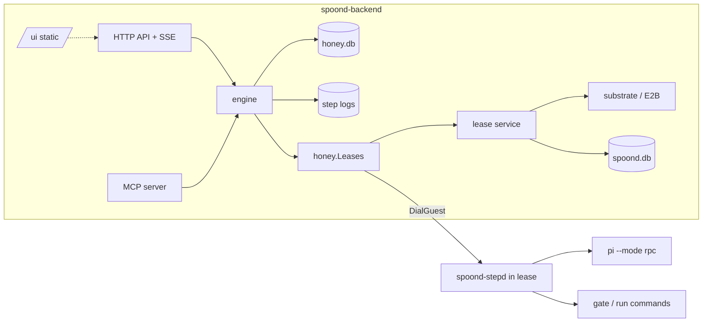

# Honey workflows: the engine, the catalog and the live view (draft for decision)

Status: **draft for decision, 2026-10-02.** Epic #78. Covers #85 (live
view) in full and the parts of #84, #87 and #88 that the engine needs.
Decisions are numbered W1-W29. Build order at the end.

Implementation starts on a branch off `main`, after `feat/e2b-substrate`
is fully merged. Paths below are `main`'s (module `github.com/jrimmer/spoond/v2`).

## Why

Every piece of unattended work is the same shape with different glue:
CI jobs (the runner), bees (`worker-start.sh`, the agent-hub `swarm-*`
scripts and Agent Mail), image builds and deploy windows. The state
machine that joins them lives in mail subjects and laptop scripts. Nobody
owns it. When vm1 stalled on 2026-10-02 every bee stopped. When the
laptop closes nothing dispatches work.

Honey owns that state machine. A **workflow** is a versioned definition in
Honey's catalog. A **run** is one execution of it. Honey stores the run's
state, its history and its messages, and it recovers them after any
crash. Jobs, the hive, CI and agent coordination become workflows.

## What this document decides

| # | Decision | Section |
|---|---|---|
| W1 | Build our own engine on SQLite. Borrow Temporal's semantics, not its code. | [Build or adopt](#build-or-adopt) |
| W2 | The engine runs inside `spoond-backend`, with its own database file `honey.db`. | [Architecture](#architecture) |
| W3 | Definitions are structured YAML blocks, not a free graph. | [Definition language](#definition-language) |
| W4 | Expressions are CEL, type-checked on publish. | [Expressions](#expressions-cel) |
| W5 | Parameters, state and outputs are typed with JSON Schema. | [Types](#types-json-schema) |
| W6 | Steps declare what they read and write. Data flow is explicit. | [Data flow](#data-flow-is-explicit) |
| W7 | The catalog is versioned and immutable; a run pins its version. | [Catalog](#the-catalog) |
| W8 | Every state change commits with its event, in one transaction. | [Durability](#durability-model) |
| W9 | Intent before action; replay policy decides what happens after a crash. | [Durability](#durability-model) |
| W10 | Request ids make starts and signals exactly-once. | [Signals](#signals-questions-memos-and-steering) |
| W11 | A step supervisor (`spoond-stepd`) runs inside the lease and keeps processes alive across engine restarts. | [stepd](#stepd-the-step-supervisor-in-the-lease) |
| W12 | The substrate gains file operations (envd filesystem). | [stepd](#stepd-the-step-supervisor-in-the-lease) |
| W13 | Agent steps drive a harness through one contract; Pi in RPC mode is the first. | [Harness](#the-harness-contract-and-pi) |
| W14 | Ownership tree: runs own child runs, forks, leases and locks; cancel is bottom-up. | [Ownership](#ownership-cancellation-and-locks) |
| W15 | Attach = snapshot at a sequence number, then a resumable SSE stream. | [Attach](#attach-the-event-stream) |
| W16 | The live view is a React Flow app with elkjs layout, served by the backend at `/ui`. | [Live view](#the-live-view-85) |
| W17 | The UI's built assets are committed; `go build` needs no Node. | [Live view](#build-and-delivery) |
| W18 | The engine is tested by crashing it at every write. | [Testing](#testing-reliability-first) |
| W19 | Triggers and concurrency limits replace the hive core (swarm plan step 4). | [Triggers](#triggers-and-the-hive) |
| W20 | The bee loop is the built-in `ralph-ticket` workflow, with the 2026-10-02 lessons as rules. | [Bee loop](#the-bee-loop-as-a-workflow) |
| W21 | The orchestrator is not a microVM. The log is the durable truth; a VM per run adds cost and no durability. | [MicroVMs](#microvms-in-the-engine) |
| W22 | Steps can checkpoint their lease's memory: retries and resumes start from the pre-step state. | [MicroVMs](#microvms-in-the-engine) |
| W23 | Lease forks parallelize work inside a run: test shards and speculative attempts. | [MicroVMs](#microvms-in-the-engine) |
| W24 | A failed step can keep a paused snapshot; a person opens a shell at the exact failure. | [MicroVMs](#microvms-in-the-engine) |
| W25 | Custom step types are images with a JSON contract, run in a lease. | [MicroVMs](#microvms-in-the-engine) |
| W26 | Ticket sources, notifiers and git hosts are providers: named, typed activities, as in Temporal. br and Forgejo first. | [Providers](#providers-ticket-sources-notifiers-git-hosts) |
| W27 | Questions go to the run's owner; escalation is configured. | [Signals](#signals-questions-memos-and-steering) |
| W28 | Notifications in v3: webhook (with chat presets) and mail, plus subscriptions to run events. | [Providers](#providers-ticket-sources-notifiers-git-hosts) |
| W29 | Retention: step logs and session files 30 days; forever for runs whose result was merged. | [Storage](#storage-honeydb) |

## Goals and non-goals

**Goals**

- Runs survive a crash or restart of the backend, of a lease, or of the
  host, without repeating a step that is not safe to repeat.
- One definition language expresses the bee loop, a CI job, a deploy
  window, a warm-snapshot refresh and a review pipeline, without escape
  hatches into shell glue.
- Small workflows compose into larger ones (calls with typed inputs and outputs).
- Every claim a run makes about itself is in its event log. The live view,
  the MCP front door, the CLI and the review packet (#89) read the same log.
- A person can follow a run live, see the data move between steps, and
  answer, approve or cancel from the same page.

**Non-goals (this epic)**

- Editing workflows in the graph view (#85 rules it out).
- More than one host. The design keeps a seam for it (W2) but does not build it.
- General-purpose code in workflows. CEL is deliberately not Turing-complete.
  Real computation runs in a step.

**Release criteria for v3**

1. The crash suite (W18) passes: every built-in workflow, crashed at
   every write, finishes with the same result and no unsafe step repeated.
2. The bee loop runs as `ralph-ticket` for one week on spoond tasks.
   The share of runs that finish without the orchestrator or a person
   stepping in is on the dashboard, and is at least the 2026-10-02 rate (3 of 5).
3. Agent Mail coordination and the `swarm-*` scripts are retired.

## Build or adopt

**W1. Build our own engine on SQLite.**

| Candidate | Model | Fit | Why not |
|---|---|---|---|
| **Temporal** | Deterministic workflow *code* replayed against an event history; separate server cluster (frontend, history, matching, worker) plus Postgres/Cassandra | Gold standard for semantics | Four services and a database on a one-host system. Our workflows are YAML data, so we would write an interpreter as a Temporal workflow anyway. The event history format is Temporal's, not ours, so the live view and the review packet would sit on a translation layer. |
| **Restate** | Durable execution via a separate Rust server; Go SDK; journaled handlers, virtual objects | Light for a server | Still an extra service and an interpreter on top. Journals are per handler invocation; a run's typed state and its UI-facing event log would be ours anyway. |
| **Hatchet** | Task queue + DAG on Postgres (+ optional RabbitMQ) | Good DAG UI | Needs Postgres. DAG-first; loops and human waits are bolted on. |
| **DBOS Transact (Go)** | Library; durable workflows checkpointed in Postgres | Library model is right | Postgres only. Code-first. |
| **go-workflows** (cschleiden) | Embedded Temporal-style library; SQLite, MySQL or Redis backend | Closest fit: embedded, SQLite, signals, timers, sub-workflows, cancellation | Replay of Go code, so we still write the interpreter as one generic workflow. Its history is opaque to the UI, and replay policy, memos, run locks and attach would be built around it rather than with it. Worth keeping as the reference implementation to compare semantics against in tests. |
| **Pi Durable** | Durable *agent conversations*: checkpoints per task, tool replay policies, memos, attach | Complementary, not a substitute | It makes the inside of one agent step durable. It is a harness capability (W13), not a run engine. Its ideas shaped W8-W10 and W15. |
| **Own engine** | Event-sourced interpreter over structured YAML; state and events in one SQLite transaction | Matches every requirement directly | We own the correctness. Mitigated by W18 and by keeping the core small. |

What tips it: the definitions are data. Every adopt option replays *code*,
so each one ends with us writing the interpreter, the event log the UI
needs, the catalog, the replay policies and the ownership tree on top of
it. The part left over for the adopted engine (durable timers, a task
queue, a history table) is the small part. We take Temporal's proven
semantics (activities with retry policies, signals, child workflows,
cancellation scopes, durable timers, heartbeats) and implement them
directly in the form we need.

## Architecture

**W2. The engine is a set of packages inside `spoond-backend`, with its
own SQLite file.** Workflows are what spoond is in v3, so they live in
the daemon, not beside it.

```
spoond-backend
├── api/            existing lease API, + /api/workflows, /api/runs, /api/profiles
├── honey/
│   ├── def/        definition schema, YAML parse, publish-time validation
│   ├── expr/       CEL environment, type provider from JSON Schema
│   ├── catalog/    workflows and profiles: versions, publish, uses
│   ├── store/      honey.db: runs, steps, events, signals, memos, locks, timers, outbox
│   ├── engine/     interpreter, scheduler, recovery, timers, cancellation
│   ├── steps/      one executor per step type (lease, run, gate, agent, ...)
│   ├── harness/    harness contract; pi/ adapter
│   ├── lease.go    the interface the engine uses to reach leases (W2 seam)
│   ├── providers/  ticket sources (br, forgejo), notifiers (webhook, mail), git hosts (W26)
│   └── triggers/   schedules, ticket_ready, webhooks, concurrency limits
├── cmd/spoond-stepd/   guest step supervisor, baked into the worker layer
├── mcp/            MCP server (#88), moved to the official Go SDK
└── web/            the live view (React Flow app); web/dist is go:embed-ed
```

Rules that keep the engine safe inside a process that does other things:

- **Own file, own writer.** `honey.db` is separate from `spoond.db`. Its
  writer connection serves only the engine, so log-heavy runs never
  delay a lease write. The backend's "availability wins over durability"
  rule stays for leases. The engine has the opposite rule: a failed write
  stops the transition, and the run is retried from its last committed state.
- **Logs are files, not rows.** Step output is appended to
  `/var/lib/spoond/honey/logs/<run>/<step>/<attempt>.log`; events carry
  byte offsets into it. Backups (`VACUUM INTO`) stay small.
- **One seam to leases.** The engine reaches leases only through
  `honey.Leases` (create, exec-via-stepd, dial, checkpoint, fork, delete,
  write files). In-process it calls `api.Service` directly. A later
  split, or a second host, implements the same interface over HTTP.
- **Panics stop at the step.** Each step worker recovers panics and
  records them as `step.failed{error: "internal: ..."}` with a stack in
  the backend log. One bad executor cannot take the lease API down.
- **Bounded work.** A global and a per-owner cap on concurrently active
  steps; a per-run cap on parallel branches. Over the cap, steps queue.



## Concepts

| Term | Meaning |
|---|---|
| **Workflow** | A named definition in the catalog. `ralph-ticket`. |
| **Version** | An immutable published revision. `ralph-ticket@3`. |
| **Run** | One execution of a workflow version. Id `r-<uuidv7>`. |
| **Step** | One node in the definition, addressed by its **path**: `rounds/implement`. |
| **Instance** | One execution of a step. Loop iterations and fork branches give a step several instances: `rounds[2]/implement`, `try[b]/build`. |
| **Attempt** | One try of an instance. Retries add attempts. |
| **State** | The run's typed JSON document. Steps read from it and write to it. |
| **Event** | One entry in the run's append-only log, with a per-run sequence number. |
| **Signal** | Input sent to a run from outside: answer, approve, reject, steer, cancel. |
| **Memo** | A recorded decision (an approval, an answer). First write wins. |
| **Lock** | A run-scoped claim on paths or named resources. |
| **Profile** | A named harness + model + provider + settings (#87). |
| **Outcome** | How an instance ended: `succeeded`, `failed`, `needs_info`, `interrupted`, `cancelled`, `timed_out`, `skipped`. |

## Definition language

**W3. Structured blocks, not a free graph.** Steps nest inside `do`
(sequence), `parallel`, `if`/`switch`, `loop`, `fork` and `try`. There
is no `goto`. A loop is a block with a budget, drawn as a back-edge.

Why: every structure has one entry and one exit. That makes publish-time
checks complete (every path that reads `state.x` is preceded by a write
to it, on every route), makes cancellation scopes obvious, keeps budgets
explicit, and gives the live view a natural nesting (ELK compound nodes).
The shape follows the CNCF Serverless Workflow DSL 1.0 (`do`, `fork`,
`switch`, `try`, `for`), without its verbosity and with our step types as
first-class keys rather than `call:` extensions.

### Shape of a definition

```yaml
apiVersion: honey/v1
kind: Workflow
name: ralph-ticket
description: Claim a ticket, implement it in a lease with an agent loop, gate and review, push.

params:                 # JSON Schema properties; validated on start
  repo:   {type: string, format: git-url}
  base:   {type: string, default: main}
  image:  {type: string, format: image}           # must exist in the image catalog
  gates:  {type: array, items: {type: string}, minItems: 1}
  source: {$ref: "honey:ticket-source"}
  rounds: {type: integer, default: 3, minimum: 1, maximum: 6}

state:                  # the run's typed document; starts from defaults
  ticket:   {$ref: "honey:ticket"}
  branch:   {type: string}
  gates:    {$ref: "honey:gate-result"}
  review:   {$ref: "honey:review"}
  commit:   {type: string}

output:                 # what callers and MCP receive
  branch: "${ state.branch }"
  commit: "${ state.commit }"
  review: "${ state.review }"

defaults:
  timeout: 1h
  retry: {max: 2, backoff: 30s..5m}
  replay: safe

do:
  - id: claim
    ticket: {source: "${ params.source }", claim: true}
    set:
      ticket: "${ result }"
      branch: "${ 'swarm/' + result.id }"
    locks: {paths: "${ result.paths }"}           # held until the run ends

  - id: precheck
    llm:
      profile: planner
      prompt: honey:prompts/task-precheck        # catalog prompt, versioned with the workflow
      with: {task: "${ state.ticket }"}
      schema: {$ref: "honey:precheck"}
    then:
      - when: "${ !result.self_contained }"
        question: "${ result.missing }"            # outcome needs_info; the run waits for an answer

  - id: box
    lease: {image: "${ params.image }", ttl: 6h, secrets: [deploy-key]}
    do:                                          # every step in this block runs in this lease
      - id: checkout
        run: |
          git clone --branch ${ params.base } ${ params.repo } /work/repo
          git -C /work/repo switch -C ${ state.branch }
        replay: safe

      - id: rounds
        loop:
          max: "${ params.rounds }"
          until: "${ state.gates.pass && state.review.blocking == 0 }"
          do:
            - id: implement
              agent:
                profile: "${ loop.last ? 'implementer-strong' : 'implementer' }"   # escalate on the last round
                cwd: /work/repo
                prompt: honey:prompts/implement
                with: {task: "${ state.ticket }", findings: "${ state.review.findings }", gates: "${ state.gates }"}
              replay: resume                     # harness resumes the conversation; see W13
            - id: gates
              gate: {cwd: /work/repo, commands: "${ params.gates }"}
              set: {gates: "${ result }"}
            - id: review
              if: "${ state.gates.pass }"
              workflow:
                name: pr-review@^2
                with: {repo_dir: /work/repo, base: "${ params.base }", previous: "${ state.review }"}
              set: {review: "${ result }"}

    finally:                                     # every exit path: pass, fail, cancel, error
      - id: push
        git: {push: {cwd: /work/repo, branch: "${ state.branch }", force_with_lease: true}}
        set: {commit: "${ result.sha }"}
        replay: idempotent
```

### Step anatomy

Every step has an `id` (unique among siblings) and exactly one type key.
Common fields:

| Field | Meaning |
|---|---|
| `if` | CEL condition; false skips the step (outcome `skipped`). |
| `with` | Inputs, as CEL expressions over `params`, `state`, `loop`, `run`. |
| `set` | State writes, as CEL over the step's `result` (and the above). |
| `then` | Post-conditions: `when` → `fail`, `question` or `goto-end` (end of the enclosing block). |
| `timeout` | Per attempt. |
| `retry` | `{max, backoff, on: [error, timed_out, interrupted]}`. Infrastructure errors (model service down, lease capacity) retry without spending the budget, like the bee loop does today. |
| `replay` | `safe` \| `idempotent` \| `resume` \| `never`. See W9. |
| `on_error` | `fail` (default) \| `continue` (record the outcome in `result`, carry on). |
| `locks` | Paths or resource names this step (or block) holds. |

Blocks: `do`, `parallel` (with `max`, `fail_fast`), `if`/`else`, `switch`
(`cases: [{when, do}]`), `loop` (`max`, `until`/`while`, `budget: {time, tokens}`),
`fork` (W14, #82), `try` (`do`, `catch: [{on, do}]`, `finally`), and the
scope steps `lease` and `lock` which run a nested `do` inside a scope that
is released when the block exits.

## Expressions (CEL)

**W4. CEL (`github.com/google/cel-go`, Apache-2.0) for every expression.**

- **Typed on publish.** The CEL environment is generated from the
  workflow's JSON Schemas, so `state.review.blockng` is a publish error,
  not a 3 a.m. surprise. Step results are typed from each step type's
  result schema (and from a called workflow's `output` schema).
- **Safe.** No loops, no I/O, guaranteed termination, a cost limit per
  evaluation. Deterministic, so the engine can re-evaluate after a crash.
- **Syntax.** A YAML value that is exactly `${ expr }` evaluates to a
  typed value. A string containing `${ ... }` interpolates. Expressions
  are always quoted (`"${ state.x }"`), because `{`, `}` and `: ` are YAML
  syntax; publish rejects an unquoted one with that remedy. Inside an
  expression, CEL strings use single quotes.
- **Library.** Standard CEL plus `strings`, `lists`, `math`, `encoders`
  extensions, and a few Honey functions: `glob(path, pattern)`,
  `duration()`, `semver()`. Nothing that reads the clock or randomness;
  `run.started_at` and `loop.index` are data.

This replaces `workflow/expr.go` (unused, and broken at line 58) and
`runner/expr.go`. The CI runner can adopt it later.

## Types (JSON Schema)

**W5. Parameters, state, outputs and step results are JSON Schema
(draft 2020-12), validated with `github.com/santhosh-tekuri/jsonschema/v6`
(Apache-2.0).**

- Honey ships a schema library under `honey:` (`honey:ticket`,
  `honey:gate-result`, `honey:review`, `honey:finding`, `honey:verdict`,
  `honey:ticket-source`, ...). Built-in step types return these.
- Custom formats tie parameters to the catalogs: `format: image`,
  `profile`, `secret`, `snapshot`, `workflow`. Publish checks that a
  default exists in its catalog; start checks the given value.
- State is validated after every `set`. A step that writes the wrong
  shape fails with the JSON Pointer of the bad field, before it can
  corrupt a later step.

## Data flow is explicit

**W6. Steps declare what they read and write.** `with` and `set` are the
only way data moves. From them the publisher computes, for every step,
its **reads** (state paths in `with`/`if`) and **writes** (paths in `set`).

That one rule pays three times:

1. **Validation.** A read of a path that no earlier step writes, on some
   route, is a publish error (with the route).
2. **The live view.** Every edge in the graph knows which state paths
   cross it. Hovering an edge shows the values that crossed, as of that
   instance, from the event log (W15). That is the "follow the data" view.
3. **Replay and caching.** A step whose reads did not change can be
   skipped when a run is resumed from a later point (a future
   "re-run from here" feature), because its inputs are known.

## The catalog

**W7. Workflows (and profiles, #87) are catalog items, versioned and
immutable.**

- `spoond workflows publish FILE`, or from a repo's `.honey/workflows/*.yaml`
  on merge (a built-in `publish-workflows` workflow, triggered by a push webhook).
- Publish assigns the next integer version (`ralph-ticket@4`). Content is
  stored with its sha256; publishing identical content is a no-op that
  returns the existing version.
- References accept `name@3`, `name@^3` (latest compatible: same
  `params` and `output` schema major) and `name` (latest). A run resolves
  every reference **at start** and records the resolved versions, so its
  behaviour never changes mid-flight, including the workflows it calls.
- **Publish-time validation** runs through the hive check engine
  (`hive.Check`/`Result{Status, Detail, Remedy}`), extended with workflow
  checks: schema, unknown step types, CEL type errors, reads-before-writes,
  referenced images, snapshots, secrets, profiles and workflows exist,
  call cycles, lock paths are well-formed, and every `replay: never`
  step is inside a scope that can report `interrupted`. Every failure
  carries a remedy. The guide (C11) is generated from the same tables.
- **Visible.** `GET /api/workflows` lists name, latest version, uses,
  last run and its result, like the image catalog. The dashboard and the
  live view show both catalogs.
- **Prompts** used by agent and llm steps are catalog items too
  (`honey:prompts/implement`), versioned with the workflow that ships
  them, so a run records exactly what each model was told.

## Durability model

**W8. State and history commit together.** Each transition is one SQLite
transaction that:

1. appends one or more events (`seq` strictly increasing per run),
2. applies the state patch those events carry (RFC 6902 JSON Patch),
3. updates the instance rows (status, attempt, lease, timings),
4. writes outbox rows for the work it causes (start this step,
   arm this timer, release that lease).

Workers act only on committed outbox rows, and mark them done in a
later transaction. A crash between the two repeats the outbox row,
never the transition. The run's current state is a materialized row;
the event log alone can rebuild it (tested, W18).

**W9. Intent before action, and a replay policy decides what a crash
means.**

Before a step does anything outside Honey it commits `step.started
{attempt, lease, handle}`. On recovery (backend start, or a lost
heartbeat), every instance that is `started` but not finished is
resolved in this order:

1. **Reattach.** Ask stepd (W11) for the handle. If the process is still
   running or has finished, reattach and read its journal from the last
   offset. Most backend restarts end here: nothing is repeated, nothing is lost.
2. **Otherwise apply the step's replay policy:**

| `replay` | After a lost attempt | Default for |
|---|---|---|
| `safe` | Start a new attempt. | `run` (unless marked otherwise), `gate`, `llm`, `transform`, `lease` (a new lease) |
| `idempotent` | Start a new attempt; the step's key makes a repeat harmless. | `git push --force-with-lease`, `snapshot` (name+run), `notify` (key = run+step+attempt) |
| `resume` | Start a new attempt that continues the harness session from its last checkpoint. | `agent` with a resumable harness |
| `never` | Outcome `interrupted`. Nothing is repeated. The enclosing `try`, or a person, decides. | `deploy`, ticket close, PR merge, any `run` that says so |

The agent step forwards tool-level replay policies to a harness that
supports them (Pi Durable later): the run is told a tool call was
interrupted rather than silently repeating it.

**Timers are durable.** `sleep`, timeouts, heartbeats and backoffs are
rows with a due time. The scheduler wakes for the earliest one. A
timeout that fell due while the backend was down fires at startup.

**Heartbeats.** stepd reports every 15 s. A step with no heartbeat for
its `heartbeat_timeout` (default 2 min) is checked: reattach, else replay
policy. This replaces "no log activity for 30 min" in the hive plan (C5)
with a mechanism that knows the difference between a slow agent and a
dead lease.

## Signals, questions, memos and steering

**W10. Exactly-once submission.** `POST /api/runs` and
`POST /api/runs/{id}/signals` require an `Idempotency-Key` header (MCP
and the CLI generate one per logical call). The key, the caller and a
hash of the body are stored. A retry with the same key returns the first
response. The same key with a different body is a 409.

- **Signals** are rows: `answer`, `approve`, `reject`, `steer`, `cancel`,
  and custom names a workflow declares (`signals: {retest: {schema}}`).
  Each is applied by a transition, so it appears in the event log.
- **Questions.** A step ends with outcome `needs_info` and a question
  (`then: question:`, or an agent asking through its harness). The run
  waits. It does **not** spend a loop round. The answer is a memo; the
  step resumes with it in `result.answer`.
- **W27. Who answers: a rule, with configured escalation.**
  1. If the workflow names a resolver step (`ask: {step: researcher}`,
     a step with more access), that step tries first. It may answer, or
     pass the question on.
  2. Otherwise, and after a resolver passes, the question goes to the
     **run's owner**. One rule covers every caller: an agent that started
     the run over MCP is the owner, and its `run_wait` returns on
     `question.raised`; a person gets a notification (W28); a run started
     by a trigger belongs to the trigger's owner.
  3. A child run's questions go up to the parent run first, so the
     caller workflow can answer from its own state or pass them up.
  4. **Escalation is configuration:** `escalate: {after: 4h, to: <person>}`
     on the project (default) or the workflow. An unanswered question is
     re-sent there, so it never waits silently.
- **Memos.** Approvals and answers are stored with the first write
  winning. A second approval is acknowledged, not applied. Memos survive
  restarts and are part of the run's record.
- **Steering.** A `steer` signal to a running agent step is forwarded to
  the harness (`steer` in Pi RPC: delivered after the current tool calls,
  before the next model call). The interactive agent step is an agent
  step with `steering: open` and a person attached through the live view.

## Ownership, cancellation and locks

**W14. Every run is the root of an ownership tree.** It owns its child
runs, fork branches, leases, locks and stepd processes. The tree is in
`honey.db` (`owner_run`, `owner_instance` columns).

- **Cancel is bottom-up.** Cancelling a run cancels the deepest owned
  things first: harness abort, stepd kill, child runs, fork branches,
  then lease release, then locks. Each step's `finally` still runs
  (so the bee loop always pushes) with a short grace timeout.
- **Leases are owned.** A lease created by a `lease:` block carries the
  run id. The backend's sweeper does not idle-suspend a lease whose
  owning run is active; GC does not delete builds that an active run's
  snapshot steps reference. When a run ends its leases are released,
  unless the block says `keep: true`.
- **Locks.** `locks: {paths: [...], resources: [...]}` on a step or a
  block. Paths are globs (`github.com/bmatcuk/doublestar/v4`, MIT) scoped
  to a repo. Two runs whose path sets overlap cannot both hold them; the
  second waits (or, with `wait: false`, ends `needs_info` with the
  holder's name). Locks are released by the ownership tree, so a crashed
  run never leaks one. This replaces Agent Mail file reservations.

## stepd: the step supervisor in the lease

Today `exec` blocks and is capped at 300 s, and the WebSocket stream
starts a new process each time and cannot reattach. An agent pass lasts
up to an hour and must survive a backend restart.

**W11. `spoond-stepd`, a small static Go binary in every worker image
(and copied in on demand otherwise), supervises step processes inside the
lease.**

- Started on first use; listens on a lease-local port reached with
  `substrate.DialGuest`. Authenticated by a per-lease token written to
  `/run/secrets/stepd` at lease creation (#80's mechanism).
- `start{handle, argv, cwd, env_files, stdin: pipe|none, pty}` runs a
  process detached from the connection. stdout and stderr go to a
  journal (`/run/honey/<handle>/journal`, length-prefixed frames with a
  monotonic offset). Exit status goes to `status`.
- `attach{handle, from_offset}` streams frames from any offset, live.
  `write{handle, data}` writes to stdin (Pi RPC commands, steering).
  `signal`, `status`, `list`. All idempotent by handle.
- The backend copies frames into the step log file and acknowledges an
  offset; stepd trims the journal behind it.
- A backend restart only drops the connection. The process keeps
  running; the engine reattaches from its last acknowledged offset.

**W12. The substrate gains file operations.** `WriteFile`, `ReadFile`,
`Stat`, `Remove`. File contents go through envd's HTTP `/files` endpoint
(GET downloads, POST is a multipart upload that creates parent
directories); `Stat`, `MakeDir` and `Remove` use the envd filesystem
Connect client that is already generated in
`substrate/e2b/gen/envd/filesystem/` but unused. envd sets no file mode
on upload, so a mode other than the default is applied after the write;
secrets are written into a directory created 0700 first, so they are
never readable by others, even briefly. They are needed for
stepd delivery, secrets (#80), artifacts (#84), harness checkpoints and
the review packet (#89). The fake substrate gets an in-memory filesystem.

## The harness contract and Pi

**W13. An agent step drives a harness through one contract** (#87):

```go
type Harness interface {
    Start(ctx, Spec) (Session, error)        // instructions, tools, cwd, profile, resume-from
}
type Session interface {
    Steer(ctx, msg string) error             // input while running
    Events() <-chan Event                    // progress, tool calls, questions, usage
    Result(ctx) (Result, error)              // structured output, validated against the step's schema
    Abort(ctx) error
    Checkpoint(ctx) (ref string, err error)  // optional capability: resumable
}
```

**Pi adapter.** Runs `pi --mode rpc --session-dir /work/.honey/pi/<run>`
under stepd. Prompts and steering go in as RPC commands through stepd's
`write`; events come back through the journal. The adapter:

- maps `tool_execution_start/end`, `message_end`, `agent_settled`,
  retry and compaction events to step progress events (the tool-call
  feed the bee loop's `[PROGRESS]` mails show today, but structured);
- detects model-service errors from `stopReason: "error"` (Pi exits 0 on
  them) and reports them as infrastructure errors, which retry without
  spending a round;
- asks for a structured result: the step's prompt ends with an
  instruction to write `result.json` against the step's schema, which
  the adapter reads (W12) and validates. Free-form text is kept as
  `result.text`;
- **resumable (first version, without Pi Durable):** after each settled
  turn the adapter copies the Pi session file to Honey's storage
  (`/var/lib/spoond/honey/sessions/<run>/<step>/`). A new attempt in a
  new lease restores it and starts Pi with `--session <file>`, then
  sends "you were interrupted; continue". `replay: resume` uses this.
- **forks carry the conversation** (#82): a fork branch gets a copy of
  the session file (Pi `clone`), so each branch keeps the context.

Pi Durable, when it is usable from Pi itself, replaces the session-file
copy with its own checkpoints and adds per-tool replay policies. The
contract does not change.

## Step types

| Type | Does | Result | Default replay |
|---|---|---|---|
| `lease` | Starts a lease (image or named snapshot, secrets, egress) and runs its nested `do` in it; releases it on exit unless `keep`. | `{lease_id}` | safe |
| `run` | A command in the current lease, via stepd; output streamed. | `{exit, stdout_tail, artifacts}` | safe |
| `gate` | The project's validations, each its own sub-instance; pass or fail with output. | `honey:gate-result` | safe |
| `llm` | One model call, no tools, structured output against a schema. | the schema | safe |
| `agent` | An agent pass through a harness, with a profile. `until:` makes it a loop. | the schema, or `{text}` | resume |
| `question` | Ends the instance `needs_info`; waits for an answer memo. | `{answer}` | — |
| `approval` | Waits for `approve`/`reject` from named people or roles. | `{approved, by, note}` | — |
| `transform` | State update only, via `set`. | — | safe |
| `workflow` | Calls a catalog workflow, waits, returns its `output`. | callee output schema | (callee's) |
| `fork` | Forks the current lease N ways (#82), runs `do` in each, picks by gate or score, releases the rest. | `{winner, branches}` | never (by default) |
| `snapshot` | Saves the lease as a named snapshot (#83). | `{name, version, build_id}` | idempotent |
| `ticket` | Claims, comments on, releases or closes a ticket through a ticket-source provider (W26); releases its claim if the run fails. | `honey:ticket` | idempotent |
| `git` | Push a branch, open or update a PR, comment. | `{sha, url}` | idempotent |
| `notify` | Sends through a notifier provider (W28): webhook, mail, the followers' feed. | — | idempotent |
| `sleep` | Durable timer. | — | safe |
| `artifact` | Collects paths from the lease into run storage (#84). | `{artifacts}` | safe |

A **job** (#84) is a one-step workflow (`lease` + `run` + `artifact`),
created by `POST /api/jobs`. The CI runner can become a client of it.

## Attach: the event stream

**W15. Attach returns the current view, then the changes.**

- `GET /api/runs/{id}` returns the run, its instance tree, its state and
  the `seq` they reflect.
- `GET /api/runs/{id}/events?after=<seq>` is SSE. Each event has
  `id: <seq>`, so a dropped connection resumes with `Last-Event-ID`.
  Without `after`, it replays from 0. The live view, MCP `wait` and the
  CLI `spoond runs follow` all use it.
- `GET /api/runs/{id}/steps/{instance}/log?offset=` streams a step's
  log from a byte offset (SSE, resumable).
- `GET /api/events?owner=me` is a multiplexed feed of run-level events
  for a person's or agent's followed runs (the inbox that replaces Agent Mail's).

Event envelope (one JSON object; `patch` only when state changed):

```json
{"seq": 41, "ts": "2026-10-02T21:04:11.201Z", "run": "r-0192...", "type": "step.completed",
 "path": "box/rounds[2]/gates", "attempt": 1, "outcome": "failed",
 "data": {"duration_ms": 48210},
 "patch": [{"op": "replace", "path": "/gates", "value": {"pass": false, "failures": ["go vet"]}}]}
```

Event types: `run.created|started|completed|cancelled`, `step.scheduled|started|progress|
heartbeat|completed|retrying|interrupted`, `signal.received`, `memo.recorded`,
`question.raised|answered`, `lock.acquired|waiting|released`,
`lease.created|released`, `child.started|completed`, `fork.branch.started|completed|chosen`,
`timer.armed|fired`. Progress events from harnesses (`tool.started`, `tool.ended`,
`usage`) are coalesced to at most 2 per second per instance in the stored log.

## The live view (#85)

**W16. A React Flow app with elkjs layout, served by the backend at `/ui`.**
It is a separate app from the dashboard. The dashboard links to it. Its
look is its own, chosen for a clear, animated data-flow view, not for
matching the Starbase panels.

### Libraries

| Library | Licence | Role |
|---|---|---|
| **@xyflow/react** (React Flow 12) | MIT | Graph rendering and interaction: custom nodes and edges as React components, sub-flows (nested groups), minimap, controls, keyboard and screen-reader support. |
| **elkjs** | EPL-2.0 | Layered layout with compound nodes, ports and back-edges, run in a web worker. (EPL-2.0 is weak copyleft at file level; we ship it unmodified, which is fine. Flag for the licence file.) |
| **motion** (formerly Framer Motion) | MIT | Node state transitions, layout animation when loops and forks expand. |
| **@xterm/xterm** + fit addon | MIT | Live step logs with ANSI colour, fast for large output. |
| **jsondiffpatch** | MIT | State diff on edge hover and in the step drawer. |
| **zustand** | MIT | Client run store fed by the event stream; reducers apply events in `seq` order. |
| **@tanstack/react-query** | MIT | Catalog and run lists. |
| **Radix UI primitives** + **Tailwind CSS** | MIT | Drawer, popovers, tooltips, tabs; accessible by default. |
| **Vite** + **TypeScript** | MIT / Apache-2.0 | Build. |
| **Vitest**, **Playwright** | MIT / Apache-2.0 | Unit tests on the reducer and layout mapping; one browser test that replays a recorded run. |

Considered and not chosen: Cytoscape.js (canvas rendering makes rich
custom nodes and hover cards harder), AntV G6 (capable, smaller
English-language ecosystem), JointJS (the useful parts are commercial),
Rete.js (editor-first), Mermaid (static), Svelte Flow (same authors,
much smaller ecosystem), dagre (unmaintained, weak compound layout).

### What the views show

- **Catalog.** Workflows and profiles; versions; parameters and outputs;
  uses and last result; a static graph of any version.
- **Runs.** Per workflow, per project and per owner: status, duration,
  current step, outcome. Deep links straight to a run's current step
  (for alerts, #81).
- **Run graph.**
  - Nodes are steps, with an icon and colour per type (agent, llm, gate,
    run, conditional, loop, workflow call, fork, approval ...). Blocks
    are groups. Called workflows are collapsible groups that expand into
    their own graph (the child run's), lazily.
  - **Live state:** the active instance pulses; finished ones show
    passed or failed with a duration; skipped branches fade; the route
    taken through `if`/`switch` is drawn solid, the others dashed.
  - **Loops** draw as a back-edge with an iteration counter; a stepper on
    the group shows one iteration at a time (`round 2 of 3`), or all side by side.
  - **Forks** draw their branches side by side, with the chosen one marked.
  - **Data flow.** When a step completes, small packets travel along the
    edges whose state paths it wrote (W6), to the steps that read them.
    Hovering an edge shows a card with each crossing path and its value
    at that moment (jsondiffpatch against the previous value). A
    "follow" toggle highlights every node that read or wrote a chosen
    state path, across the whole run.
  - **Time scrubber.** Because the view is a fold over the event log, a
    slider replays the run to any `seq`. Live runs follow the tail.
- **Step drawer** (click a node): live log (xterm), inputs (`with`
  evaluated), outputs (`set` applied, as a diff), the lease (link to its
  dashboard row), profile and resolved model, attempts and their
  outcomes, retries, questions and memos, the harness's tool-call feed
  for agent steps.
- **Controls:** cancel, approve, reject, answer, steer. Shown only to
  the run's owner or an admin, and sent with an `Idempotency-Key`.

### Graph model

The server derives a **graph description** from each workflow version
at publish (nodes = step paths, groups = blocks, edges = control flow,
`edge.data = [state paths]`) and stores it. The client never parses YAML
or CEL. A run's view is that graph plus instances from the event log:
loops and forks expand into instance nodes on the client. ELK runs once
per graph shape in a worker and is cached by shape hash, so a live run
re-lays out only when a loop or fork adds instances.

### Auth

The UI uses the same bearer token as the API (a person's Honey user
token, entered once and kept in `sessionStorage`; agents use MCP). Read
access follows run ownership and shares; admins see all. The read-only
`watch` basic-auth account of the dashboard is not used here.

### Build and delivery

**W17.** `web/` holds the source. `npm run build` writes `web/dist/`,
which is committed and served with `//go:embed`. `go build` needs no
Node. CI gains one job: `npm ci && npm run build && git diff --exit-code web/dist`
(the committed build must match the source), plus the Vitest and
Playwright tests. The bundle target is under 400 KB gzipped, with elkjs
loaded in its worker only when a graph is shown.

## MCP front door (#88)

Move `mcp/` from the hand-rolled JSON-RPC server to the official
`github.com/modelcontextprotocol/go-sdk` (MIT). Streamable HTTP and
stdio, progress notifications and cancellation come with it. Tools:

| Tool | Does |
|---|---|
| `workflows_list` / `workflow_show` | Catalog, with params and output schemas. |
| `profiles_list` | Profile catalog. |
| `run_start` | Starts a run; takes `request_id` (W10). Returns the run id. |
| `run_wait` | Waits up to a bound (default 5 min) for completion, a question, or a given event type; returns the current view and a `cursor` to call again with. Resumable across disconnects. |
| `run_read` | State, output, outcome, instance tree; `step_log` with offsets. |
| `run_signal` | answer, approve, reject, steer, cancel; takes `request_id`. |

Results are the run's typed output, so an agent never parses logs.

## Providers: ticket sources, notifiers, git hosts

**W26. External systems are reached through providers, following
Temporal's activity pattern.** A provider is registered by name and kind.
Each operation is an activity with a typed input and output (JSON Schema),
a timeout, a heartbeat for long calls, a retry policy, and a declared
idempotency. The engine never talks to Forgejo, br or SMTP directly; step
executors call providers. A project configures instances of them
(`sources: {tasks: {provider: forgejo, repo: lacy.casa/spoond, milestone: v3}}`),
with credentials referenced by secret name (#80).

| Kind | Operations | v3 providers | Later |
|---|---|---|---|
| `ticket-source` | `list_ready`, `claim`, `release`, `comment`, `close`, `get` | `br` (the host workspace, swarm plan C2), `forgejo` (issues by repo, milestone, label; also registered as `gitea`, same API) | `github` (issues, milestones), Linear, Jira, ... |
| `notifier` | `send` (subject, body, links, severity) | `webhook`, `mail` (W28), `feed` (built in) | Matrix native, push, reply-by-mail |
| `git-host` | `push`, `open_pr`, `update_pr`, `comment`, `merge` | `forgejo` / `gitea` | `github`, `gitlab` |

- **Claims are idempotent and leased.** `claim` takes the run id as its
  key, so a repeated claim by the same run is a no-op, and the claim
  records the run id where the source allows it (a br assignee, a Forgejo
  assignee plus a label `honey:claimed` and a comment linking the run).
  A claim whose run is gone is released by recovery.
- **One shape for every source.** Providers map their records to
  `honey:ticket` (`id`, `source`, `title`, `body`, `labels`, `priority`,
  `paths`, `deps`, `url`). Workflows depend on the shape, not the source,
  so `ralph-ticket` runs on br tasks or Forgejo issues unchanged.
- **More providers without backend changes.** Besides Go providers in
  `honey/providers/`, a provider can be a step image (W25) that
  implements the same operations over JSON in and out.

**W28. Notifications in v3: webhook and mail.**

- **`webhook`**: POST JSON with an HMAC signature header, retried with
  backoff. Presets shape the body for Slack, Discord, ntfy and Matrix,
  which all accept incoming webhooks, so one provider covers most chat
  systems.
- **`mail`**: SMTP, plain text plus a minimal HTML part.
- **Deep links**: every notification links to the run's current step in
  the live view, where the person answers, approves or rejects. No action
  is taken by replying, in v3.
- **Subscriptions** as well as `notify` steps: a person (or agent)
  subscribes to run events, such as `question.raised`, `approval.waiting`,
  `run.failed` or `run.completed`, per workflow, project or run, choosing
  a notifier. That is how owners hear about questions (W27) without every
  workflow adding a notify step. The followers' feed (`GET /api/events`)
  gets every subscribed event regardless.

## Triggers and the hive

**W19. Triggers and concurrency limits replace the hive core** (swarm
plan, step 4, deferred to this epic):

- **Triggers** on a catalog workflow, or on a project's use of one:
  `manual`, `schedule` (cron, `github.com/robfig/cron/v3`, MIT),
  `ticket_ready` (a ticket-source provider has eligible tickets),
  `webhook` (Forgejo push, merge, label). A trigger starts a run with
  fixed parameters. **In scope for v3.0.**
- **Concurrency:** `concurrency: {key: ${ params.repo }, max: 3, queue: true}`
  replaces `max_workers`. A trigger starts runs only while the key is under its limit.
- **Budgets:** `budget: {lease_hours_per_day: 24}` per project (C9).
- `hive.yaml` (C10) becomes: "use `ralph-ticket` with these parameters,
  triggered by `ticket_ready` on this source, at most N at once". The
  enlistment checks (C10, C11) stay and gain workflow checks.

## The bee loop as a workflow

**W20. `ralph-ticket` (above) is the bee loop.** Its built-in workflows:
`ralph-ticket`, `pr-review`, `task-precheck`, `warm-snapshot`, `deploy-window`,
`publish-workflows`, `job`. The 2026-10-02 lessons become rules in them:

| Lesson (2026-10-02) | Rule |
|---|---|
| Gates and reviews mixed; reviews raised new nits each round | `gates` decides pass/fail first. `pr-review@2` takes the previous review, re-checks its findings plus only the new diff, and marks each finding `blocking` or not. Only blocking findings fail a round. |
| Facts the bee could not reach (production settings) | `precheck` (an llm step) asks whether the task is self-contained. Missing facts become a question, answered by a person or a step with access. No round is spent. |
| Two tasks edited the same files | Path locks from the ticket (W14). |
| Ran out of rounds | The last round uses `implementer-strong` (escalation) before the run reports blocked. |
| The last round's commit was not pushed (spoond-y93) | `push` is in `finally`, so every exit path pushes and reports the sha. |
| Verifier timeouts burned rounds (spoond-0ms) | Infrastructure errors and timeouts without a verdict retry without spending the loop budget. |
| Secrets in `/proc/<pid>/cmdline` (spoond-r5l) | `secrets:` on the lease, as 0600 files (#80). Nothing secret on a command line. |
| Bees died at the TTL cap, or were idle-suspended | The lease is owned by an active run (W14). Heartbeats come from stepd. |
| Nothing moved without the orchestrator | Triggers (W19). |

**Measure it.** Each run records `intervened: none|person|orchestrator`
(set by signals that change its course and by manual ticket edits). The
share of runs with `none` is a Prometheus metric and a dashboard number.

### What replaces each agent-hub script

| Today | In Honey |
|---|---|
| `amail` (Agent Mail CLI) | Run events, signals, questions, memos and the followers' feed. |
| `swarm next` / `done` / `block` | `ticket` step (claim, release on failure); outcome on the run. |
| `swarm-assign` | A `ticket_ready` trigger with concurrency. |
| `swarm-spawn` | `lease:` block with `secrets:` and egress derived from the project. |
| `swarm-stop` | Lease released by the ownership tree when the run ends; `spoond runs cancel`. |
| `swarm-keepalive` | Leases owned by active runs are not idle-swept; stepd heartbeats. |
| `worker-start.sh` | `ralph-ticket`, `pr-review`, the Pi adapter and stepd. |
| `build-worker` | `images build` stays; a `warm-snapshot` workflow adds the warm layer (#83). |
| `vm2-window` | `deploy-window` workflow: approval, then the audited script, verify, roll back. With #79 it runs on the host. |
| Orchestrator's deadlines, retries, `attempt:N` | Timeouts, heartbeats, retry policies and loop budgets in the definitions. |

## MicroVMs in the engine

Memory snapshot, resume and fork are why spoond moved to E2B. The
question is where they help a workflow engine.

### W21. The orchestrator itself is not a microVM

A microVM per run (or per orchestrator) was considered and rejected:

- **No durability gain.** A run's durable truth is its committed event
  log (W8). A memory snapshot of an interpreter is a point in time; the
  world has moved on since (steps finished, signals arrived, leases
  died). Restoring one would still have to re-read the log to learn
  what happened, so the log does the work and the snapshot adds a second,
  stale copy of the truth. Two restored copies of one run are a
  split-brain hazard that a single engine over one database does not have.
- **No parallelism gain.** The interpreter's work per transition is a
  CEL evaluation and one SQLite transaction: microseconds. The slow
  parts (agent passes, builds, tests, model calls) already run in leases.
- **Real cost.** Runs spend most of their life waiting: on an agent, on
  an approval, overnight on a person. A goroutine waiting costs a few KB.
  A microVM waiting holds hugepage memory from the pool that bees and
  CI need.
- **Isolation is already where it is needed.** Definitions are data and
  CEL cannot loop or do I/O. Untrusted *code* runs in steps, which run in
  leases.

The seam that matters for scale is `honey.Leases` (W2): more hosts
means more leases, not more orchestrators.

### W22. Step checkpoints: retry and resume from the pre-step memory state

`Checkpoint` (memory + disk, the lease keeps running) already exists and
the backend already resumes lost leases from their last checkpoint. The
engine uses it at step boundaries:

```yaml
- id: implement
  agent: {...}
  checkpoint: before          # before | interval: 10m | none (default)
  retry: {max: 2, from: checkpoint}
```

- **Clean retries.** A failed attempt restarts from the lease as it was
  *before* the step, not from a fresh checkout and build, and not from
  the half-changed tree the failed attempt left. Retries get faster and
  every attempt sees the same starting state.
- **Harness-agnostic resume.** With `checkpoint: interval`, a lost lease
  resumes from its last memory checkpoint *with the agent process still
  inside it*. Any harness gets resume this way, not only one that saves
  its own sessions (W13). Caveats, handled by the harness adapter: TCP
  connections are reset on restore (Pi retries model calls), and wall
  clock jumps. Work done after the checkpoint is redone, so `replay`
  still applies to the step.
- **Cost:** a checkpoint pauses the VM briefly and stores a build. Build
  step 2 measures pause time and size per GB of guest memory; checkpoints
  are GC'd when the run ends (W14 ownership).

### W23. Forks parallelize inside a run

The `fork` step (#82) is more than "try N approaches":

- **Sharded gates.** Build once, fork the warm lease N ways, run a test
  shard in each, merge the results. `gate: {shards: 4}` does this
  without the workflow saying `fork`. The build and module caches are
  shared because the memory is.
- **Speculation.** Fork before a risky step; run it in the fork; on
  success adopt the fork, on failure throw it away and keep the
  untouched parent. That is a transactional step:
  `try: {in: fork, do: [...]}`.
- **Fan-out with context.** N agent branches start from one warmed
  state and one conversation (W13, Pi `clone`).

### W24. Failure snapshots: open a shell at the failed step

A step that fails can leave its lease paused instead of deleted
(`on_fail: {keep: paused, for: 24h}`, default on for `gate` and `run`
in built-in workflows). The live view's step drawer shows **Open
shell here**: it resumes a copy of that snapshot as an interactive
lease (the exe.dev-style environment) with the exact files, processes
and caches of the failure. The original stays untouched for the next
person. Paused snapshots cost disk, not memory, and expire.

### W25. Custom step types are images

A new step type should not need Go code in the backend. A **step
image** is an image with an entrypoint that reads
`/run/honey/input.json` (its `with`, validated against the schema it
declares) and writes `/run/honey/output.json`. Published to the catalog
with its input and output schemas, it becomes a step type:

```yaml
- id: scan
  step: {image: trivy-scan@2, with: {path: /work/repo}}
```

It runs in its own short lease (or inside the current one, with
`in: current`). That makes the engine a foundation others can extend
(an agent can publish a step type over MCP, #88) while the backend
only ever runs CEL and its built-in executors.

## Storage (honey.db)

```
workflows(name, version, sha256, source, def_json, graph_json, published_by, published_at)
profiles(name, version, def_json, ...)
runs(id, workflow, version, owner, parent_run, parent_instance, status, outcome,
     params_json, state_json, state_seq, output_json, intervened,
     idem_key, created_at, started_at, ended_at)
instances(run, path, attempt, status, outcome, lease, handle, profile_resolved,
          started_at, ended_at, heartbeat_at, error)
events(run, seq, ts, type, path, attempt, data_json, patch_json)   -- PK(run, seq)
outbox(id, run, kind, payload_json, due_at, claimed_by, claimed_at, done_at)
timers  -- outbox rows with kind=timer
signals(run, id, idem_key, kind, payload_json, by, at, applied_seq)
memos(run, key, value_json, by, at)                                 -- PK(run, key)
locks(scope, key, run, instance, acquired_at)                       -- path and resource locks
idempotency(key, caller, body_sha, response_json, at)
uses(workflow, version, project, runs, last_run, last_outcome)
```

**W29. Retention.** Step logs and harness session files are kept 30
days after a run ends, and forever for runs whose result was merged
(the `git` provider records the merge). Events, state and memos are kept
for every run; they are small. Paused failure snapshots (W24) expire
after their `for:` period.

Same conventions as `store/`: embedded numbered migrations, WAL,
`busy_timeout`, `foreign_keys`. One difference: `synchronous(FULL)` on
honey.db, because a committed transition must survive power loss. The
daily `VACUUM INTO` backup covers it.

## Security

- Runs act with their owner's identity and quotas. A run started by a
  trigger acts as the identity that owns the trigger (the project's
  service identity, like the hive's `swarm`).
- Secrets are referenced by name (#80); values never enter the event
  log, state, step logs or the graph. stepd and the harness receive them
  as 0600 files. The log writer redacts known secret values as a second line of defence.
- `run` commands are templated with CEL. Interpolated values are passed
  as environment files or arguments by stepd, never re-parsed by a
  shell, unless the step explicitly says `shell: true` (then publish
  warns on every interpolation in it).
- stepd listens only on the lease network, behind the per-lease token.

## Observability

Prometheus: runs started/completed by workflow and outcome, step
durations by type, retries, interrupted steps, recovery actions
(reattach vs replay), outbox lag, timer lag, active leases per run,
interventions. Alerts (#81): a run stuck with no event for its step's
heartbeat timeout; outbox lag over 30 s; any `interrupted` outcome.

## Testing: reliability first

**W18. The engine is tested by crashing it at every write.**

1. **Crash suite.** The engine's store is wrapped by a fault injector
   that can stop the process (simulated: abandon the engine, reopen
   honey.db, start a new engine) after the Nth write. For each built-in
   workflow and a set of synthetic ones, run once to count writes N, then
   run N more times crashing at each write. Invariants: the run reaches
   the same outcome and output; no `never` step ran twice; events are
   contiguous and replaying them rebuilds the stored state exactly; no
   lock or lease is leaked.
2. **Deterministic simulation.** The engine takes a clock, a random
   source and the `Leases`/`Harness` interfaces as inputs. Tests drive a
   simulated stepd that can be killed, delayed or partitioned.
3. **Property tests** on the interpreter: random well-formed definitions
   (bounded depth) against a reference evaluator.
4. **Semantics cross-check.** A handful of workflows also expressed in
   go-workflows, compared outcome for outcome.
5. **Conformance** (`//go:build conformance`, on the host): a real lease,
   real stepd, a backend restart in the middle of an agent pass.
6. The race detector runs on the engine packages in CI.

## Build order

Each step is its own ticket under #78 and ends with something running.

| # | Step | Size | Ends with |
|---|---|---|---|
| 1 | This design, accepted. | — | Decisions W1-W29 settled. |
| 2 | **Substrate files + stepd.** W12 file operations; `spoond-stepd` with journal, attach, write, signal; baked into the worker layer. | M | A 1 h process survives a backend restart and is reattached. |
| 3 | **Definition, CEL, schemas, catalog.** `honey/def`, `honey/expr`, `honey/catalog`; publish with validation through the check engine; graph description. | L | `spoond workflows publish` rejects bad workflows with remedies. |
| 4 | **Engine core.** honey.db, transitions, outbox, timers, recovery, signals, memos, idempotency, ownership and cancel; step types `lease`, `run`, `gate`, `transform`, `sleep`, `notify`, `question`, `approval`; blocks `do`, `parallel`, `if`, `switch`, `loop`, `try`. The crash suite. | XL | Crash suite green; `spoond runs start/follow/signal`. |
| 5 | **Event stream + run API.** Attach (W15), step logs, the followers' feed. | M | `spoond runs follow` live. |
| 6 | **Live view v1.** Catalog, runs list, run graph with live state, loops, step drawer, controls. | L | A real run followed in the browser. |
| 7 | **Profiles + agent step + Pi adapter** (#87). `llm` and `agent` steps; resumable via session files. | L | An agent step resumes in a new lease after its lease is killed. |
| 8 | **Bee loop port** (W20): `ralph-ticket`, `pr-review`, `task-precheck`; provider registry (W26) with `br` and `forgejo` ticket sources and the `forgejo` git host; `ticket` and `git` steps; locks; secrets (#80). | L | spoond tasks run as workflows beside the swarm. |
| 9 | **Composition + data flow UI:** `workflow` step, collapsible child graphs, packets and edge hover, time scrubber. | M | A feature pipeline of called workflows, followed live. |
| 10 | **Triggers + concurrency + budgets** (W19); hive.yaml shrinks. Notifiers `webhook` and `mail`, subscriptions and escalation (W27, W28). | M | No orchestrator needed to dispatch. |
| 11 | **MCP front door** (#88) on the official SDK. | M | A laptop session starts `pr-review` and acts on its output. |
| 12 | **Jobs** (#84), `artifact` step. | S | `spoond job run`. |
| 13 | **Fork + snapshot steps** (#82, #83). | L | `fork` picks a winner from 3 branches. |
| 14 | **Review packet** (#89). | M | Every `ralph-ticket` run ends with a packet. |
| 15 | Retire Agent Mail and the `swarm-*` scripts. | S | The release criteria hold for a week. |
| 16 | **MicroVM features:** step checkpoints (W22), sharded gates and speculative `try` (W23), failure snapshots + "open shell here" (W24), step images (W25). W22's measurement belongs in step 2. | L | A flaky gate is retried from the pre-step checkpoint; a failure is opened as a shell from the live view. |

### Doing this work with v2

The work is done by v2's swarm: each build-order step is a Forgejo issue
under #78, split into bee-sized `br` tasks (self-contained spec, branch,
gates, commit message). Bees branch from `origin/main`, so this document
and every finished task are merged to `main` before a dependent task is
dispatched. Two constraints shape the tasks:

- **Bees have no public egress** (`GOPROXY=off`, caches baked into the
  worker image). Every new dependency (cel-go, jsonschema, doublestar,
  the MCP SDK, cron; later the npm packages for `web/`) is added to
  `main` by the orchestrator first, and the worker image is rebuilt,
  before a task that uses it is dispatched.
- **Specs for later steps are written when the step before them lands,**
  against the code that exists, not ahead of it. Until then they are
  deferred placeholders in `br`.

Steps 2 and 3 can run in parallel. 6 can start on recorded event logs
as soon as 5's format is fixed.

## Settled questions (2026-10-02)

1. **Ticket sources**: any; providers (W26). br and Forgejo now.
2. **Triggers**: in scope for v3.0 (W19).
3. **Who answers questions**: the run's owner, with configured escalation (W27).
4. **Notifications**: webhook and mail in v3, through providers, plus subscriptions (W28).
5. **Retention**: 30 days, forever for merged results (W29).
